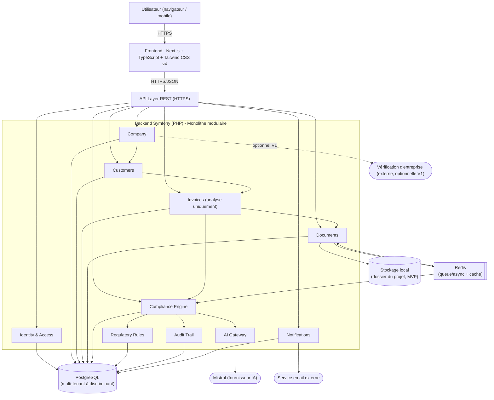
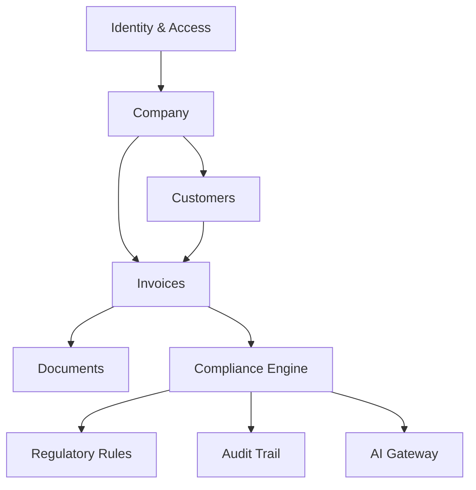
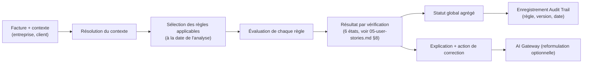
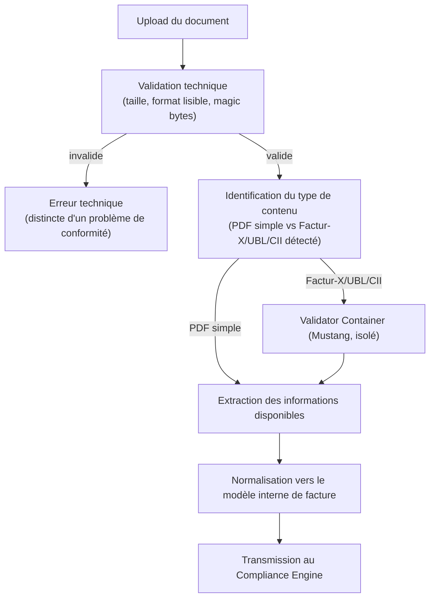
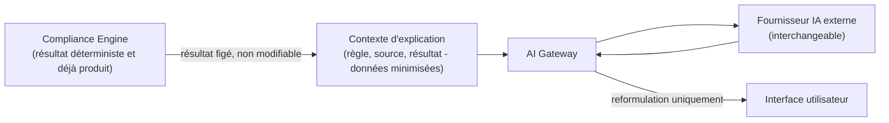
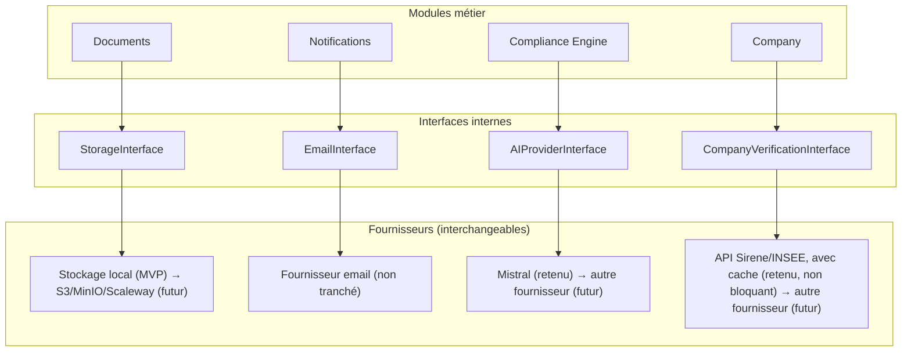
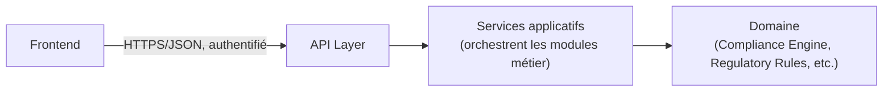
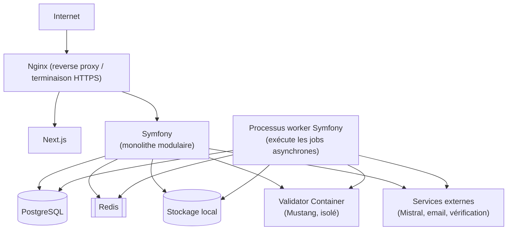

# Technical Architecture - Assistant de conformité à la facturation électronique

> Ce document s'appuie sur `01-intent-note.md` à `05-user-stories.md` comme source de vérité fonctionnelle. Il définit _comment_ le système est structuré, jamais _ce qu'il fait_ (déjà défini dans le PRD et les User Stories) ni _quelle réglementation_ il applique (définie dans `02-regulatory-study.md`). Aucune décision de modèle de données détaillé, d'API, de sécurité complète ou de design visuel n'est prise ici - ces sujets relèvent respectivement de `07-data-model.md`, `08-api-specification.md`, `10-security-privacy.md` et `11-frontend-design-system.md`.

## 1. Résumé architectural

Le système est construit comme un **monolithe modulaire**, déployé initialement comme une application unique organisée en modules métier clairement délimités, avec une base de données relationnelle unique en mode multi-tenant à discriminant (`tenant_id`), un traitement asynchrone limité aux opérations qui le justifient réellement (analyse de document, appels IA), et une **abstraction stricte de toute dépendance externe** (IA, email, stockage, vérification d'entreprise) derrière des interfaces internes. Le composant central est le **Compliance Engine**, conçu comme un module déterministe et versionné, strictement séparé de la couche IA qui ne fait qu'expliquer ses résultats sans jamais les produire elle-même (cohérent avec `04-product-requirements.md`, DEC-002).

Ce choix découle directement de la contrainte de faisabilité pour un développeur solo établie dans `03-market-analysis.md` (section 17) : l'architecture privilégie la simplicité opérationnelle et la vitesse de développement initiale, tout en conservant des frontières de modules suffisamment nettes pour permettre une extraction progressive de composants si le produit devait grandir (section 33 de ce document).

> **Stack technique retenue** (décision produit, voir ADR-007 en section 34) : frontend Next.js + TypeScript + Tailwind CSS v4 ; backend Symfony (PHP) ; base de données PostgreSQL ; API REST ; fournisseur IA initial Mistral ; conteneurisation Docker ; CI/CD GitHub Actions ; reverse proxy Nginx ; file de tâches et cache Redis ; authentification par JWT ; stockage documentaire local (dossier du projet) pour le MVP, abstrait derrière une interface de stockage. Cette décision **remplace les choix de fournisseurs jusqu'ici laissés ouverts** dans ce document (IA, stockage) tout en conservant intégralement les principes d'abstraction posés en section 17 - Symfony et PostgreSQL restent la source de vérité du domaine métier, Mistral reste cantonné au rôle d'explication (ADR-002, inchangé).

## 2. Contexte et contraintes

Contraintes héritées des documents précédents, qui structurent chaque décision de ce document :

- **Développeur solo** (`03-market-analysis.md`, section 17) - exclut d'emblée toute architecture distribuée complexe.
- **Le Compliance Engine est la source de vérité déterministe ; l'IA n'est qu'une couche d'assistance** (`04-product-requirements.md`, DEC-002 ; `05-user-stories.md`, contrainte transverse sur EPIC-AI-ASSISTANT).
- **Traçabilité et versionnement des règles obligatoires** - le système doit pouvoir répondre à « pourquoi cette facture était-elle conforme à telle date ? » (`04-product-requirements.md`, section 24 ; `05-user-stories.md`, US-HISTORY-001).
- **Aucune émission ou transmission réelle de factures** - le produit n'a pas vocation à devenir une plateforme agréée (`04-product-requirements.md`, section 7 et 30).
- **Isolation stricte des données entre entreprises** - chaque entreprise ne doit jamais pouvoir accéder aux données d'une autre (`04-product-requirements.md`, section 14 - Sécurité).
- **Minimisation des données et confidentialité** - les documents et informations financières manipulés sont sensibles (`04-product-requirements.md`, section 14 - Confidentialité).
- **Réglementation évolutive** - le calendrier et les sanctions ont déjà changé plusieurs fois en 2025-2026 (`02-regulatory-study.md`, section 4 et 17), ce qui impose une architecture de règles capable d'évoluer sans réécriture du code métier.

## 3. Principes architecturaux

| Principe                                                               | Justification                                                                                                                                                                                                                                                                                                                                                                                                                                    |
| ---------------------------------------------------------------------- | ------------------------------------------------------------------------------------------------------------------------------------------------------------------------------------------------------------------------------------------------------------------------------------------------------------------------------------------------------------------------------------------------------------------------------------------------ |
| **Modularité avant distribution**                                      | Un développeur solo doit pouvoir raisonner sur l'ensemble du système ; des frontières de modules claires à l'intérieur d'un seul déploiement offrent la structuration nécessaire sans le coût opérationnel de services séparés.                                                                                                                                                                                                                  |
| **Le déterminisme avant l'intelligence**                               | Le Compliance Engine doit produire des résultats reproductibles et traçables ; l'IA, par nature non déterministe, ne peut donc jamais être la source d'un verdict de conformité (`04-product-requirements.md`, section 17).                                                                                                                                                                                                                      |
| **Auditabilité et traçabilité réglementaire par construction**         | Chaque résultat de conformité doit rester explicable dans le temps (`04-product-requirements.md`, section 24) ; ce n'est pas une fonctionnalité ajoutée après coup mais une contrainte structurante du modèle de règles (section 9-10).                                                                                                                                                                                                          |
| **Privacy et security by design**                                      | Les données manipulées sont financières et personnelles ; la minimisation et l'isolation doivent être pensées dès la structure des modules, pas ajoutées en périphérie.                                                                                                                                                                                                                                                                          |
| **Provider-agnostic pour toute dépendance externe**                    | Le principe d'abstraction s'applique systématiquement, que le fournisseur soit déjà choisi ou non : IA (Mistral), stockage (filesystem local, MVP) et vérification d'entreprise (API Sirene/INSEE, avec cache) sont désormais actés (décision produit, ADR-007) ; seul le fournisseur email reste une question ouverte (section 16, 34). L'architecture doit permettre de changer de fournisseur, choisi ou non, sans toucher au domaine métier. |
| **Fail safely, jamais silencieusement**                                | Une erreur technique ne doit jamais être confondue avec un résultat de conformité (`04-product-requirements.md`, section 15) ; le système doit échouer de façon visible et catégorisée plutôt que de produire un résultat de conformité incorrect par défaut.                                                                                                                                                                                    |
| **Simplicité opérationnelle**                                          | Le coût d'exploitation (temps, argent, charge mentale) doit rester gérable par une seule personne ; chaque composant d'infrastructure ajouté doit être justifié par un besoin réel, pas par anticipation.                                                                                                                                                                                                                                        |
| **Configuration plutôt que hardcoding pour les règles réglementaires** | Une règle de conformité ne doit jamais être une condition `if` dispersée dans le code métier, mais une donnée versionnée et interprétée par le moteur (section 9-10) - condition nécessaire à la maintenabilité exigée par `04-product-requirements.md`, section 14.                                                                                                                                                                             |

## 4. Architecture globale



Ce schéma reflète directement les Epics de `05-user-stories.md` (section 4) : chaque module du backend correspond à une Epic ou à un regroupement d'Epics proches (par exemple, EPIC-SETTINGS est intégré au module Identity & Access plutôt que traité comme un module séparé, la distinction n'étant pas justifiée par un besoin d'isolation propre).

## 5. Style architectural

| Style                                      | Évaluation pour ce projet                                                                                                                                                                                                                                                                                                                                       |
| ------------------------------------------ | --------------------------------------------------------------------------------------------------------------------------------------------------------------------------------------------------------------------------------------------------------------------------------------------------------------------------------------------------------------- |
| **Microservices**                          | Rejeté au stade actuel - impose une charge opérationnelle (déploiement, observabilité, communication inter-services) disproportionnée pour un développeur solo et un MVP dont le volume attendu est faible (`03-market-analysis.md`, section 17). Voir aussi section 36.                                                                                        |
| **Serverless (fonctions événementielles)** | Rejeté comme fondation principale - complique le raisonnement sur des transactions métier qui touchent plusieurs modules (par exemple une analyse de conformité qui doit rester cohérente avec l'entreprise, le client et le document). Peut néanmoins être envisagé ponctuellement pour des jobs isolés (section 13), sans être le style architectural global. |
| **Monolithe classique (non modulaire)**    | Rejeté - un monolithe sans frontières de modules explicites accumulerait rapidement des dépendances croisées incontrôlées entre, par exemple, Compliance et Documents, ce qui nuirait à la maintenabilité exigée par `04-product-requirements.md` (section 14) et à la possibilité d'extraction future (section 33).                                            |
| **Monolithe modulaire (retenu)**           | Un seul déploiement, mais des modules aux frontières explicites (section 6-7), communiquant par des interfaces internes claires plutôt que par accès direct aux données d'un autre module. Combine la simplicité opérationnelle nécessaire à un développeur solo et la structuration nécessaire à la maintenabilité et à l'évolutivité à moyen terme.           |

**Choix retenu : monolithe modulaire.** C'est le compromis le plus adapté entre la vitesse de développement initiale (un seul projet, un seul déploiement, un seul processus de build) et la rigueur de structuration nécessaire à un produit dont le composant central (Compliance Engine) doit rester maintenable, testable et auditable indépendamment du reste du système.

## 6. Architecture logique

| Module                | Responsabilité                                                              | Données manipulées                                  | Dépendances                                                                      | Principales opérations                                                    |
| --------------------- | --------------------------------------------------------------------------- | --------------------------------------------------- | -------------------------------------------------------------------------------- | ------------------------------------------------------------------------- |
| **Identity & Access** | Authentification, gestion du compte utilisateur                             | Compte, identifiants                                | Aucune dépendance vers les autres modules métier                                 | Créer compte, connexion, récupération d'accès (US-AUTH-001 à 003)         |
| **Company**           | Gestion des informations d'entreprise (statut TVA, taille)                  | Entreprise, historique de modification              | Identity & Access (propriétaire)                                                 | Configurer/modifier entreprise (US-COMPANY-001 à 003)                     |
| **Customers**         | Gestion minimale des clients associés à une facture analysée                | Client (statut, SIREN le cas échéant)               | Company                                                                          | Renseigner client d'une facture (US-CUSTOMER-001, 002)                    |
| **Invoices**          | Gestion des factures **à des fins d'analyse uniquement**, jamais d'émission | Facture (mentions, montants, contexte)              | Company, Customers, Documents                                                    | Importer/saisir une facture (US-INVOICE-001, 002)                         |
| **Documents**         | Traitement des fichiers importés (validation technique, extraction)         | Fichier, métadonnées d'extraction                   | Invoices                                                                         | Upload, validation, consultation, suppression (US-DOCUMENT-001, 002)      |
| **Compliance Engine** | Détermination et évaluation des règles applicables à une facture            | Résultat de conformité (par vérification et global) | Invoices, Regulatory Rules, Audit Trail                                          | Analyser une facture, produire un résultat (US-COMPLIANCE-001 à 007)      |
| **Regulatory Rules**  | Stockage et sélection des règles réglementaires versionnées                 | Règle, version, période de validité                 | Aucune dépendance sortante (module de référence)                                 | Définir/interroger une règle applicable à une date donnée (section 9-10)  |
| **Audit Trail**       | Conservation immuable des événements et résultats importants                | Journal d'événements, historique de résultats       | Reçoit des événements de tous les modules, n'en dépend d'aucun fonctionnellement | Enregistrer un événement, interroger un historique (US-HISTORY-001)       |
| **AI Gateway**        | Abstraction de la couche IA d'explication                                   | Requêtes/réponses IA, logs associés                 | Consomme un résultat déjà produit par Compliance Engine, ne le modifie jamais    | Reformuler un résultat, répondre à une question générale (US-AI-001, 002) |
| **Notifications**     | Envoi de rappels liés à une échéance déterminée par le diagnostic           | Notification, échéance associée                     | Compliance Engine (lecture du diagnostic)                                        | Notifier une échéance (US-NOTIFICATION-001, P2)                           |

**Modules explicitement non créés**, cohérent avec le hors-périmètre du PRD (`04-product-requirements.md`, section 30) : pas de module Billing/Subscription (aucun modèle économique tranché, `04-product-requirements.md` section 32), pas de module Administration orienté utilisateur (aucun rôle multiple au MVP, PRD section 21) - un besoin interne minimal de gestion des règles existe néanmoins et est couvert par le module Regulatory Rules lui-même plutôt que par une Epic Administration séparée (cohérent avec `05-user-stories.md`, section 6, Epic Administration : « fonction interne, non utilisateur »).

**Traduction en structure de code Symfony** (namespace `src/`), sans modifier les frontières logiques ci-dessus :

```text
backend/
├── src/
│   ├── Identity/        ← Identity & Access
│   ├── Organization/    ← Company (renommé Organization pour cohérence avec 07-data-model.md)
│   ├── Customer/        ← Customers
│   ├── Invoicing/       ← Invoices
│   ├── Compliance/      ← Compliance Engine + Regulatory Rules (sous-namespaces distincts : Compliance/Engine, Compliance/Rules)
│   ├── Document/        ← Documents
│   ├── AI/              ← AI Gateway
│   ├── Notification/    ← Notifications
│   └── Shared/          ← Audit Trail + éléments transverses (identifiants, exceptions communes, StorageInterface, etc.)
```

Cette structure regroupe deux modules logiques distincts (**Regulatory Rules** et **Compliance Engine**) sous un même namespace `Compliance/`, en sous-dossiers séparés (`Compliance/Rules`, `Compliance/Engine`) - la règle de frontière de la section 7 (aucune dépendance sortante de Regulatory Rules) s'applique à l'intérieur de ce namespace exactement comme entre deux modules séparés, et n'est pas affaiblie par ce regroupement physique. De même, **Audit Trail** est hébergé dans `Shared/` plutôt que dans un namespace dédié, car il est consommé passivement par tous les autres modules sans logique métier propre suffisamment riche pour justifier un namespace séparé - son statut de « module de référence, sans dépendance sortante » (section 7) reste inchangé.

## 7. Domain boundaries



Règle de frontière : un module ne doit **jamais** lire ou écrire directement les données internes d'un autre module ; toute interaction passe par une interface exposée par ce module (même au sein d'un même déploiement - cette discipline est ce qui distingue un monolithe modulaire d'un monolithe non structuré, voir section 5). En particulier :

- **Regulatory Rules** n'a aucune dépendance sortante : c'est un module de référence, interrogé mais qui n'appelle jamais les autres modules. Cette absence de dépendance est ce qui garantit que la définition d'une règle reste indépendante du contexte d'une facture particulière (nécessaire au versionnement, section 10).
- **Audit Trail** reçoit des événements de tous les modules mais n'en dépend fonctionnellement d'aucun - il agit comme un journal passif, jamais comme un déclencheur d'action métier.
- **AI Gateway** ne peut être appelé qu'_après_ que le Compliance Engine ait produit un résultat ; il n'a pas d'accès direct aux données de Invoices, Company ou Customers en dehors du contexte explicitement transmis par le Compliance Engine (voir section 15, minimisation des données envoyées à l'IA).

## 8. Compliance Engine

Composant le plus critique du système (`04-product-requirements.md`, section 10).



**Comment les règles sont sélectionnées** : à partir du contexte résolu (statut TVA et taille de l'entreprise, statut du client, nature de l'opération, date de l'analyse), le Compliance Engine interroge le module Regulatory Rules pour obtenir l'ensemble des règles dont la période de validité couvre la date de l'analyse et dont les conditions correspondent au contexte (section 9-10).

**Comment elles sont évaluées** : chaque règle sélectionnée est évaluée indépendamment contre les données disponibles de la facture. Une règle ne peut produire qu'un des états définis dans `05-user-stories.md` (section 8) : `CONFORME`, `NON_CONFORME`, `AVERTISSEMENT`, `NON_APPLICABLE`, `A_VERIFIER`, `INCERTAIN_REGLEMENTAIRE`. L'absence d'une donnée nécessaire à l'évaluation produit systématiquement `A_VERIFIER`, jamais `NON_CONFORME` par défaut (BR-COMPLIANCE-003 du PRD) - cette règle doit être appliquée au niveau de l'évaluateur lui-même, pas laissée à l'appréciation de chaque règle individuelle, pour garantir la cohérence.

**Comment les exceptions sont gérées** : une règle marquée `NON_APPLICABLE` à un contexte donné (par exemple une règle d'e-invoicing appliquée à un client particulier) est simplement exclue du résultat affiché comme problème, mais reste tracée dans l'audit pour expliquer pourquoi elle n'a pas été retenue si l'utilisateur s'interroge (cohérent avec US-COMPLIANCE-007).

**Comment les résultats sont produits** : le statut global de la facture est dérivé des statuts individuels (par exemple, non conforme si au moins une vérification est `NON_CONFORME`), selon une logique d'agrégation elle-même définie comme une règle explicite plutôt que codée en dur (voir section 9).

**Comment les règles sont versionnées** : voir section 10.

**Comment les résultats sont audités** : chaque analyse produit un enregistrement immuable dans Audit Trail contenant le contexte résolu, chaque règle appliquée avec sa version, et le résultat obtenu (section 22).

## 9. Regulatory Rules Engine

Le système doit éviter que la réglementation soit dispersée sous forme de conditions `if` dans le code métier du Compliance Engine - une règle est une **donnée versionnée**, pas une instruction codée en dur.

```text
Rule (conceptuel - pas un schéma de base de données)
├── id (identifiant stable de la règle, ex. "mention-siren-client")
├── version
├── effective_from
├── effective_until (nullable - null si toujours en vigueur)
├── conditions (contexte auquel la règle s'applique : statut client, type d'opération, etc.)
├── check (ce qui est vérifié sur la facture)
├── severity (quel état produire en cas de non-respect : NON_CONFORME, AVERTISSEMENT...)
├── source (référence vers 02-regulatory-study.md et/ou la source officielle)
├── confidence (niveau de confiance repris de 02-regulatory-study.md, ex. Élevé/Moyen/Faible)
└── explanation_template (base du message pédagogique, avant reformulation IA éventuelle)
```

Chaque règle codée dans le système doit être **traçable individuellement** vers une section précise de `02-regulatory-study.md` (cohérent avec `04-product-requirements.md`, section 18 et `05-user-stories.md`, section 13). Une règle dont la source réglementaire est elle-même marquée « à confirmer » ou de confiance « Faible/Moyen » dans l'étude réglementaire doit porter cette information dans son `confidence`, afin que le Compliance Engine puisse produire un état `INCERTAIN_REGLEMENTAIRE` plutôt qu'un verdict catégorique (BR-COMPLIANCE-004 du PRD).

**Logique d'agrégation du statut global** : également représentée comme une règle explicite et non codée en dur dans le Compliance Engine, afin qu'une évolution de cette logique (par exemple, décider qu'un `AVERTISSEMENT` seul ne rend pas le statut global non conforme) reste elle-même versionnable et traçable.

> Ce modèle reste conceptuel : sa traduction en tables, colonnes et types de données précis relève entièrement de `07-data-model.md`.

## 10. Versionnement réglementaire

Exigence fondamentale directement héritée de `04-product-requirements.md` (section 24) et `05-user-stories.md` (US-HISTORY-001) : pouvoir répondre à _« quelle version des règles a été utilisée pour analyser cette facture ? »_, y compris longtemps après une mise à jour des règles.

**Principe architectural retenu : immutabilité des versions de règles.**

- Une règle n'est **jamais modifiée en place**. Toute évolution (changement de calendrier, de sanction, de mention obligatoire - comme documenté dans `02-regulatory-study.md`, section 4 et 17) crée une **nouvelle version** de la règle, avec sa propre `effective_from`, tandis que la version précédente reçoit une `effective_until` correspondante.
- La sélection des règles applicables à une analyse se fait toujours **à la date de l'analyse**, jamais à la date de consultation ultérieure du résultat (section 8).
- Le résultat d'une analyse **enregistre explicitement** l'identifiant et la version de chaque règle appliquée (pas seulement l'identifiant de la règle), de sorte qu'une évolution future de cette règle ne modifie jamais rétroactivement l'interprétation d'un résultat historique déjà produit.
- Conséquence directe : le résultat d'une analyse doit être une **copie ou une référence figée** du contenu pertinent de la règle au moment de l'analyse (explication, source, sévérité), et non un simple pointeur vers « la règle actuelle » qui changerait de sens avec le temps.

Ce principe d'immutabilité est ce qui garantit la propriété énoncée dans les règles absolues de ce document (règle 19) : _les résultats historiques doivent rester explicables_, indépendamment des évolutions ultérieures du moteur de règles.

## 11. Architecture documentaire



**Décision produit (ADR-007, complément)** : pour le MVP, la validation technique fine des formats structurés (Factur-X, UBL, CII) s'appuie sur un **outil de validation existant plutôt qu'une réimplémentation complète** - cohérent avec la recommandation de `03-market-analysis.md` (section 9 et 17). Outil retenu à évaluer en priorité : **Mustangproject** (support Factur-X/CII/UBL, incluant des règles françaises dans ses versions récentes). Ce composant étant écrit en Java, il **n'est jamais intégré directement dans le runtime PHP/Symfony** : il s'exécute comme un **conteneur isolé** (`Validator Container`), appelé depuis Symfony via HTTP ou invocation de processus, ce qui préserve la frontière de confiance (section 7) entre le domaine métier et un composant tiers manipulant des fichiers non fiables (section 22 de `10-security-privacy.md`). **Priorité de format pour le MVP : Factur-X en premier** (le plus adapté à la cible TPE/micro-entrepreneurs, cohérent avec `02-regulatory-study.md` section 23), UBL/CII en complément selon la disponibilité du temps de développement.

Cohérent avec `04-product-requirements.md` (section 16, 28) et `03-market-analysis.md` (section 9, 17) : le MVP **n'a pas vocation à reconstruire un parseur complet des formats Factur-X/UBL/CII** - le recours à Mustang (ci-dessus) répond directement à cette contrainte. L'architecture documentaire du MVP se limite à :

- valider qu'un fichier est lisible et dans un format supporté a minima (PDF, éventuellement saisie manuelle en remplacement) ;
- détecter si un document est un PDF simple non structuré (cas central de US-COMPLIANCE-005) plutôt que d'analyser finement une structure XML embarquée ;
- déléguer la validation technique fine d'un document structuré au Validator Container (Mustang) plutôt que de la réimplémenter ;
- extraire les informations utiles au Compliance Engine (mentions présentes, montants) via une extraction volontairement limitée au périmètre de règles du MVP.

**Cas d'erreur à couvrir explicitement** (cohérent avec `05-user-stories.md`, US-INVOICE-001) :

- fichier illisible ou corrompu → erreur technique, proposition de bascule vers la saisie manuelle ;
- format non supporté → erreur technique, même traitement ;
- fichier trop volumineux (limite retenue pour le MVP : **20 Mo par fichier**, décision produit) → erreur technique explicite (`413`, `08-api-specification.md` section 42) ;
- document vide ou sans donnée exploitable → distinct d'une erreur technique : le document est traité, mais la plupart des vérifications aboutissent à `A_VERIFIER` faute de données ;
- échec ou indisponibilité du Validator Container (Mustang) → erreur technique explicite, jamais interprétée comme un résultat de conformité, avec repli possible vers la saisie manuelle.

**Périmètre de formats effectivement livré en Phase 7 (décision produit, docs/12-roadmap.md)** : PDF simple et Factur-X bénéficient d'un traitement complet (identification, extraction limitée, validation Mustang pour Factur-X). UBL et CII sont **détectés** (magic bytes/structure XML reconnue) mais leur traitement n'est **pas couvert** par cette phase - un document XML UBL/CII est accepté techniquement, jamais envoyé au Validator Container, et se termine en erreur technique explicite (`FORMAT_NOT_SUPPORTED`, distincte d'un fichier invalide) plutôt qu'un résultat de conformité. Gap connu et documenté, pas une limitation silencieuse : réévaluer l'effort UBL/CII dans une phase ultérieure si le besoin se confirme, plutôt que d'avoir engagé un chemin Mustang non vérifié pour ces deux formats dès cette phase.

## 12. Traitements synchrones et asynchrones

| Opération                                                                 | Synchrone / Asynchrone                                                                                                                                                 | Justification                                                                                            |
| ------------------------------------------------------------------------- | ---------------------------------------------------------------------------------------------------------------------------------------------------------------------- | -------------------------------------------------------------------------------------------------------- |
| Connexion, consultation d'une entreprise, d'un client, de l'historique    | Synchrone                                                                                                                                                              | Opérations de lecture simples, temps de réponse attendu immédiat                                         |
| Configuration de l'entreprise, saisie manuelle d'une facture              | Synchrone                                                                                                                                                              | Validation simple, pas de traitement lourd                                                               |
| Diagnostic d'éligibilité (US-COMPLIANCE-001)                              | Synchrone                                                                                                                                                              | Évaluation d'un nombre restreint de règles sur un contexte simple, pas de document à traiter             |
| Upload et validation technique d'un document                              | Synchrone pour la validation immédiate (format lisible ou non) ; **asynchrone** pour l'extraction si le document est volumineux ou nécessite un traitement non trivial | Évite de bloquer l'utilisateur sur un traitement dont la durée peut varier                               |
| Analyse de conformité complète d'une facture importée (US-COMPLIANCE-002) | **Asynchrone** si elle dépend d'une extraction de document asynchrone ; synchrone si la facture provient d'une saisie manuelle déjà structurée                         | Cohérent avec les états `NON_ANALYSEE`/`ANALYSE_EN_COURS` proposés dans `05-user-stories.md` (section 8) |
| Reformulation IA d'un résultat (US-AI-001, 002)                           | **Asynchrone** (ou synchrone avec délai toléré)                                                                                                                        | Dépendance à un service externe dont la latence n'est pas maîtrisée (section 15)                         |
| Envoi de notifications (US-NOTIFICATION-001)                              | Asynchrone                                                                                                                                                             | Ne doit jamais bloquer une action utilisateur en cours                                                   |

Principe retenu : un traitement est asynchrone **uniquement** lorsqu'il dépend d'une ressource dont la latence ou la disponibilité n'est pas maîtrisée par le système lui-même (document volumineux, service externe). Toute opération purement interne et rapide reste synchrone, pour ne pas ajouter de complexité de coordination non justifiée (principe de simplicité, section 3).

## 13. Jobs et queues

Une file de tâches asynchrones minimale est nécessaire, justifiée uniquement par les opérations identifiées en section 12 :

```text
Document importé
      ↓
Job: ExtractDocumentContent
      ↓
Job: RunComplianceAnalysis
      ↓
Job: RequestAIExplanation (optionnel, si activé)
      ↓
Job: NotifyUserIfNeeded
```

**Idempotence** : chaque job doit pouvoir être rejoué sans produire un résultat différent ou dupliqué (par exemple, `RunComplianceAnalysis` rejoué sur le même document et le même contexte doit produire le même résultat, tant que les règles applicables à cette date n'ont pas changé - cohérent avec le principe d'immutabilité de la section 10).

**Retries** : un job qui échoue pour une raison technique (par exemple, extraction de document temporairement indisponible) doit être retenté un nombre limité de fois avant d'être placé en échec explicite, jamais silencieusement abandonné.

**Dead-letter handling** : un job en échec définitif doit rester visible et consultable (pour l'exploitation par le développeur solo), et l'utilisateur doit recevoir un état d'erreur technique explicite plutôt qu'une absence de réponse.

**Monitoring** : voir section 24.

**Priorité** : au stade du MVP, une seule file suffit - le volume attendu (`03-market-analysis.md` ne documente aucune volumétrie massive à ce stade) ne justifie pas une hiérarchisation de priorités entre jobs.

**Implémentation retenue : Redis**, utilisé exclusivement comme backend de file de tâches (transport asynchrone, cohérent avec l'écosystème Symfony) et, potentiellement, comme cache applicatif et support de rate limiting (section 18) - **jamais comme source de vérité métier** : PostgreSQL reste seul responsable de la persistance durable des données de domaine (facture, résultat de conformité, etc.), cohérent avec le principe de simplicité et avec ADR-004. Cette décision est purement une implémentation de l'abstraction déjà posée en section 12-13 ; aucun module métier ne dépend directement de Redis, uniquement de l'interface de file de tâches.

## 14. Architecture IA

Principe fondamental, rappelé explicitement (cohérent avec `04-product-requirements.md`, section 17, et `05-user-stories.md`, contrainte transverse sur EPIC-AI-ASSISTANT) : **l'IA ne doit jamais être l'autorité réglementaire**.



L'AI Gateway (section 15) ne reçoit **jamais** l'ensemble des données brutes de l'entreprise ou de la facture : il reçoit uniquement le contexte d'explication nécessaire (la règle concernée, sa source, le résultat déjà déterminé, et les éléments strictement nécessaires à la reformulation), conformément au principe de minimisation (`04-product-requirements.md`, section 14 - Confidentialité, et section 28 de ce document).

**Ce que l'architecture doit garantir** :

- Le résultat produit par le Compliance Engine (état de conformité) n'est **jamais** modifiable par la couche IA - l'IA reçoit ce résultat en entrée, elle ne le renvoie jamais en sortie sous une forme qui pourrait être interprétée comme un nouveau verdict.
- Un échec ou une indisponibilité du fournisseur IA (timeout, erreur) **ne doit jamais bloquer** l'affichage du résultat déterministe déjà produit par le Compliance Engine - un message pédagogique par défaut (non reformulé) doit rester disponible en repli (fallback, section 26).
- Les logs des échanges avec le fournisseur IA doivent être conservés pour audit (section 22), sans toutefois inclure de données personnelles au-delà de ce qui est strictement nécessaire (section 28).

## 15. AI Gateway

Rôle : point d'entrée unique et unique responsable de toute interaction avec un fournisseur IA, afin qu'aucun autre module (en particulier Compliance Engine) ne dépende directement d'un fournisseur précis.

Responsabilités :

- **Abstraction du fournisseur** - une interface interne stable (`AIProviderInterface`, section 17), dont **Mistral constitue l'implémentation initiale retenue** (décision produit, ADR-007) ; changer de fournisseur ne doit affecter que l'implémentation de cette interface, jamais les modules qui l'appellent. Le choix de Mistral n'affaiblit donc pas le principe provider-agnostic posé par ADR-005 - il en constitue la première concrétisation, pas une exception.
- **Contrôle des prompts** - construction du contexte transmis à partir du résultat du Compliance Engine et de `02-regulatory-study.md` uniquement, jamais à partir de données brutes non filtrées de l'entreprise.
- **Limitation des données envoyées** - application explicite du principe de minimisation (section 14, 28) avant tout appel externe.
- **Monitoring et limitation des coûts** - traçage du volume d'appels, possibilité de désactiver ou limiter la couche IA sans affecter le reste du produit (cohérent avec la priorité P1 de EPIC-AI-ASSISTANT dans `05-user-stories.md`, qui n'est pas bloquante pour la proposition de valeur centrale).
- **Fallback** - en cas d'échec, retour d'une explication non reformulée (issue directement du `explanation_template` de la règle, section 9) plutôt qu'une absence de réponse.
- **Politique de données** - garantit qu'aucune donnée envoyée au fournisseur IA n'est conservée au-delà de ce qui est nécessaire à l'audit (à détailler dans `10-security-privacy.md`).

## 16. Intégrations externes

| Intégration                             | Responsabilité                                                                  | Fournisseur retenu (MVP)                                                                 | Données échangées                            | Erreurs / Timeout / Retry                                                                     | Fallback                                                                                    | Priorité (PRD §22)    |
| --------------------------------------- | ------------------------------------------------------------------------------- | ---------------------------------------------------------------------------------------- | -------------------------------------------- | --------------------------------------------------------------------------------------------- | ------------------------------------------------------------------------------------------- | --------------------- |
| Fournisseur IA                          | Reformulation pédagogique                                                       | **Mistral** (décision produit, ADR-007)                                                  | Contexte d'explication minimisé (section 14) | Timeout court, pas de retry automatique sur une reformulation (l'utilisateur peut redemander) | Explication brute non reformulée                                                            | P1                    |
| Service email                           | Récupération de compte, notifications                                           | Non tranché - reste une question ouverte                                                 | Adresse email, contenu du message            | Retry limité, échec visible en file dead-letter (section 13)                                  | Aucun canal de repli au MVP (l'email reste le seul canal)                                   | P0 (authentification) |
| Stockage de documents                   | Conservation des fichiers importés                                              | **Stockage local** (dossier du projet), abstrait derrière `StorageInterface` pour le MVP | Fichier binaire, métadonnées                 | Retry sur écriture, erreur technique explicite si échec définitif                             | Aucun - l'upload échoue explicitement, l'utilisateur peut réessayer ou saisir manuellement  | P0                    |
| Vérification d'entreprise (SIREN, etc.) | Fiabiliser les données saisies                                                  | SIREN, informations d'identification                                                     | Timeout, retry limité                        | Saisie manuelle non vérifiée reste acceptée (dégradation gracieuse, pas de blocage)           | V1, non bloquant - **fournisseur retenu : API Sirene/INSEE, avec cache** (décision produit) |
| Plateforme(s) agréée(s)                 | Orientation informative uniquement, jamais de transmission réelle (PRD §7, §30) | Aucune donnée transmise au MVP                                                           | Non applicable au MVP                        | Simple lien/information statique                                                              | Future                                                                                      |
| Outils de validation Factur-X existants | Éventuelle délégation de la validation technique fine (section 11)              | Fichier ou données extraites                                                             | À définir si l'intégration est retenue       | Analyse interne limitée en repli                                                              | Future                                                                                      |

Chaque intégration est accédée via une **interface interne dédiée** (section 17), jamais appelée directement depuis un module métier - un module comme Documents ne connaît que « un service de stockage », jamais le nom du fournisseur réel.

## 17. Architecture provider-agnostic



Cette approche s'applique systématiquement aux quatre catégories de dépendances externes identifiées (IA, email, stockage, vérification d'entreprise). Trois choix sont désormais actés au niveau produit (Mistral pour l'IA, stockage local pour le MVP, API Sirene/INSEE avec cache pour la vérification d'entreprise - décision produit reprise en ADR-007) ; seul le fournisseur email reste une question ouverte. Dans tous les cas, l'abstraction reste identique : elle limite l'impact de ces choix - actés ou non - sur le domaine métier, et permet une migration future du stockage local vers un stockage objet distant (S3, MinIO, Scaleway Object Storage) sans réécrire la logique métier, exactement selon le schéma `DocumentService → StorageInterface → LocalStorage` déjà anticipé.

## 18. API Layer

Style retenu : **API HTTP de type REST**, exposée par le backend au frontend (section 29-30), organisée par domaine (aligné sur les modules de la section 6).

Principes architecturaux (sans détail d'endpoints, qui relève de `08-api-specification.md`) :

- **Authentification** requise sur l'ensemble des routes hors inscription/connexion, via un mécanisme à définir dans `10-security-privacy.md` (jeton de session ou équivalent).
- **Autorisation** systématiquement vérifiée au niveau de chaque ressource par rapport au `tenant_id` de l'utilisateur authentifié (section 20), jamais uniquement au niveau du routage.
- **Validation** des données d'entrée à la frontière de l'API, avant tout passage aux modules métier - permet de distinguer une erreur de saisie (section 25) d'une erreur métier plus profonde.
- **Erreurs** structurées et catégorisées (section 25), avec une distinction explicite entre erreur technique et résultat de conformité (jamais un statut HTTP d'erreur pour un résultat `NON_CONFORME`, qui est un résultat métier valide).
- **Pagination** nécessaire pour la consultation de l'historique (US-HISTORY-001), dont le volume croît avec le temps.
- **Idempotency** particulièrement importante pour le déclenchement d'une analyse (éviter qu'une double soumission ne produise deux analyses redondantes) - à traiter via une clé d'idempotence ou une vérification d'état côté serveur.
- **Rate limiting** nécessaire a minima sur les routes déclenchant un traitement coûteux (analyse, appel IA), pour limiter les risques d'abus et les coûts (section 39, risques architecturaux).
- **Versionnement** de l'API non jugé nécessaire au MVP compte tenu d'un unique client frontend maîtrisé en interne ; à réévaluer si une API publique ou des intégrations tierces sont envisagées (Future Scope).

## 19. Authentication & Authorization

Principes architecturaux (le détail des exigences de sécurité relève de `10-security-privacy.md`) :

- Authentification par identifiants (email/mot de passe a minima). **Mécanisme retenu : JWT access token de courte durée + refresh token en cookie `HttpOnly`, `Secure`, `SameSite`** (décision produit, ADR-007). L'access token est conservé **en mémoire côté frontend, jamais en `localStorage`**, ce qui limite l'exposition en cas de faille XSS ; le refresh token, porté par un cookie inaccessible en JavaScript, est présenté au backend Symfony - qui reste l'autorité d'authentification - pour obtenir un nouvel access token. Conséquence directe : une protection CSRF ciblée reste nécessaire sur l'endpoint utilisant ce cookie (`/auth/refresh`), même si l'access token porté en en-tête `Authorization` réduit l'exposition CSRF générale du reste de l'API. Ce mécanisme reste cohérent avec la séparation physique du frontend (Next.js) et du backend (Symfony) - un jeton porteur est plus naturel qu'une session serveur classique dans cette configuration à deux applications distinctes. Les aspects opérationnels fins (durée de vie précise de chaque jeton, mécanisme de rotation, révocation, comportement du logout) restent à préciser dans `10-security-privacy.md` (sections 12-14 et 20), sans remettre en cause le mécanisme lui-même désormais acté.
- Un seul rôle au MVP - **propriétaire du compte** - cohérent avec `04-product-requirements.md` (section 21) et `05-user-stories.md` (EPIC-ADMINISTRATION comme fonction interne uniquement, pas de rôles multiples utilisateur).
- L'architecture d'autorisation doit néanmoins être conçue de façon à pouvoir accueillir des rôles supplémentaires (collaborateur, comptable - persona secondaire C) sans refonte complète, si ce besoin est validé ultérieurement (`04-product-requirements.md`, section 32).
- **Vérification d'email : résolue.** Décision produit (cohérente avec `05-user-stories.md`, section 18, résolu) : obligatoire avant l'accès aux fonctionnalités sensibles (upload de document, analyses persistantes, usage de l'assistant IA), mais pas nécessairement bloquante avant toute utilisation basique du compte. L'architecture doit donc prévoir un état de compte intermédiaire (email non vérifié) qui restreint l'accès aux modules Documents, Compliance Engine et AI Gateway sans empêcher la simple connexion ; le détail de ce contrôle relève de `10-security-privacy.md`. **Récupération de compte** : l'emplacement architectural (module Identity & Access, section 6) est acté, les détails du mécanisme restent à préciser dans `10-security-privacy.md`.
- **Isolation des entreprises** : traitée au niveau de la stratégie multi-tenant (section 20), pas uniquement au niveau applicatif - la vérification d'appartenance à un tenant doit être systématique à chaque accès aux données, pas optionnelle ou reposant uniquement sur la discipline du code applicatif.

## 20. Multi-tenancy

| Stratégie                                                 | Évaluation                                                                                                                                                                                                                                  |
| --------------------------------------------------------- | ------------------------------------------------------------------------------------------------------------------------------------------------------------------------------------------------------------------------------------------- |
| **Base de données séparée par tenant**                    | Rejetée au MVP - complexité opérationnelle disproportionnée (autant de bases à gérer, migrer, sauvegarder que d'entreprises) pour un développeur solo et un volume attendu faible en début de vie du produit.                               |
| **Schéma séparé par tenant**                              | Rejetée pour la même raison, à un degré moindre - reste plus complexe à opérer et à faire évoluer (migrations à répercuter sur N schémas) qu'une base partagée, sans bénéfice de sécurité suffisant pour justifier ce coût au stade actuel. |
| **Base partagée avec discriminant `tenant_id` (retenue)** | Le plus simple à opérer pour un développeur solo (une seule base, une seule migration à la fois) ; la garantie d'isolation repose sur une discipline stricte et systématique de filtrage par `tenant_id` à chaque accès aux données.        |

**Comment garantir qu'une entreprise ne puisse jamais accéder aux données d'une autre** : le filtrage par `tenant_id` ne doit pas dépendre uniquement de chaque requête écrite individuellement dans le code applicatif (risque d'oubli), mais être **appliqué de façon systématique** au niveau de la couche d'accès aux données elle-même (par exemple, un mécanisme d'accès aux données qui exige toujours un `tenant_id` explicite et refuse toute requête qui l'omettrait). Le détail technique de ce mécanisme (contraintes au niveau de la base de données, couche d'accès aux données centralisée, etc.) relève de `07-data-model.md` et `10-security-privacy.md` ; ce document pose le principe que cette garantie **ne doit jamais reposer sur la seule vigilance humaine**.

## 21. Data Architecture

Composants nécessaires (sans schéma détaillé, voir `07-data-model.md`) :

- **Base de données relationnelle : PostgreSQL** (décision produit, ADR-007) - stockage principal des entités métier (entreprise, client, facture, règle versionnée, résultat de conformité), avec multi-tenant à discriminant (section 20). Une base relationnelle est justifiée par la nature fortement structurée et relationnelle des données (une facture appartient à une entreprise, référence un client, produit des résultats liés à des règles précises).
- **Stockage documentaire : système de fichiers local du projet pour le MVP** (décision produit, ADR-007) - conservation des fichiers de documents importés (section 11), séparé de la base relationnelle qui ne conserve que les métadonnées et références, et systématiquement accédé via `StorageInterface` (section 17) pour permettre une migration ultérieure vers un stockage objet distant (S3, MinIO, Scaleway Object Storage) sans réécrire la logique métier. Ce choix simplifie l'exploitation au MVP mais implique une attention particulière à la sauvegarde (section 32) et à la localisation physique du disque (pas de garantie de durabilité distribuée avant migration).
- **File de tâches asynchrones et cache : Redis** (décision produit, ADR-007) - support des jobs de la section 13, et potentiellement du cache et du rate limiting (section 18) si un besoin réel émerge, sans que cela ne remette en cause l'absence de cache jugée suffisante au MVP ci-dessous.
- **Journal d'audit** - réside dans PostgreSQL (table dédiée en append-only) plutôt que dans un système séparé au MVP, la volumétrie attendue ne justifiant pas un système de journalisation distinct dès le départ (voir section 33 pour l'évolution possible).
- **Cache** - Redis étant déjà présent pour la file de tâches, un cache applicatif reste **possible mais non activé par défaut au MVP**, faute de besoin fonctionnel identifié (nature peu répétitive des analyses individuelles) ; à réévaluer si la latence de sélection des règles applicables devenait un point de friction mesuré - l'infrastructure nécessaire est déjà en place.
- **Recherche** - non nécessaire au MVP (pas de fonctionnalité de recherche textuelle avancée identifiée dans le PRD ou les User Stories).

## 22. Audit Trail

Le système doit pouvoir répondre à _« qui a fait quoi, quand, et dans quel contexte ? »_, exigence directement héritée de `04-product-requirements.md` (section 24).

Événements à conserver, de façon **immuable (append-only)** :

- Connexion et actions de gestion de compte.
- Création/modification des informations d'entreprise (avec l'état précédent, cohérent avec US-COMPANY-003 qui exige que les analyses passées conservent la trace du contexte qui était le leur).
- Import/saisie d'une facture.
- Déclenchement et résultat d'une analyse de conformité, incluant chaque règle appliquée **avec sa version précise** (section 10).
- Toute reformulation IA produite (pour audit de ce qui a été montré à l'utilisateur, section 14).
- Actions administratives internes sur les règles elles-mêmes (création d'une nouvelle version de règle, section 9-10).

Ce journal sert une double fonction : la **conformité produit** elle-même (répondre à l'utilisateur sur une analyse passée, US-HISTORY-001) et l'**audit technique** (comprendre le comportement du système a posteriori). Ces deux usages partagent la même exigence d'immutabilité et peuvent donc être servis par le même mécanisme au MVP, sans dupliquer l'infrastructure.

## 23. Observabilité

**Logs** - erreurs techniques (distinctement des résultats de conformité, section 25), échecs de jobs (section 13), échecs d'intégrations externes (section 16-17).

**Metrics** - nécessaires a minima sur : latence de l'analyse de conformité, taux d'échec des jobs, volume et coût des appels IA (contrôle direct du risque de coût, section 39), taux d'erreurs techniques sur l'import de documents.

**Traces** - utiles pour suivre le parcours d'une analyse à travers les modules (Invoices → Compliance Engine → Regulatory Rules → Audit Trail → AI Gateway), particulièrement pour diagnostiquer un résultat inattendu ; pertinence à confirmer au regard du volume réel une fois le produit en usage, non bloquant au MVP.

**Monitoring** - disponibilité de l'application elle-même, disponibilité perçue des intégrations externes (section 16), santé de la file de tâches (jobs bloqués ou en échec répété, section 13), utilisation du stockage.

Aucun outil précis n'est choisi ici, conformément à la consigne de ne pas trancher prématurément l'implémentation.

## 24. Gestion des erreurs

Distinction fondamentale, reprise et renforcée depuis `04-product-requirements.md` (section 15) et `05-user-stories.md` :

```text
Business Error              - une règle métier est violée (ex. tentative de modifier une analyse déjà auditée)
Technical Error              - le système ne fonctionne pas (fichier illisible, service externe indisponible)
External Dependency Error    - une intégration externe échoue (IA, email, stockage, vérification)
Compliance Result            - n'est PAS une erreur : un résultat NON_CONFORME est un résultat métier valide et attendu
```

Chaque catégorie doit être **identifiable distinctement** à tous les niveaux de l'architecture (module métier, API, interface utilisateur), pour que le frontend puisse toujours distinguer « le système a un problème » de « votre facture a un problème » (exigence directe de `04-product-requirements.md`, section 15). Une erreur technique ou de dépendance externe ne doit **jamais** être traduite en un état de conformité (par exemple, un `A_VERIFIER` ne doit jamais résulter d'un timeout technique masqué - un timeout technique doit rester une `Technical Error` explicite).

## 25. Résilience

- **Retry** - appliqué aux erreurs de dépendance externe transitoires (section 16), avec un nombre de tentatives limité et un backoff pour éviter d'aggraver une indisponibilité du fournisseur.
- **Timeout** - défini pour chaque intégration externe (section 16), particulièrement l'IA dont la latence peut varier fortement.
- **Circuit breaker** - non jugé indispensable au MVP compte tenu du faible volume d'appels externes attendu ; à réévaluer si les intégrations IA ou de vérification d'entreprise deviennent critiques au flux principal.
- **Fallback** - systématique pour la couche IA (section 14-15, explication brute en repli) ; pour le stockage et l'email, l'échec reste visible sans fallback automatique au MVP (l'utilisateur est informé et peut réessayer).
- **Idempotence** - appliquée aux jobs (section 13) et à l'API (section 18) pour les opérations qui déclenchent un traitement coûteux ou ayant un effet métier.
- **Traitement partiel** - une analyse de conformité doit pouvoir produire un résultat partiel (certaines vérifications en `A_VERIFIER`) plutôt que d'échouer entièrement si une donnée manque, cohérent avec BR-COMPLIANCE-003 du PRD.
- **Reprise après erreur** - un job en échec (section 13) doit pouvoir être rejoué sans dupliquer son effet (idempotence), et l'utilisateur doit pouvoir relancer une analyse manuellement en cas d'échec technique visible.

## 26. Sécurité architecturale

> Principes structurants uniquement ; le détail complet relève de `10-security-privacy.md`.

- **Isolation des tenants** - voir section 20 ; garantie au niveau de la couche d'accès aux données, pas seulement applicative.
- **Chiffrement** - des données sensibles au repos (documents, informations d'entreprise et de facturation) et en transit (HTTPS systématique, section 4).
- **Secrets** (identifiants de fournisseurs externes, clés d'API) - gérés en dehors du code source, injectés par configuration d'environnement (section 27).
- **Accès internes** - principe de moindre privilège : chaque module n'accède qu'aux données strictement nécessaires à sa responsabilité (section 6-7) ; l'AI Gateway en particulier n'a jamais d'accès direct à la base de données, uniquement au contexte minimisé qui lui est transmis (section 14).
- **Stockage des documents** - séparé de la base de données relationnelle (section 21), avec un contrôle d'accès propre garantissant qu'un document ne peut être récupéré que par son entreprise propriétaire.
- **Validation des fichiers** - systématique avant tout traitement (section 11), pour limiter les risques liés à des fichiers malveillants ou mal formés.
- **Protection API** - authentification, autorisation par tenant, rate limiting (section 18).
- **Audit** - voir section 22, contribue également à la détection d'anomalies de sécurité.
- **Least privilege** - appliqué à la fois entre modules internes (section 7) et vis-à-vis des fournisseurs externes (un fournisseur IA ne reçoit jamais plus de données que nécessaire, section 14).

## 27. Privacy by Design

- **Minimisation** - chaque module ne collecte que les données nécessaires à sa fonction (cohérent avec `04-product-requirements.md`, section 14) ; en particulier, l'AI Gateway (section 14-15) ne reçoit jamais l'intégralité d'une facture ou d'une fiche entreprise, seulement le contexte d'explication pertinent.
- **Séparation des données** - les documents bruts (stockage objet) sont séparés des métadonnées structurées (base relationnelle), limitant l'exposition en cas d'incident sur l'un des deux composants.
- **Conservation** - la durée de conservation des documents et analyses n'est pas tranchée ici (question ouverte de `04-product-requirements.md`, section 32, et `05-user-stories.md`, section 18) ; l'architecture doit néanmoins permettre une politique de rétention configurable plutôt qu'une conservation indéfinie par défaut.
- **Suppression - résolue** : cohérente avec US-DOCUMENT-002 et US-SETTINGS-002 (`05-user-stories.md`, section 18, résolu). Lorsqu'un document est supprimé, le fichier original est supprimé, ainsi que les données extraites contenant des données personnelles et non nécessaires à la traçabilité ; le `ComplianceEvaluation` (résultat de conformité) associé est en revanche **conservé** lorsqu'il est nécessaire à la traçabilité, avec une mention explicite indiquant que le document source a été supprimé. Ce comportement concilie le droit de l'utilisateur à supprimer ses données et l'exigence d'auditabilité (section 22), sans tension non résolue entre les deux.
- **Anonymisation** - non nécessaire au MVP, le produit n'ayant pas vocation à produire de statistiques agrégées à ce stade (hors périmètre du PRD).
- **Données envoyées à des fournisseurs externes** - strictement limitées et documentées pour chaque intégration (section 16-17), avec une attention particulière au fournisseur IA (section 14-15) et à un éventuel service de vérification d'entreprise.

## 28. Frontend Architecture

> Architecture logique uniquement ; le design visuel relève de `11-frontend-design-system.md`.

- **Routing** - organisé autour des grandes activités de la User Story Map (`05-user-stories.md`, section 3) : onboarding, entreprise, diagnostic, facture (import/saisie), résultat de conformité, historique, dashboard, paramètres.
- **Modules frontend** - alignés sur les Epics plutôt que sur les modules backend un-à-un, pour refléter les parcours utilisateurs plutôt que la structure technique interne.
- **State management** - doit distinguer clairement l'état de session (authentification), l'état des données métier (entreprise, factures, résultats) et l'état des traitements en cours (`ANALYSE_EN_COURS`, section 12), pour permettre un affichage cohérent des états de progression exigés par `04-product-requirements.md` (section 14, Performance).
- **API client** - encapsule les appels HTTP vers le backend (section 18), avec une gestion centralisée de l'authentification et des erreurs, pour appliquer de façon homogène la distinction erreur technique / résultat de conformité (section 25) dans l'affichage.
- **Authentication state** - géré de façon centralisée, conditionnant l'accès à l'ensemble des routes hors inscription/connexion (section 19).
- **Error handling** - doit systématiquement afficher différemment une erreur technique (section 25) d'un résultat de conformité `NON_CONFORME`, ce dernier n'étant jamais présenté comme un échec du système.
- **Forms** - pour la configuration d'entreprise, de client et la saisie manuelle de facture (US-COMPANY-001/002, US-CUSTOMER-001/002, US-INVOICE-002), avec validation côté client cohérente avec la validation côté API (section 18).
- **Compliance UI** - composant central affichant les six états de conformité (`05-user-stories.md`, section 8) de façon visuellement distincte, avec accès systématique au détail (règle, source, explication, action de correction) plutôt qu'un simple badge de statut (exigence structurante, section 11 du PRD).
- **Document upload** - doit refléter les états du traitement (section 11-12 de ce document) : validation immédiate, puis état d'avancement si extraction asynchrone.
- **Dashboard** - construit à partir des données déjà exposées par le Compliance Engine et l'Audit Trail (US-DASHBOARD-001), sans logique métier propre au frontend.

## 29. Communication Frontend / Backend



- **Contrats** - définis par domaine (section 18), formalisés en détail dans `08-api-specification.md`.
- **Validation** - appliquée à la fois côté frontend (retour immédiat à l'utilisateur) et côté API (source de vérité, ne fait jamais confiance à la validation frontend seule).
- **Erreurs** - transmises avec une catégorisation explicite (section 25), permettant au frontend d'adapter l'affichage sans avoir à interpréter un message texte libre.
- **Loading states** - nécessaires pour toute opération asynchrone identifiée en section 12, en particulier l'analyse de conformité lorsqu'elle dépend d'une extraction de document.
- **Async operations / polling** - pour les traitements asynchrones (section 12-13), le frontend interroge périodiquement l'état du traitement (`NON_ANALYSEE` → `ANALYSE_EN_COURS` → résultat final) ; un mécanisme de notification temps réel (WebSocket ou équivalent) n'est **pas jugé nécessaire au MVP**, le polling simple étant suffisant compte tenu de la nature ponctuelle de l'attente et de la simplicité opérationnelle recherchée (section 3).
- **Notifications temps réel** - hors périmètre MVP pour la même raison ; les notifications de la section 13 (échéances) sont envoyées par email, pas par un canal temps réel dans l'application.

## 30. Infrastructure



| Composant                         | Responsabilité                                                                                                                                    | Choix retenu                                                                                                                   | Nécessaire au MVP ?                                                                                                                   |
| --------------------------------- | ------------------------------------------------------------------------------------------------------------------------------------------------- | ------------------------------------------------------------------------------------------------------------------------------ | ------------------------------------------------------------------------------------------------------------------------------------- |
| Reverse proxy / terminaison HTTPS | Point d'entrée sécurisé, redirection vers le frontend et l'API                                                                                    | **Nginx** (ADR-007)                                                                                                            | Oui                                                                                                                                   |
| Frontend                          | Sert l'interface utilisateur                                                                                                                      | **Next.js + TypeScript + Tailwind CSS v4** (ADR-007)                                                                           | Oui                                                                                                                                   |
| Application (processus principal) | Sert l'API REST                                                                                                                                   | **Symfony (PHP)** (ADR-007)                                                                                                    | Oui                                                                                                                                   |
| Processus worker                  | Exécute les jobs asynchrones (section 13) - peut être un second processus Symfony du même déploiement plutôt qu'une infrastructure séparée au MVP | Symfony (même code applicatif que l'API)                                                                                       | Oui, sous forme minimale                                                                                                              |
| Base de données relationnelle     | Stockage principal (section 21)                                                                                                                   | **PostgreSQL** (ADR-007)                                                                                                       | Oui                                                                                                                                   |
| File de tâches / cache            | Support des jobs (section 13)                                                                                                                     | **Redis** (ADR-007)                                                                                                            | Oui, sous une forme aussi simple que possible compte tenu du volume attendu                                                           |
| Stockage documentaire             | Documents importés (section 11, 21)                                                                                                               | **Système de fichiers local** du projet, MVP uniquement (ADR-007)                                                              | Oui                                                                                                                                   |
| Validator Container               | Validation technique fine des formats Factur-X/UBL/CII (section 11, ADR-008)                                                                      | **Mustangproject**, conteneur isolé, appelé par HTTP/process                                                                   | Oui, pour la priorité Factur-X du MVP                                                                                                 |
| Services externes                 | IA, email, vérification (section 16)                                                                                                              | IA : **Mistral** (ADR-007) ; vérification d'entreprise : **API Sirene/INSEE** avec cache (non bloquante) ; email : non tranché | Partiellement - email nécessaire dès le MVP (authentification), vérification d'entreprise et IA peuvent être différées ou simplifiées |

PostgreSQL et Redis sont déployés en **self-hosted/conteneurisé** (Docker) pour le MVP, sans dépendance à un service managé tiers - cohérent avec le principe de minimisation des fournisseurs externes retenu pour cette phase (`10-security-privacy.md`, section 44). Aucun composant d'infrastructure supplémentaire au-delà de ceux listés ci-dessus (moteur de recherche, service mesh) n'est retenu au MVP, conformément au principe de simplicité opérationnelle (section 3).

**Implémenté en Phase 7** (docs/12-roadmap.md) : `docker-compose.yml` porte désormais les services `worker` (second processus Symfony, `messenger:consume async`, même image que `backend`) et `mustang` (Validator Container - image construite depuis `docker/mustang/`, JRE + Mustang-CLI officiel vendoré avec somme de contrôle figée, wrapper HTTP minimal écrit pour ce projet, jamais de port publié). Le worker et `mustang` partagent le même bind-mount source que `backend` en développement : leur script d'entrée dédié (`docker/entrypoint-worker-dev.sh`) attend que `backend` ait terminé sa propre installation plutôt que de la refaire en parallèle (constaté à l'implémentation : le verrouillage de fichier entre conteneurs distincts via `flock` n'est pas fiable sur ce type de bind-mount).

## 31. Environnements

| Environnement  | Rôle                                                                     | Différences principales                                                                                                                                |
| -------------- | ------------------------------------------------------------------------ | ------------------------------------------------------------------------------------------------------------------------------------------------------ |
| **Local**      | Développement quotidien                                                  | Services externes simulés ou en mode dégradé (par exemple, un fournisseur IA fictif) pour ne pas dépendre de services payants pendant le développement |
| **Test**       | Exécution automatisée des tests (`09-test-strategy.md`)                  | Données jetables, intégrations externes systématiquement simulées pour garantir la reproductibilité                                                    |
| **Staging**    | Validation avant mise en production, dans des conditions proches du réel | Intégrations externes réelles mais isolées (comptes de test des fournisseurs), données non réelles                                                     |
| **Production** | Utilisation réelle par les entreprises                                   | Intégrations réelles, secrets réels (section 27), sauvegardes actives (section 32)                                                                     |

Principe de configuration : toute différence entre environnements (URL de services externes, secrets, niveaux de log) est portée par la configuration d'environnement, jamais par une différence de code entre environnements - cohérent avec le principe « configuration plutôt que hardcoding » (section 3).

## 32. Déploiement

- **Conteneurisation : Docker** (décision produit, ADR-007) - l'application Symfony, son worker, le frontend Next.js et leurs dépendances (PostgreSQL, Redis) sont packagés de façon reproductible via Docker/Docker Compose, pour garantir la cohérence entre environnements (section 31) sans imposer une orchestration complexe (pas de Kubernetes au MVP, cohérent avec la contrainte développeur solo).
- **CI/CD : GitHub Actions** (décision produit, ADR-007) - un pipeline automatisé exécute les tests (`09-test-strategy.md`) avant tout déploiement, particulièrement critique pour un composant comme le Compliance Engine où une régression pourrait produire des résultats de conformité incorrects silencieusement.
- **Migrations** - les évolutions du schéma de données (`07-data-model.md`) doivent être versionnées et appliquées de façon contrôlée, avec une attention particulière à ne jamais altérer rétroactivement l'historique des règles déjà versionnées (section 10).
- **Rollback** - la possibilité de revenir à une version antérieure de l'application doit être maintenue, sans toutefois pouvoir « annuler » une analyse de conformité déjà produite et auditée (l'audit reste immuable, section 22, même après un rollback applicatif).
- **Secrets** - jamais dans le code source ni les images de conteneur, injectés à l'exécution (section 27, 31).
- **Health checks** - nécessaires a minima sur l'application et la disponibilité de la base de données et de la file de tâches, pour détecter une indisponibilité avant qu'elle n'affecte les utilisateurs.
- **Backups** - sauvegardes régulières de la base de données et du stockage objet, avec une attention particulière à la restauration cohérente des deux ensemble (un document sans sa métadonnée, ou l'inverse, serait problématique).
- **Monitoring** - voir section 23.

## 33. Scalabilité

**Court terme (développeur solo, petit nombre d'utilisateurs)** : l'architecture retenue (monolithe modulaire, base partagée à discriminant, file de tâches simple) est dimensionnée pour ce contexte et ne nécessite aucune optimisation de scalabilité prématurée.

**Évolution progressive envisageable, dans cet ordre, et seulement si justifiée par un besoin réel mesuré** :

1. **Scale vertical de l'application** - augmenter les ressources du processus applicatif unique, solution la plus simple avant toute restructuration.
2. **Scale horizontal de l'application** - plusieurs instances de l'application derrière le reverse proxy (section 30), rendu possible par le fait que l'état de session et les traitements longs sont déjà externalisés (base de données, file de tâches) plutôt que conservés en mémoire locale.
3. **Extraction du worker** - si le volume de jobs asynchrones (section 13) devient significatif, le worker peut être déployé et mis à l'échelle indépendamment de l'application principale, sans changement du code métier (la séparation logique existe déjà, section 30).
4. **Extraction du Compliance Engine en composant dédié** - seulement si son volume d'exécution ou ses besoins de ressources (par exemple, si une extraction documentaire plus lourde était ajoutée) le justifient clairement ; les frontières de module déjà établies (section 6-8) rendent cette extraction possible sans réécriture complète.

Ce chemin de migration reflète directement le principe énoncé en section 5 : ne pas anticiper une architecture distribuée, mais concevoir des frontières qui la rendent possible **si et quand** le besoin est réellement démontré.

## 34. Architecture Decision Records

**ADR-001**
Décision : adopter un monolithe modulaire plutôt que des microservices pour l'architecture initiale.
Contexte : produit développé par un développeur solo (`03-market-analysis.md`, section 17), volume attendu faible en début de vie.
Alternatives : microservices, serverless pur.
Choix : monolithe modulaire à frontières explicites (section 5-7).
Justification : minimise la charge opérationnelle tout en conservant une structuration suffisante pour évoluer (section 33).
Conséquences : nécessite une discipline stricte de respect des frontières de modules pour ne pas dégénérer en monolithe non structuré (section 7).

**ADR-002**
Décision : le Compliance Engine ne dépend jamais de la couche IA pour produire un résultat.
Contexte : exigence explicite du PRD (DEC-002) et des User Stories (contrainte transverse EPIC-AI-ASSISTANT).
Alternatives : laisser l'IA proposer directement un verdict de conformité (rejetée).
Choix : séparation stricte, l'IA ne reçoit qu'un résultat déjà produit (section 8, 14).
Justification : le déterminisme et la traçabilité réglementaire sont non négociables pour ce produit (section 3, principes).
Conséquences : toute fonctionnalité future impliquant l'IA doit être conçue en aval du Compliance Engine, jamais en remplacement.

**ADR-003**
Décision : versionnement immuable des règles réglementaires, jamais de modification en place.
Contexte : besoin d'auditabilité historique (`04-product-requirements.md`, section 24 ; `05-user-stories.md`, US-HISTORY-001).
Alternatives : mise à jour en place des règles avec horodatage de modification uniquement (rejetée, insuffisante pour garantir la non-altération rétroactive des résultats).
Choix : chaque évolution de règle crée une nouvelle version, l'ancienne étant close par une date de fin de validité (section 10).
Justification : seule cette approche garantit qu'une évolution future des règles ne modifie jamais l'interprétation d'un résultat déjà produit.
Conséquences : le modèle de données (`07-data-model.md`) doit prévoir une structure de versionnement dès sa conception initiale, pas comme une évolution ultérieure.

**ADR-004**
Décision : stratégie multi-tenant par discriminant `tenant_id` dans une base partagée, plutôt que base ou schéma séparé par tenant.
Contexte : contrainte développeur solo, volume attendu faible.
Alternatives : base séparée par tenant, schéma séparé par tenant (section 20).
Choix : base partagée avec `tenant_id` systématique.
Justification : le coût opérationnel des alternatives (migrations, sauvegardes multipliées) n'est pas justifié par le volume attendu au MVP.
Conséquences : l'isolation entre tenants doit être garantie au niveau de la couche d'accès aux données, pas laissée à la discipline individuelle de chaque requête (section 20) - un point de vigilance fort à documenter précisément dans `07-data-model.md` et `10-security-privacy.md`.

**ADR-005**
Décision : toute dépendance externe (IA, email, stockage, vérification d'entreprise) est encapsulée derrière une interface interne provider-agnostic.
Contexte : aucun fournisseur n'est encore choisi (`04-product-requirements.md`, section 32).
Alternatives : intégration directe des SDK de fournisseurs dans les modules métier (rejetée).
Choix : interfaces internes dédiées par catégorie de dépendance (section 17-18).
Justification : permet de différer les choix de fournisseurs sans bloquer le développement du domaine métier, et de changer de fournisseur sans réécrire le domaine.
Conséquences : un léger surcoût de développement initial (écrire une interface même pour un seul fournisseur), jugé justifié par la flexibilité obtenue.

**ADR-006**
Décision : traitement majoritairement synchrone, asynchrone uniquement pour les opérations dépendant d'une ressource à latence non maîtrisée.
Contexte : éviter la complexité de coordination d'un système entièrement asynchrone pour un volume qui ne le justifie pas.
Alternatives : tout asynchrone par défaut (rejetée, complexité disproportionnée), tout synchrone (rejetée, bloquerait l'utilisateur sur des traitements potentiellement longs comme l'extraction de document ou l'appel IA).
Choix : synchrone par défaut, asynchrone ciblé (section 12).
Justification : cohérent avec le principe de simplicité opérationnelle (section 3).
Conséquences : nécessite malgré tout une file de tâches minimale (section 13), composant d'infrastructure jugé indispensable plutôt qu'optionnel.

**ADR-007**
Décision : adoption d'une stack technique concrète - frontend Next.js/TypeScript/Tailwind CSS v4, backend Symfony (PHP), base de données PostgreSQL, API REST, fournisseur IA initial Mistral, conteneurisation Docker, CI/CD GitHub Actions, reverse proxy Nginx, file de tâches/cache Redis, authentification JWT, stockage documentaire local pour le MVP (abstrait derrière `StorageInterface`).
Contexte : décision produit communiquée après la rédaction initiale de ce document, qui laissait ces choix ouverts (ADR-005, section 32 du PRD) pour ne pas bloquer le développement du domaine métier.
Alternatives : les choix de fournisseurs restaient délibérément non tranchés dans la version initiale de cette architecture (approche provider-agnostic, ADR-005), précisément pour pouvoir accueillir une décision de ce type sans réécriture.
Choix : stack ci-dessus, appliquée dans l'ensemble des sections de ce document (4, 6, 13, 15-17, 19, 21, 30, 32).
Justification : Symfony et PostgreSQL offrent un socle mature et documenté pour un monolithe modulaire porté par un développeur solo ; Next.js/TypeScript/Tailwind est un choix frontend standard et productif pour ce profil ; Redis complète naturellement Symfony pour les traitements asynchrones (Symfony Messenger) ; Mistral, fournisseur français/européen, s'inscrit favorablement dans l'évaluation de localisation des données prévue en `10-security-privacy.md` (section 30, 45) ; le stockage local pour le MVP est cohérent avec le principe de simplicité opérationnelle (section 3), à condition de rester strictement encapsulé derrière `StorageInterface`.
Conséquences : le choix de fournisseur email reste ouvert (non couvert par cette décision) ; le fournisseur de vérification d'entreprise est désormais retenu (API Sirene/INSEE, avec cache, ADR-007 complément) ; le mécanisme JWT est désormais précisé - access token courte durée en mémoire frontend + refresh token en cookie `HttpOnly`/`Secure`/`SameSite`, avec protection CSRF ciblée sur `/auth/refresh` (section 19) - seuls ses aspects opérationnels fins (durée de vie précise, rotation, révocation, logout) restent à détailler dans `10-security-privacy.md` avant implémentation ; le stockage local implique une vigilance particulière sur les sauvegardes (section 32) et constitue une dette technique intentionnelle à faire évoluer vers un stockage objet distant si le volume ou la résilience l'exigent (chemin déjà prévu, section 17).

**ADR-008**
Décision : la validation technique fine des formats structurés (Factur-X, UBL, CII) s'appuie sur un outil de validation existant (Mustangproject), exécuté comme un conteneur isolé, plutôt qu'une réimplémentation interne.
Contexte : recommandation de `03-market-analysis.md` (section 9, 17) de ne pas reconstruire cette brique technique pour un développeur solo ; décision produit confirmée après vérification (section 11).
Alternatives : réimplémentation complète d'un parseur Factur-X/UBL/CII en PHP (rejetée, effort disproportionné pour un développeur solo) ; intégration directe d'une bibliothèque Java dans le runtime PHP (rejetée, viole la séparation de responsabilités et complexifie le déploiement).
Choix : Mustangproject en conteneur séparé, appelé depuis Symfony par HTTP ou invocation de processus (section 11, 30) ; Factur-X en priorité pour le MVP, UBL/CII en complément.
Justification : évite de dupliquer un travail déjà mature côté écosystème Factur-X/UN-CEFACT, tout en conservant l'isolation nécessaire vis-à-vis d'un composant traitant des fichiers non fiables (section 22 de `10-security-privacy.md`).
Conséquences : ajoute un composant d'infrastructure supplémentaire (section 30) ; toute indisponibilité de ce conteneur doit être traitée comme une erreur technique (section 25), jamais comme un résultat de conformité ; la dépendance à ce composant externe doit rester encapsulée et ne jamais influencer directement le Compliance Engine (ADR-002 reste inchangé - Mustang valide la structure technique du fichier, il n'évalue jamais lui-même une règle de conformité métier).

## 35. Alternatives rejetées

**Microservices** - rejetés pour la charge opérationnelle qu'ils imposeraient (déploiements multiples, observabilité distribuée, gestion de la communication inter-services) à un développeur solo, sans bénéfice justifié par le volume attendu du MVP (`03-market-analysis.md`, section 17). Cette décision pourrait être révisée si le produit atteignait une échelle où l'extraction de composants spécifiques (section 33) devient nécessaire - mais jamais comme point de départ.

**Serverless généralisé** - rejeté comme fondation principale : la nature du Compliance Engine, qui orchestre plusieurs modules dans une même transaction logique (contexte entreprise + client + facture + règles + audit), se prête mal à une décomposition en fonctions indépendantes sans complexifier artificiellement la cohérence transactionnelle. Des fonctions événementielles ponctuelles restent envisageables pour des tâches isolées (par exemple l'envoi d'un email), mais ne structurent pas l'architecture globale.

**Base de données séparée par tenant** - rejetée au MVP (section 20) pour son coût opérationnel disproportionné par rapport au volume attendu ; reste une option d'évolution si des exigences de conformité ou de clients spécifiques l'imposaient un jour (non identifié dans les documents précédents à ce stade).

**Intégration directe et non abstraite des fournisseurs externes** - rejetée (ADR-005) car elle lierait prématurément le domaine métier à des choix de fournisseurs non encore arrêtés, et rendrait coûteux tout changement ultérieur.

**IA comme moteur de décision de conformité** - rejetée explicitement et de façon non négociable (ADR-002), conformément à la contrainte fondamentale posée par `04-product-requirements.md`.

## 36. Diagrammes

Les diagrammes suivants ont été inclus dans les sections correspondantes de ce document, et sont rappelés ici pour synthèse :

- **Diagramme de contexte et de composants** - section 4.
- **Diagramme de frontières de domaines** - section 7.
- **Diagramme de flux du Compliance Engine** - section 8.
- **Diagramme de traitement documentaire** - section 11.
- **Diagramme d'intégration IA** - section 14.
- **Diagramme provider-agnostic** - section 17.
- **Diagramme de communication frontend/backend** - section 29.
- **Diagramme d'infrastructure et de déploiement** - section 30.

Aucun diagramme supplémentaire n'a été ajouté au-delà de ceux directement utiles à la compréhension d'une décision architecturale précise, conformément à la consigne d'éviter les diagrammes décoratifs.

## 37. Contraintes et compromis

| Compromis                                | Choix fait                                                                                                        | Raison                                                                                                                                                                           |
| ---------------------------------------- | ----------------------------------------------------------------------------------------------------------------- | -------------------------------------------------------------------------------------------------------------------------------------------------------------------------------- |
| Simplicité vs scalabilité                | Simplicité privilégiée au MVP                                                                                     | Le volume attendu ne justifie pas une architecture distribuée d'emblée (section 33)                                                                                              |
| Rapidité de développement vs abstraction | Abstraction ciblée uniquement sur les dépendances externes (section 17)                                           | Un développeur solo ne peut pas se permettre une abstraction généralisée à chaque composant, mais l'absence de choix de fournisseur (PRD §32) justifie cette abstraction précise |
| Coût vs disponibilité                    | Disponibilité de base (health checks, sauvegardes) sans haute disponibilité complexe                              | Le produit n'assure pas de mission critique en temps réel (section 2)                                                                                                            |
| Flexibilité vs complexité                | Flexibilité du modèle de règles (section 9-10) acceptée malgré sa complexité relative                             | Le versionnement réglementaire est une exigence non négociable (ADR-003), contrairement à d'autres axes de flexibilité qui restent volontairement simples                        |
| Sécurité vs ergonomie                    | Isolation stricte des tenants (section 20) même si cela impose une discipline d'accès aux données plus rigoureuse | Une fuite de données entre entreprises serait un risque disproportionné pour un produit manipulant des données financières                                                       |
| Précision réglementaire vs IA            | L'IA n'a explicitement aucune autorité sur la précision réglementaire (ADR-002)                                   | Condition non négociable posée par le PRD ; toute tentation de laisser l'IA « combler les trous » du moteur de règles est explicitement écartée                                  |

## 38. Risques architecturaux

| Risque                                                                                                | Impact                                                                                              | Probabilité qualitative                                                                                         | Mitigation                                                                                                   |
| ----------------------------------------------------------------------------------------------------- | --------------------------------------------------------------------------------------------------- | --------------------------------------------------------------------------------------------------------------- | ------------------------------------------------------------------------------------------------------------ |
| Évolution réglementaire fréquente nécessitant des mises à jour de règles                              | Élevé si le mécanisme de versionnement (section 10) est mal conçu ou mal utilisé                    | Élevée - le calendrier et les sanctions ont déjà changé plusieurs fois en 2025-2026 (`02-regulatory-study.md`)  | Modèle de règles versionné dès la conception (ADR-003), pas ajouté après coup                                |
| Complexité sous-estimée de l'extraction documentaire                                                  | Retard de développement, qualité d'extraction insuffisante                                          | Moyenne                                                                                                         | Périmètre volontairement restreint au MVP (section 11), délégation possible à un outil tiers en Future Scope |
| Dépendance à un fournisseur IA (coût, disponibilité, dérive de comportement)                          | Moyen si bien encapsulé (AI Gateway), élevé sinon                                                   | Moyenne                                                                                                         | Encapsulation stricte (section 15), fallback systématique, IA non bloquante pour la valeur centrale (P1)     |
| Défaut d'isolation entre tenants (bug applicatif)                                                     | Très élevé - fuite de données financières entre entreprises                                         | Faible si la garantie est centralisée (section 20), plus élevée si laissée à la discipline individuelle du code | Mécanisme d'accès aux données centralisé exigeant systématiquement un `tenant_id` (section 20, ADR-004)      |
| Volume de documents ou d'analyses dépassant les hypothèses du MVP                                     | Dégradation de performance                                                                          | Faible à court terme (`03-market-analysis.md` ne documente pas de volumétrie massive)                           | Chemin de scalabilité progressif déjà identifié (section 33), pas de blocage architectural                   |
| Coûts IA incontrôlés                                                                                  | Impact financier direct sur un produit dont le modèle économique n'est pas encore tranché (PRD §32) | Moyenne si l'usage de la reformulation IA devient intensif                                                      | Monitoring et limitation des coûts au niveau de l'AI Gateway (section 15, 23)                                |
| Dette technique liée à la simplicité volontaire du MVP (pas de cache, une seule file de tâches, etc.) | Modéré à moyen terme                                                                                | Moyenne, si la croissance du produit est plus rapide que prévu                                                  | Chemin de migration explicite (section 33) plutôt qu'une architecture figée                                  |

## 39. Évolution future

Voir section 33 pour le chemin de scalabilité détaillé. Au-delà de la scalabilité technique, les évolutions suivantes, déjà anticipées structurellement par cette architecture sans être engagées au MVP, pourraient être envisagées :

- Ajout de rôles multiples (collaborateur, comptable - persona secondaire C) sans refonte de l'authentification, l'architecture d'autorisation ayant été pensée pour cette extension (section 19).
- Intégration technique avec des outils de validation Factur-X ou des plateformes agréées, via le mécanisme d'intégration provider-agnostic déjà en place (section 16-17), sans modification du Compliance Engine lui-même.
- Extraction du worker ou du Compliance Engine en composant séparé si le volume le justifie (section 33), les frontières de domaine (section 7) rendant cette extraction possible sans réécriture.

## 40. Limites de cette architecture

- Cette architecture **ne résout pas** la question du modèle économique (PRD, section 32), qui pourrait avoir des implications architecturales non anticipées ici (par exemple, un besoin de facturation/abonnement introduirait un nouveau module non couvert par ce document).
- Elle **dépend de décisions réglementaires encore ouvertes** documentées dans `02-regulatory-study.md` (section 23), notamment sur les durées de conservation, qui affectent directement la politique de rétention (section 27) sans que cette dernière soit tranchée ici.
- Elle **dépend encore d'un choix de fournisseur externe non fait, pour l'email uniquement** (PRD section 32) ; les choix de fournisseur IA (Mistral), de stockage documentaire (local, MVP) et de vérification d'entreprise (API Sirene/INSEE, avec cache) sont désormais actés (ADR-007). L'abstraction mise en place (section 17) limite l'impact de ce choix, acté ou non, mais ne l'élimine pas.
- Elle **ne définit pas** le schéma de données précis (`07-data-model.md`), les contrats d'API détaillés (`08-api-specification.md`), la stratégie de tests complète (`09-test-strategy.md`), les exigences de sécurité et de confidentialité détaillées (`10-security-privacy.md`), ni le design visuel (`11-frontend-design-system.md`) - chacun de ces documents devra respecter les principes posés ici sans les reproduire.
- Elle **suppose un volume d'usage modéré** en début de vie du produit ; une adoption plus rapide que prévu nécessiterait d'anticiper plus tôt certaines étapes du chemin de scalabilité (section 33).

## 41. Impact sur les documents suivants

- **`07-data-model.md`** doit traduire les agrégats métier de la section « Informations nécessaires au modèle de données » ci-dessous en entités et relations précises, en respectant le principe d'immutabilité du versionnement des règles (section 10, ADR-003) et la stratégie multi-tenant (section 20, ADR-004).
- **`08-api-specification.md`** doit définir les endpoints détaillés pour chaque famille d'interactions listée ci-dessous, en respectant les principes de la section 18 (erreurs catégorisées, idempotence, pagination).
- **`09-test-strategy.md`** doit couvrir spécifiquement le déterminisme du Compliance Engine (section 8-10), l'isolation multi-tenant (section 20), et le comportement de repli de la couche IA (section 14-15).
- **`10-security-privacy.md`** doit détailler l'authentification (section 19), le chiffrement et la gestion des secrets (section 26-27), et trancher les questions de conservation/suppression laissées ouvertes (section 27).
- **`11-frontend-design-system.md`** doit s'appuyer sur les six états de conformité (section 28) et la distinction erreur technique/résultat métier (section 25) comme fondations de son système visuel.
- **`12-roadmap.md`** doit tenir compte du chemin de scalabilité progressif (section 33) et des risques architecturaux (section 38) dans le séquencement des itérations.

## Informations nécessaires au modèle de données

À l'attention de `07-data-model.md`, sans définir de schéma :

- **Agrégats métier principaux** : Compte utilisateur, Entreprise (avec historique de modification), Client (au sens minimal défini par le PRD), Facture (analysée, pas émise), Document (fichier + métadonnées d'extraction), Règle de conformité (versionnée), Résultat de conformité (par vérification et global, lié à une version précise de règle), Diagnostic d'éligibilité.
- **Relations importantes** : une Entreprise possède plusieurs Factures ; une Facture référence un Client et zéro ou plusieurs Documents ; une analyse de conformité produit plusieurs Résultats de vérification, chacun lié à une version précise de Règle ; chaque Résultat est rattaché à un enregistrement d'Audit immuable.
- **Données réglementaires** : Règle (avec `effective_from`/`effective_until`, conditions, source, niveau de confiance repris de `02-regulatory-study.md`) - voir section 9.
- **Données d'audit** : événements immuables (section 22), incluant les résultats historiques figés indépendamment des évolutions ultérieures des règles (section 10).
- **Données de versionnement** : chaque Règle et chaque Résultat de conformité doit porter une référence de version explicite, jamais implicite.
- **Données multi-tenant** : chaque entité métier (hors Règle, qui est globale et non liée à un tenant) doit porter un `tenant_id` explicite (section 20).
- **Documents** : séparation entre métadonnées (base relationnelle) et fichier brut (stockage objet), section 21.
- **Résultats de conformité** : structure capable de représenter les six états définis (section 8), avec explication et action de correction associées, potentiellement enrichies par une reformulation IA distincte du résultat déterministe lui-même (section 14).

## Informations nécessaires à l'API

À l'attention de `08-api-specification.md`, sans définir d'endpoints :

- **Authentification** - création de compte, connexion, récupération d'accès (section 19).
- **Entreprises** - configuration et modification du statut TVA et de la taille (section 6).
- **Clients** - renseignement minimal associé à une facture à analyser (section 6).
- **Factures** - import de document ou saisie manuelle, à des fins d'analyse uniquement (section 6, 11).
- **Documents** - upload, consultation, suppression, statut de traitement (section 11-12).
- **Conformité** - déclenchement d'une analyse, consultation d'un résultat détaillé, diagnostic d'éligibilité (section 8-9).
- **Résultats / Historique** - consultation paginée de l'historique des analyses (section 18, 21).
- **Dashboard** - vue synthétique agrégée à partir des résultats et de l'audit (section 21-22).
- **Notifications** - consultation et configuration des rappels d'échéance (section 6, 13).
- **IA** - demande de reformulation ou de question générale, toujours en aval d'un résultat déjà produit (section 14-15).
- **Intégrations** - statut des intégrations externes actives, si une visibilité utilisateur est jugée pertinente (non tranché ici).
- **Administration** - interne uniquement (gestion des versions de règles), non exposée comme API utilisateur au MVP (section 6).
