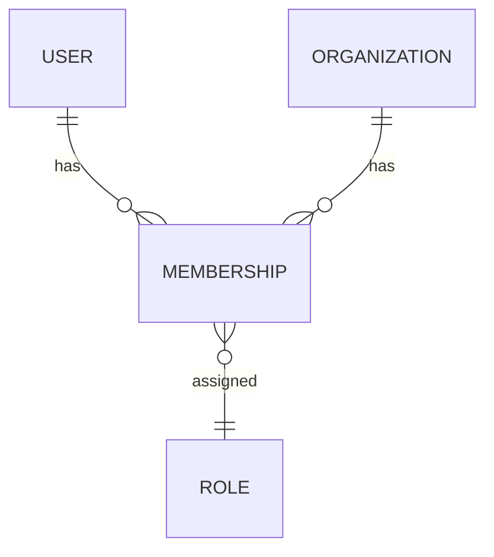
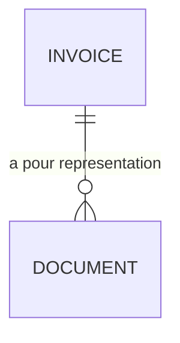
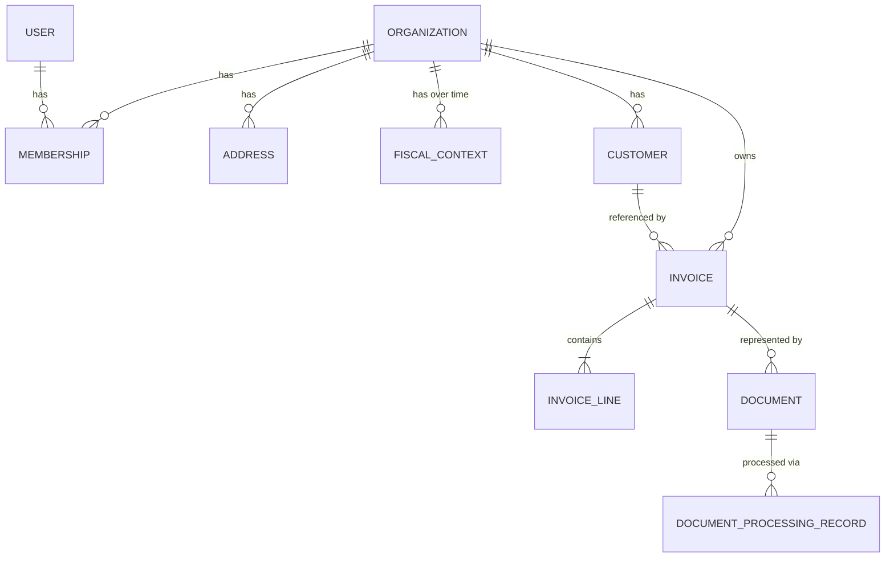
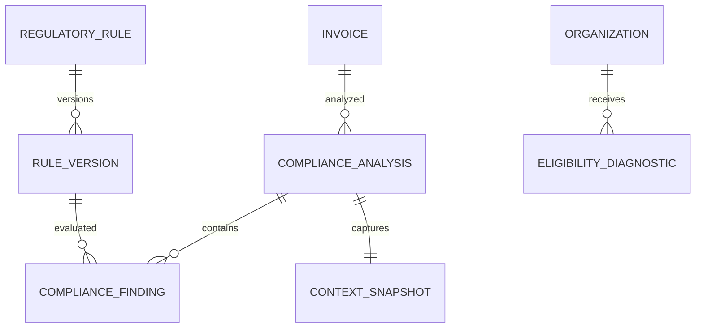
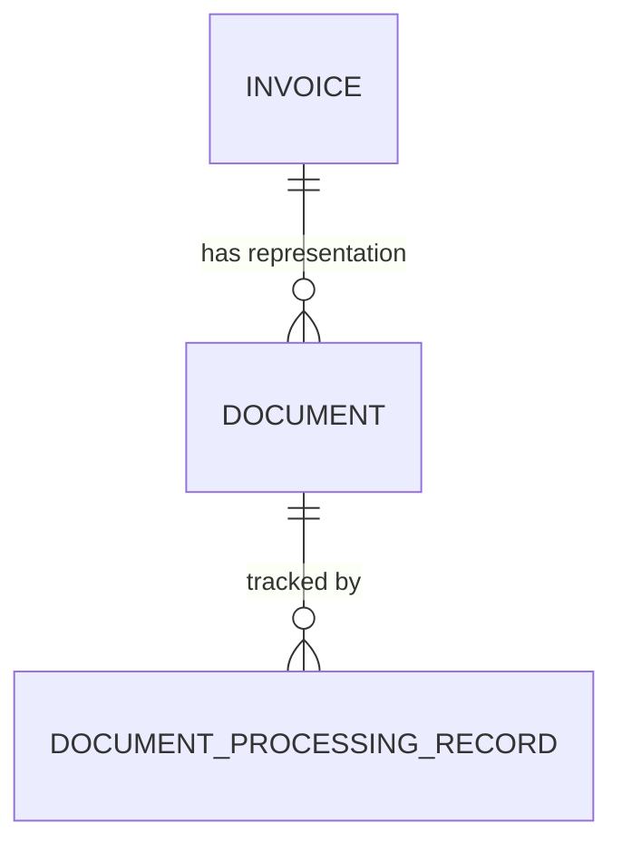
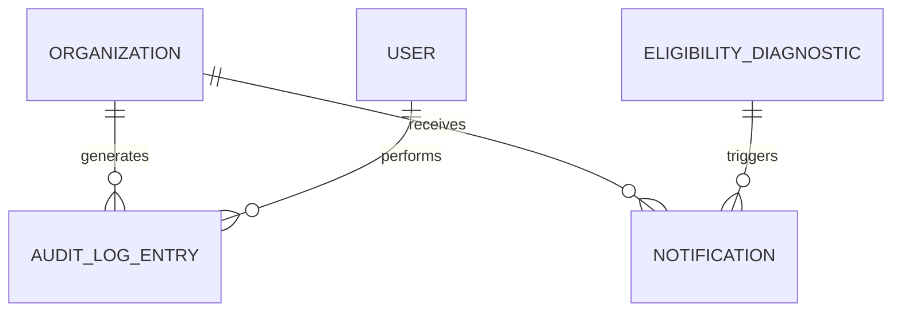

# Data Model - Assistant de conformité à la facturation électronique

> Ce document définit le modèle de données métier et logique (Domain Model + Logical Data Model) du système, à partir de `01-intent-note.md` à `06-technical-architecture.md`. Il ne définit ni schéma SQL, ni migrations, ni ORM, ni endpoints API. Toute donnée décrite ici est justifiée par un besoin exprimé dans un document précédent ; toute proposition allant au-delà d'une exigence explicite est signalée comme telle.
>
> **Stack technique retenue** (`06-technical-architecture.md`, ADR-007) : PostgreSQL comme base relationnelle unique, Symfony/Doctrine comme couche d'accès aux données côté backend. Ce document reste au niveau logique et n'en dépend pas fonctionnellement - les types conceptuels utilisés ici (`UUID`, `Decimal`, `Enum`, `JSON`) se traduisent directement en types PostgreSQL natifs (`uuid`, `numeric`, `enum` ou contrainte `CHECK`, `jsonb`) sans divergence de conception, cette traduction relevant strictement de l'implémentation (migrations Doctrine), non couverte ici.

## 1. Objectifs

Ce modèle doit permettre au système de répondre, de façon fiable et reconstructible, aux questions suivantes (reprises de la mission et directement héritées de `04-product-requirements.md` section 24 et `06-technical-architecture.md` section 10) :

- Quel était le contexte (entreprise, client, opération) d'une facture au moment de son analyse ?
- Quelles règles, et quelle version précise de ces règles, étaient applicables lors d'une analyse donnée ?
- Quel résultat le Compliance Engine a-t-il produit, et pourquoi ?
- Qui a modifié une donnée, quand, et dans quel contexte ?
- À quelle entreprise (tenant) une donnée appartient-elle, avec une garantie d'isolation stricte ?

## 2. Principes de modélisation

| Principe                                                         | Application dans ce modèle                                                                                                                                                                                                                                                                                     |
| ---------------------------------------------------------------- | -------------------------------------------------------------------------------------------------------------------------------------------------------------------------------------------------------------------------------------------------------------------------------------------------------------- |
| **Immutabilité des règles versionnées**                          | Aucune version de règle n'est modifiée en place (`06-technical-architecture.md`, ADR-003) - voir sections 15-16.                                                                                                                                                                                               |
| **Séparation identité légale / configuration / contexte fiscal** | L'entreprise n'est pas une entité monolithique - voir section 8.                                                                                                                                                                                                                                               |
| **Séparation facture métier / représentation documentaire**      | Une facture et ses documents (PDF, etc.) sont des entités distinctes - voir sections 10, 13.                                                                                                                                                                                                                   |
| **Isolation multi-tenant systématique**                          | Chaque entité tenant-scoped porte un `tenant_id` explicite, jamais implicite (`06-technical-architecture.md`, ADR-004) - voir sections 4, 25.                                                                                                                                                                  |
| **Traçabilité et snapshot du contexte**                          | Une analyse de conformité fige le contexte et les règles utilisées, indépendamment de leur évolution ultérieure - voir sections 19-21.                                                                                                                                                                         |
| **Pas de sur-normalisation ni de JSON fourre-tout**              | Les entités reflètent des concepts métier explicites (par exemple `InvoiceLine` plutôt qu'un tableau JSON de lignes) ; le JSON n'est utilisé que pour des structures dont la forme varie légitimement (conditions de règle, section 16) et jamais pour masquer une relation métier qui devrait être explicite. |
| **Distinction état courant / historique / audit**                | Trois mécanismes distincts et non interchangeables - voir section 34.                                                                                                                                                                                                                                          |
| **Modèle raisonnable pour un développeur solo**                  | Aucune entité n'est créée sans besoin direct identifié dans les documents 1 à 6 ; les ambiguïtés sont signalées plutôt que résolues arbitrairement (section 43).                                                                                                                                               |

## 3. Domaines de données

Repris directement de `06-technical-architecture.md` (section 6), avec le même principe de frontières explicites :

| Domaine           | Responsabilité                                                                                                                                      | Données possédées                                                       | Données qu'il ne modifie jamais directement                      |
| ----------------- | --------------------------------------------------------------------------------------------------------------------------------------------------- | ----------------------------------------------------------------------- | ---------------------------------------------------------------- |
| Identity & Access | Compte utilisateur, authentification                                                                                                                | User, Session                                                           | Organization, Invoice, etc.                                      |
| Organization      | Identité légale et configuration de l'entreprise                                                                                                    | Organization, FiscalContext                                             | Customer, Invoice                                                |
| Customers         | Clients associés aux factures analysées                                                                                                             | Customer                                                                | Invoice (référencée, pas possédée)                               |
| Invoicing         | Factures à des fins d'analyse (jamais d'émission)                                                                                                   | Invoice, InvoiceLine                                                    | Document (référencé), ComplianceAnalysis (référencée)            |
| Documents         | Fichiers importés et leur traitement                                                                                                                | Document, DocumentProcessingRecord                                      | Invoice (référencée)                                             |
| Compliance        | Analyse et résultats de conformité                                                                                                                  | ComplianceAnalysis, ComplianceFinding, EligibilityDiagnostic            | RegulatoryRule (référencée en lecture seule)                     |
| Regulatory Rules  | Référentiel des règles versionnées                                                                                                                  | RegulatoryRule, RuleVersion                                             | Aucune donnée tenant-scoped                                      |
| Audit             | Journal immuable des événements                                                                                                                     | AuditLogEntry                                                           | Toutes les autres entités (en lecture seule, jamais en écriture) |
| Notifications     | Rappels d'échéance                                                                                                                                  | Notification                                                            | EligibilityDiagnostic (référencé)                                |
| Integrations      | État des intégrations externes                                                                                                                      | IntegrationConfig, ExternalReference                                    | -                                                                |
| Subscription      | Abonnement et facturation du service - **non implémentée au cœur du MVP, architecture extensible prévue** (décision produit 2026) - voir section 24 | Plan, Subscription, SubscriptionStatus (futurs, non implémentés au MVP) | Organization                                                     |

## 4. Multi-tenancy

**Le Tenant est l'Organization.** Il n'existe pas d'entité `Tenant` séparée : conformément à `06-technical-architecture.md` (section 20), l'espace de données d'une entreprise cliente est directement porté par l'entité `Organization` (section 8). Chaque entité tenant-scoped référence `organization_id` comme discriminant.

- **Rattachement des utilisateurs** : un `User` est rattaché à une `Organization` via une relation `Membership` (section 5) - même si le MVP ne comporte qu'un seul rôle (`04-product-requirements.md`, section 21), cette relation explicite est nécessaire pour permettre l'évolution future vers plusieurs membres par organisation (persona secondaire C, `06-technical-architecture.md` section 39) sans refonte.
- **Rattachement des données** : toute entité tenant-scoped (Customer, Invoice, Document, ComplianceAnalysis, Notification, etc.) porte un `organization_id` non nul.
- **Données globales** (non tenant-scoped) : `RegulatoryRule` et `RuleVersion` - la réglementation ne dépend pas d'une entreprise particulière, elle est partagée par toutes les organisations (voir section 25 pour la classification complète).
- **Aucune donnée n'est partagée entre tenants** en dehors du référentiel réglementaire global.

**Garantie d'isolation** : conformément à `06-technical-architecture.md` (section 20), ce modèle pose que la vérification du `organization_id` ne doit jamais reposer sur la seule discipline d'une requête individuelle. Ce document recommande que toute entité tenant-scoped porte une contrainte de clé étrangère vers `Organization` **non nullable**, et que toute relation entre deux entités tenant-scoped (par exemple `Invoice` → `Customer`) soit accompagnée d'une contrainte garantissant que les deux entités partagent le même `organization_id` (contrainte d'intégrité, section 37) - cette garantie doit être vérifiable au niveau de la base de données elle-même, pas seulement au niveau applicatif.

## 5. Identity & Access



- **User** - compte individuel. Attributs : identifiant, email, informations d'authentification (hors périmètre de détail, voir `10-security-privacy.md`), date de création.
- **Membership** - relation entre un `User` et une `Organization`, porteuse du `Role`. **Tranché (décision produit du 21/08/2026, DEC-009)** : un `User` **peut** avoir plusieurs `Membership` - un par `Organization` à laquelle il appartient, chacun avec son propre `Role` (ex. `OWNER` d'une organisation, `COLLABORATOR` d'une autre). Question précédemment ouverte, désormais résolue par **oui** ; cohérent avec le fait qu'un `User` n'a pas de `organization_id` direct.
- **Role** - **révisé (Phase 14, DEC-009)** : trois valeurs - **`OWNER`** (contrôle complet de l'organisation), **`ADMIN`** (administration opérationnelle, sans les actions les plus sensibles réservées à `OWNER`), **`COLLABORATOR`** (usage métier courant, sans gestion d'équipe). Reste une énumération simple portée par `Membership`, pas un système RBAC complexe avec entité `Permission` séparée - la matrice de permissions (`04-product-requirements.md` section 21.1) reste codée en dur par rôle, cohérent avec le principe « ne crée pas de RBAC complexe sans justification » : trois valeurs fixes ne justifient toujours pas une table de permissions dynamique.
- **Session** - non modélisée comme entité métier dans ce document : sa nature (jeton, session serveur) relève d'une décision de sécurité renvoyée à `10-security-privacy.md`, pas du modèle de données métier.
- **Invitation** (nouvelle entité, Phase 14) - matérialise une invitation en attente (FR-TEAM-001) : `id`, `organization_id`, `email` invité, `role` proposé, `invited_by` (référence `User`), `status` (`pending`/`accepted`/`expired`/`revoked`), `created_at`, `expires_at`. Devient un `Membership` une fois acceptée ; jamais fusionnée avec `Membership` lui-même (une invitation en attente n'accorde aucun accès).
- **PlatformAdministrator** (nouvelle entité, Phase 15, ADR-009) - **structurellement séparée** de `User` : jamais un indicateur booléen sur l'entité tenant-scoped existante, cohérent avec le principe que l'isolation tenant ne doit jamais reposer sur la seule discipline du code (`06-technical-architecture.md`, section 20). Attributs : `id`, `email`, informations d'authentification propres (MFA obligatoire, `10-security-privacy.md`), `created_at`. N'a **aucune** relation avec `Organization`/`Membership` - un même individu ne peut pas être à la fois `PlatformAdministrator` et titulaire d'un `Membership` sur le même compte (identités séparées, même si la même personne physique peut légitimement posséder les deux comptes distincts).

## 6. Organization / Company

Conformément à la consigne de ne pas tout regrouper dans une seule entité, l'entreprise est modélisée en trois parties distinctes :

**Organization** (identité légale et configuration produit)
| Attribut | Type conceptuel | Justification |
|---|---|---|
| id | UUID | Identifiant technique |
| legal_name (raison sociale) | String | Nécessaire à l'identification légale |
| trade_name (nom commercial) | String, optionnel | Distinct de la raison sociale, usage courant en France |
| siren | String | Identifiant légal français, nécessaire aux vérifications de conformité (`02-regulatory-study.md` section 10) |
| siret | String, optionnel | Complément du SIREN si pertinent |
| legal_form (forme juridique) | Enum/String | Utile au contexte, non central au MVP |
| country | String | Nécessaire pour distinguer entreprise établie en France (périmètre de la réforme, `02-regulatory-study.md` section 6-7) |
| created_at | DateTime | Suivi standard |
| suspended_at | DateTime, nullable | **Nouveau (Phase 15, US-PLATFORMADMIN-002)** - renseigné par une action `PlatformAdministrator` (jamais par un `OWNER`/`ADMIN` de l'organisation elle-même). Une organisation suspendue conserve toutes ses données (jamais une suppression) mais perd l'accès applicatif pour l'ensemble de ses membres tant que ce champ est renseigné. |

**Address** (voir section 9 pour la justification de la séparation)

**FiscalContext** (contexte fiscal et réglementaire, section 7) - séparé de `Organization` car ce contexte évolue dans le temps indépendamment de l'identité légale (voir section 7).

**Décision explicite** : les « paramètres produit » (préférences d'affichage, etc.) ne sont pas modélisés ici faute de besoin identifié dans le PRD ou les User Stories au-delà de la configuration fiscale elle-même - **à compléter si `04-product-requirements.md` ou une itération future en identifie le besoin**.

## 7. Fiscal & Regulatory Context

Le Compliance Engine a besoin de connaître, à la date d'une analyse, le statut TVA et la taille de l'entreprise (`04-product-requirements.md`, FR-COMPANY-001/002 ; `02-regulatory-study.md` section 5-6). Ce contexte **peut évoluer dans le temps** (franchissement de seuil, changement de taille - limitation explicitement documentée en `04-product-requirements.md` section 28) : il est donc modélisé comme une **entité historisée**, distincte de l'entité `Organization` elle-même.

**FiscalContext**
| Attribut | Type conceptuel | Description |
|---|---|---|
| id | UUID | Identifiant technique |
| organization_id | Reference | Tenant-scoped |
| vat_status | Enum (`assujetti_redevable`, `assujetti_franchise_en_base`, `non_assujetti`) | Reflète la distinction assujetti/redevable de `02-regulatory-study.md` section 6 - cette distinction à trois valeurs, plutôt qu'un simple booléen, est nécessaire pour représenter fidèlement le cas de la franchise en base (assujetti mais non redevable) |
| employees_count | Integer | **Donnée résolue (décision produit, 2026)** - effectif salarié, l'une des trois données saisies par l'utilisateur (US-COMPANY-002, `05-user-stories.md`) pour déterminer `company_size_category` |
| annual_turnover | Decimal | Chiffre d'affaires annuel, deuxième donnée saisie |
| annual_balance_sheet_total | Decimal | Total du bilan annuel, troisième donnée saisie |
| company_size_category | Enum (`grande_entreprise_eti`, `pme_tpe_micro`) | Dérivée des trois attributs ci-dessus ; détermine la date d'obligation d'émission applicable (`02-regulatory-study.md` section 5). **Précision ajoutée en Phase 3** : cette valeur est une classification à **deux niveaux propre au calendrier de la réforme**, dérivée de la seule distinction PME/non-PME au sens INSEE (le seuil PME étant le seul dont ce produit a besoin, `02-regulatory-study.md` sections 5-6 regroupant GE et ETI sous une même date), ce n'est **pas** une restitution de la classification légale INSEE à quatre niveaux (Micro/PME/ETI/GE) ; `grande_entreprise_eti` signifie seulement « non-PME », jamais « confirmé ETI » ou « confirmé grande entreprise ». Ne jamais présenter cette valeur à l'utilisateur comme sa catégorie légale INSEE. |
| effective_from | Date | Début de validité de ce contexte |
| effective_until | Date, nullable | Fin de validité (null si contexte courant) |
| recorded_at | DateTime | Date d'enregistrement dans le système, distincte de `effective_from` |

**Point d'attention conservé du complément réglementaire (2026)** : une micro-entreprise au sens fiscal n'est pas automatiquement équivalente à la catégorie statistique « microentreprise » de l'INSEE, qui repose sur les mêmes trois critères mais avec des seuils propres - le produit doit éviter toute confusion entre ces deux notions dans son contenu pédagogique (cohérent avec `05-user-stories.md`, US-COMPANY-002).

**Invariant** : à un instant donné, une `Organization` ne doit avoir qu'un seul `FiscalContext` dont l'intervalle `[effective_from, effective_until)` couvre cet instant (contrainte d'absence de chevauchement, section 37). Chaque nouvelle version crée un nouvel enregistrement plutôt que de modifier l'existant, cohérent avec le besoin de US-COMPANY-003 (`05-user-stories.md`) : « les analyses de conformité passées conservent la trace du contexte qui était le leur ».

## 8. Customers

**Customer**
| Attribut | Type conceptuel | Description |
|---|---|---|
| id | UUID | Identifiant technique |
| organization_id | Reference | Tenant-scoped |
| customer_type | Enum (`professionnel_francais`, `particulier`, `professionnel_etranger`) | Détermine les règles applicables (e-invoicing vs e-reporting, `02-regulatory-study.md` section 7 ; US-CUSTOMER-001) |
| name (identité) | String | Nom ou raison sociale |
| siren | String, optionnel, y compris si `customer_type = professionnel_francais` | Identification légale ; **précision (plan Phase 4, décision D1)** : la formulation précédente de cette ligne ("obligatoire si professionnel_francais") était ambiguë et a entraîné une contradiction avec `08-api-specification.md` (§26) et `05-user-stories.md` (US-CUSTOMER-002) - cette dernière fait foi : une absence de SIREN n'est jamais une erreur de validation à la création du client, elle est qualifiée en `A_VERIFIER` par le Compliance Engine (Phase 5), jamais avant |
| vat_number | String, optionnel | Pertinent pour un client professionnel étranger (contexte intracommunautaire, `02-regulatory-study.md` section 7-8) |
| country | String | Nécessaire à la qualification B2B France / international |
| address_id | Reference, optionnel | Voir section 9. **Non implémenté au Phase 4** (plan Phase 4, décision D5) : aucun endpoint de cette phase n'expose `Address` (`08-api-specification.md` §26), colonne absente du schéma tant qu'un besoin réel ne l'introduit pas |
| created_at / updated_at | DateTime | Suivi standard |

**Client changeant d'information dans le temps** : contrairement au `FiscalContext` de l'organisation, le PRD et les User Stories ne documentent pas de besoin explicite de conserver un historique des changements d'un `Customer` en tant que tel - en revanche, l'exigence d'auditabilité (`04-product-requirements.md` section 24) porte sur le résultat d'analyse, pas sur l'évolution du client lui-même. **Décision confirmée (2026)** : ne pas historiser `Customer` au MVP - le snapshot déjà pris au moment de chaque analyse (section 19) suffit à garantir la traçabilité. Une historisation complète de `Customer` pourra être ajoutée ultérieurement si un besoin explicite émerge, mais n'est pas retenue pour le MVP.

## 9. Addresses

**Décision** : les adresses sont modélisées comme une **entité séparée** (`Address`), et non intégrées directement dans `Organization` ou `Customer`, pour deux raisons justifiées par les documents précédents :

1. Une organisation peut avoir une adresse de facturation distincte de son adresse légale (mention potentielle de l'adresse de livraison, `02-regulatory-study.md` section 10 - nouvelle mention obligatoire « adresse complète de livraison du bien, uniquement si elle est différente de l'adresse de facturation »).
2. Cela évite de dupliquer la structure d'adresse (rue, code postal, ville, pays) dans plusieurs entités.

**Address**
| Attribut | Type conceptuel |
|---|---|
| id | UUID |
| organization_id | Reference (tenant-scoped, une adresse appartient toujours à une organisation même si elle est utilisée par un client de cette organisation) |
| line1, line2 | String |
| postal_code | String |
| city | String |
| country | String |
| address_type | Enum (`legal`, `billing`, `delivery`) |

**Versionnement/historisation** : non retenu pour `Address` elle-même - cohérent avec la décision de la section 8 (le snapshot au niveau de l'analyse suffit à la traçabilité, section 19), plutôt qu'un versionnement de chaque adresse individuellement, qui ajouterait une complexité non justifiée par un besoin exprimé.

## 10. Invoicing

**Distinction fondamentale, rappelée depuis `06-technical-architecture.md` (section 6)** : `Invoice` représente une facture **à des fins d'analyse uniquement**, jamais un document destiné à être émis ou transmis à un client (`04-product-requirements.md`, section 7, section 30).

**Invoice**
| Attribut | Type conceptuel | Description |
|---|---|---|
| id | UUID | Identifiant technique |
| organization_id | Reference | Tenant-scoped |
| customer_id | Reference | Client associé (US-CUSTOMER-001) |
| invoice_number | String, optionnel | Numéro métier tel que présent sur le document analysé - non généré par notre système (nous n'émettons pas de facture), simplement extrait/saisi |
| issue_date | Date | Date d'émission telle qu'indiquée sur la facture analysée |
| operation_type | Enum (`vente_bien`, `prestation_service`, `mixte`) | Nouvelle mention obligatoire à vérifier (`02-regulatory-study.md` section 10) |
| currency | String | Nécessaire au calcul des montants (section 11) |
| total_amount_ht, total_amount_ttc | Decimal | Dérivés des lignes (section 11), conservés au niveau facture pour cohérence de lecture |
| status | Enum - voir section 32 | Cycle de vie de l'objet d'analyse (pas un cycle de vie d'émission) |
| source | Enum (`document_importe`, `saisie_manuelle`) | Distingue l'origine (US-INVOICE-001 vs US-INVOICE-002) |
| created_at / updated_at | DateTime | Suivi standard |

**Attributs explicitement exclus** (avec justification) : pas de champ « date d'échéance » au sens d'un suivi de paiement - hors périmètre produit (`04-product-requirements.md` section 30, pas de gestion de paiement) ; pas de champ « statut d'émission électronique via plateforme agréée » - le produit ne transmet jamais de facture (section 6 de `06-technical-architecture.md`).

## 11. Invoice Lines

**InvoiceLine**
| Attribut | Type conceptuel | Description |
|---|---|---|
| id | UUID | Identifiant technique |
| invoice_id | Reference | Facture parente |
| description | String | Désignation du bien/service (mention obligatoire préexistante) |
| quantity | Decimal | |
| unit_price_ht | Decimal | |
| vat_rate | Decimal | Taux applicable à cette ligne - nécessaire pour gérer plusieurs taux sur une même facture (section 12) |
| line_amount_ht | Decimal | |
| line_amount_vat | Decimal | |
| line_amount_ttc | Decimal | |

**Invariant** : pour chaque ligne, `line_amount_ht × vat_rate = line_amount_vat` (à une tolérance d'arrondi près, à préciser en implémentation) et `line_amount_ht + line_amount_vat = line_amount_ttc`. Au niveau de la facture, `Invoice.total_amount_ht = Σ InvoiceLine.line_amount_ht` et `Invoice.total_amount_ttc = Σ InvoiceLine.line_amount_ttc`. Ces invariants sont des règles de cohérence de saisie/extraction, **distinctes** des règles de conformité réglementaire elles-mêmes (qui sont évaluées par le Compliance Engine, section 17-18, pas encodées comme contraintes de base de données).

## 12. Taxes / VAT

Plutôt qu'une entité `Tax` séparée, la TVA est représentée **au niveau de la ligne de facture** (`InvoiceLine.vat_rate`, section 11), ce qui permet nativement de gérer plusieurs taux sur une même facture (une facture avec des lignes à 20 % et à 5,5 %, par exemple).

**VatSummary** (agrégat calculé, pas une entité stockée séparément - **proposition de modélisation, pas une exigence explicite**) : pour faciliter la vérification de conformité et l'affichage, il peut être utile de dériver, à la lecture, un récapitulatif par taux (montant HT et TVA correspondante par taux, cohérent avec les données d'e-reporting décrites en `02-regulatory-study.md` section 11). Ce récapitulatif est un **calcul dérivé des `InvoiceLine`**, pas une donnée stockée redondante, pour éviter une désynchronisation entre la source et le résumé.

**Cas d'exonération/non-assujettissement** : représenté par `vat_rate = 0` associé à une donnée qualitative sur la nature de l'exonération (attribut `vat_exemption_reason`). **Granularité résolue (décision produit)** : porté au niveau de `Invoice` (une facture a un régime/exonération global), pas au niveau de chaque `InvoiceLine`. Si la réglementation impose un jour une granularité plus fine (exonération différente selon la ligne), cet attribut pourra être dupliqué au niveau `InvoiceLine` sans remise en cause du modèle global.

**Pas de hardcoding des taux** : les taux de TVA ne sont pas une énumération fermée dans le modèle (ils peuvent varier selon les biens/services et évoluer réglementairement) - `vat_rate` est un `Decimal` libre, pas un `Enum`.

## 13. Documents

**Distinction fondamentale demandée par la mission** : une `Invoice` (facture métier, section 10) est distincte de sa ou ses représentations documentaires.



**Document**
| Attribut | Type conceptuel | Description |
|---|---|---|
| id | UUID | Identifiant technique |
| organization_id | Reference | Tenant-scoped |
| invoice_id | Reference, optionnel | Une facture peut avoir zéro document (saisie manuelle pure) ou plusieurs (par exemple, le PDF importé initialement, puis une version corrigée) |
| file_name | String | Nom du fichier tel qu'importé |
| file_format | Enum (`pdf_simple`, `facturx`, `ubl`, `cii`, `inconnu`) | Nécessaire pour US-COMPLIANCE-005 (distinction PDF simple / facture structurée) |
| file_size | Integer | Utile pour la validation (limite de taille, `06-technical-architecture.md` section 11) |
| checksum | String | Intégrité du fichier |
| storage_reference | Reference (opaque) | Pointeur vers le stockage documentaire - **le fichier lui-même n'est pas stocké en base**, cohérent avec `06-technical-architecture.md` section 21. Pour le MVP, ce pointeur résout un chemin dans le système de fichiers local du serveur (décision produit, ADR-007), toujours au travers de `StorageInterface` : la colonne reste un identifiant opaque, jamais un chemin de fichier construit directement à partir d'une donnée utilisateur (cohérent avec `10-security-privacy.md`, section 22) |
| processing_status | Enum - voir section 14 | |
| uploaded_at | DateTime | |

Le modèle ne stocke donc **jamais** le contenu binaire du fichier dans la base relationnelle : `storage_reference` est un identifiant opaque vers le stockage documentaire défini architecturalement (`06-technical-architecture.md`, section 21 - stockage local pour le MVP, ADR-007, migrable vers un stockage objet distant sans changement de ce modèle puisque `storage_reference` reste opaque quel que soit le fournisseur sous-jacent).

## 14. Document Processing

**DocumentProcessingRecord**
| Attribut | Type conceptuel | Description |
|---|---|---|
| id | UUID | |
| document_id | Reference | |
| status | Enum (`UPLOADED`, `PROCESSING`, `PARSED`, `VALIDATED`, `FAILED`) | États adaptés du gabarit de la mission, cohérents avec `06-technical-architecture.md` section 11-12 |
| started_at / completed_at | DateTime | |
| failure_reason | String, optionnel | Nécessaire pour distinguer une erreur technique d'un problème de conformité (`04-product-requirements.md` section 15) |
| extracted_data_summary | Reference ou JSON limité | Résumé de ce qui a pu être extrait, transmis ensuite au Compliance Engine sous forme d'`Invoice`/`InvoiceLine` structurées - **ce champ reste un pont technique vers l'extraction, il ne remplace jamais la structuration en `InvoiceLine`** (pour éviter l'écueil du « JSON fourre-tout » signalé dans les règles absolues) |

**Pourquoi une entité séparée de `Document`** : `Document` représente le fichier lui-même (fait une seule fois à l'upload), tandis que `DocumentProcessingRecord` peut représenter plusieurs tentatives de traitement (par exemple, un réessai après échec) - séparer les deux évite de perdre l'historique des tentatives en écrasant un unique champ `status` sur `Document`.

## 15. Compliance Rules

**RegulatoryRule** - entité **globale**, non tenant-scoped (section 25).

| Attribut     | Type conceptuel                                                                       | Description                                                                                                                             |
| ------------ | ------------------------------------------------------------------------------------- | --------------------------------------------------------------------------------------------------------------------------------------- |
| id           | UUID ou identifiant métier stable (ex. `mention-siren-client`)                        | Identifiant stable de la règle, indépendant de ses versions                                                                             |
| name         | String                                                                                | Nom lisible                                                                                                                             |
| description  | String                                                                                |                                                                                                                                         |
| category     | Enum (`mention_obligatoire`, `eligibilite`, `qualification_operation`, `format`, ...) | Catégorisation reprise de `02-regulatory-study.md` section 20 et `06-technical-architecture.md` section 9                               |
| jurisdiction | String (ex. `FR`)                                                                     | Portée géographique, utile si le produit devait un jour couvrir d'autres périmètres (non prévu au MVP mais champ peu coûteux à prévoir) |
| status       | Enum (`active`, `retired`)                                                            | Une règle peut être retirée sans que ses versions passées soient supprimées (section 34)                                                |

## 16. Rule Versions

**RuleVersion** - entité **globale**, non tenant-scoped.

| Attribut             | Type conceptuel                                                                                     | Description                                                                                                                                                                                                                                    |
| -------------------- | --------------------------------------------------------------------------------------------------- | ---------------------------------------------------------------------------------------------------------------------------------------------------------------------------------------------------------------------------------------------- |
| id                   | UUID                                                                                                | Identifiant technique de cette version précise                                                                                                                                                                                                 |
| rule_id              | Reference vers `RegulatoryRule`                                                                     |                                                                                                                                                                                                                                                |
| version_number       | Integer                                                                                             | Séquence de version au sein de la règle                                                                                                                                                                                                        |
| effective_from       | Date                                                                                                | Début de validité - cohérent avec `06-technical-architecture.md` section 10                                                                                                                                                                    |
| effective_until      | Date, nullable                                                                                      | Fin de validité                                                                                                                                                                                                                                |
| conditions           | JSON structuré                                                                                      | Contexte auquel s'applique cette règle (statut client, type d'opération, etc.) - **le JSON est justifié ici** car la nature des conditions varie selon la catégorie de règle, contrairement aux données métier structurées comme `InvoiceLine` |
| check_definition     | Reference ou JSON                                                                                   | Ce qui est vérifié - niveau de détail conceptuel uniquement, la logique d'évaluation elle-même relève de l'implémentation                                                                                                                      |
| severity             | Enum, aligné sur les états de `05-user-stories.md` section 8 (`NON_CONFORME`, `AVERTISSEMENT`, ...) | État produit en cas de non-respect                                                                                                                                                                                                             |
| source_reference     | String                                                                                              | Référence explicite vers `02-regulatory-study.md` (section et, si possible, source officielle) - exigence de traçabilité (`04-product-requirements.md` section 18)                                                                             |
| confidence_level     | Enum (`Élevé`, `Moyen`, `Faible`)                                                                   | Repris de `02-regulatory-study.md` section 26 - nécessaire pour produire l'état `INCERTAIN_REGLEMENTAIRE` (BR-COMPLIANCE-004 du PRD)                                                                                                           |
| explanation_template | String                                                                                              | Base du message pédagogique (`06-technical-architecture.md` section 9)                                                                                                                                                                         |
| created_at           | DateTime                                                                                            |                                                                                                                                                                                                                                                |

**Invariant central (ADR-003 de `06-technical-architecture.md`)** : une `RuleVersion` **n'est jamais modifiée après sa création**. Toute évolution de la règle crée une nouvelle `RuleVersion`, et la version précédente reçoit une `effective_until` correspondante. Aucune opération de mise à jour en place n'est prévue sur cette entité - seule une opération de création est possible après le premier enregistrement (au niveau applicatif, cette contrainte doit être appliquée strictement, cf. section 37).

## 17. Compliance Analysis

**ComplianceAnalysis**
| Attribut | Type conceptuel | Description |
|---|---|---|
| id | UUID | |
| organization_id | Reference | Tenant-scoped |
| invoice_id | Reference | Facture analysée |
| status | Enum (`PENDING`, `RUNNING`, `COMPLETED`, `FAILED`) | Cf. section 32 |
| triggered_at | DateTime | |
| completed_at | DateTime, optionnel | |
| global_result | Enum, dérivé des `ComplianceFinding` (section 21) | Statut global agrégé (`04-product-requirements.md` section 11) |
| context_snapshot_id | Reference vers un snapshot (section 19) | Contexte figé au moment de l'analyse |

**Une facture peut être analysée plusieurs fois** : `Invoice 1 ─── N ComplianceAnalysis`, cohérent avec US-COMPLIANCE-006 (`05-user-stories.md`) qui exige que les résultats précédent et nouveau restent tous deux consultables après une correction et une nouvelle analyse.

## 18. Compliance Findings

**ComplianceFinding**
| Attribut | Type conceptuel | Description |
|---|---|---|
| id | UUID | |
| compliance_analysis_id | Reference | |
| rule_version_id | Reference vers `RuleVersion` | **Référence la version précise**, jamais la règle en général - condition nécessaire à l'immutabilité historique (section 16) |
| result | Enum - les six états de `05-user-stories.md` section 8 (`CONFORME`, `NON_CONFORME`, `AVERTISSEMENT`, `NON_APPLICABLE`, `A_VERIFIER`, `INCERTAIN_REGLEMENTAIRE`) | |
| message | String | Message pédagogique produit, dérivé de `RuleVersion.explanation_template` mais figé au moment de l'analyse (voir invariant ci-dessous) |
| related_field | String, optionnel | Champ de la facture concerné (ex. `customer.siren`) |
| observed_value | String, optionnel | Valeur observée ayant mené au résultat, utile à l'explication |
| correction_action | String | Action de correction concrète proposée (FR-COMPLIANCE-003 du PRD) |

**Invariant** : `message` et `correction_action` sont **copiés/figés** au moment de la création du `ComplianceFinding`, pas recalculés dynamiquement à partir de `RuleVersion` à chaque consultation - cette redondance apparente est nécessaire pour garantir que le texte affiché à l'utilisateur reste identique dans le temps même si la règle globale (et son `explanation_template`) évolue par ailleurs (cohérence avec le principe d'immutabilité historique, section 16, ADR-003 de `06-technical-architecture.md`). C'est un choix délibéré de **redondance contrôlée**, justifié par l'exigence d'auditabilité, à ne pas confondre avec une sur-normalisation évitable.

**Équivalence de nomenclature avec l'architecture du Compliance Engine (décision produit, 2026)** : l'architecture conceptuelle du moteur de règles (`Rule Registry`, `Rule Versions`, `Rule Evaluators`, `Context Builder`, `Evaluation Engine`, `Findings`) désigne parfois ce même mécanisme sous les noms `ComplianceRule`, `ComplianceRuleVersion`, `ComplianceEvaluation`. Ce modèle **ne duplique pas** ces entités : elles correspondent respectivement à `RegulatoryRule` (section 15), `RuleVersion` (section 16), et à la combinaison `ComplianceAnalysis`/`ComplianceFinding` (sections 17-18) déjà définies ici. Les champs conceptuels attendus sont présents, avec des écarts de nommage **assumés** plutôt qu'un renommage rétroactif de ce document :

- `id`/`code`/`name`/`description`/`category`/`severity`/`legal_reference` (côté `ComplianceRule`) : `RegulatoryRule.id` sert à la fois d'identifiant stable et de `code` métier (section 32) ; `name`, `description`, `category` sont directement présents (section 15). `severity` et `legal_reference` (`source_reference`) sont en revanche portés par `RuleVersion` plutôt que par `RegulatoryRule` - écart assumé, car la sévérité et la référence légale précise peuvent évoluer d'une version à l'autre d'une même règle, ce qui serait perdu si ces champs étaient figés au niveau de la règle globale.
- `version`/`effective_from`/`effective_to`/`status`/`configuration` (côté `ComplianceRuleVersion`) : `RuleVersion.version_number`, `effective_from`, `effective_until` correspondent directement (section 16) ; `conditions`/`check_definition` jouent le rôle de `configuration`. Il n'existe pas de champ `status` distinct sur `RuleVersion` elle-même - le statut effectif d'une version se déduit de son intervalle de validité et du `status` (`active`/`retired`) de la `RegulatoryRule` parente (section 15) - équivalence fonctionnelle assumée plutôt qu'un champ dupliqué.
- `rule_version_id`/`invoice_id`/`result`/`evaluated_at` (côté `ComplianceEvaluation`) : correspond à la combinaison de `ComplianceFinding.rule_version_id`/`result` (section 18) et de `ComplianceAnalysis.invoice_id`/`triggered_at` (section 17) - `invoice_id` et la date d'évaluation ne sont pas répétés sur chaque `ComplianceFinding` afin d'éviter une redondance non justifiée, ces informations étant déjà portées par la `ComplianceAnalysis` parente.

## 19. Snapshots et données historiques

**Question posée par la mission** : si les données de l'entreprise ou du client changent demain, pouvons-nous toujours comprendre le résultat d'une analyse effectuée hier ?

**Réponse retenue** : oui, via un mécanisme de **snapshot au niveau de chaque `ComplianceAnalysis`**, plutôt qu'un versionnement complet de chaque entité (`Organization`, `Customer`) qui serait disproportionné au regard des besoins identifiés.

**ContextSnapshot**
| Attribut | Type conceptuel | Description |
|---|---|---|
| id | UUID | |
| compliance_analysis_id | Reference (1:1) | |
| fiscal_context_id | Reference vers le `FiscalContext` applicable à la date de l'analyse | Référencé, pas copié - `FiscalContext` est déjà historisé et immuable pour une période donnée (section 7), donc une référence suffit à garantir la traçabilité |
| customer_snapshot | JSON structuré, copie figée des attributs pertinents du `Customer` au moment de l'analyse (type, SIREN, pays) | **Copié**, car `Customer` n'est pas historisé (décision de la section 8) - c'est ici que la traçabilité du client est garantie |
| invoice_snapshot_reference | Reference vers `Invoice`/`InvoiceLine` | Référencé et non copié : une `Invoice` déjà analysée ne devrait pas être modifiable arbitrairement après analyse (voir invariant, section 28) - la référence directe est donc sûre |

**Ce qui est référencé vs copié, et pourquoi** :

- `FiscalContext` → **référencé** (déjà historisé et immuable par construction, section 7).
- `RuleVersion` (via `ComplianceFinding`, section 18) → **référencé** (déjà immuable par construction, section 16).
- `Customer` → **copié** (`customer_snapshot`), car non historisé (section 8) et donc potentiellement modifiable après l'analyse.
- `Invoice`/`InvoiceLine` → **référencés**, sous réserve de l'invariant de non-modification après analyse (section 28) qui rend la référence directe équivalente à une copie figée.

Cette approche différenciée évite de dupliquer systématiquement toutes les données (ce qui serait coûteux et redondant) tout en garantissant la traçabilité complète, en s'appuyant sur l'immutabilité déjà garantie ailleurs dans le modèle chaque fois que c'est possible, et en ne copiant que ce qui n'est pas déjà protégé par une autre garantie.

## 20. Audit Log

**AuditLogEntry** - journal **append-only** (jamais de modification ou suppression), cohérent avec `06-technical-architecture.md` section 22.

| Attribut                | Type conceptuel                                                                                                             | Description                                                                                                                               |
| ----------------------- | --------------------------------------------------------------------------------------------------------------------------- | ----------------------------------------------------------------------------------------------------------------------------------------- |
| id                      | UUID                                                                                                                        |                                                                                                                                           |
| organization_id         | Reference, nullable                                                                                                         | Nullable pour couvrir les événements globaux (par exemple, création d'une nouvelle `RuleVersion`, qui n'appartient à aucune organisation) |
| actor_type              | Enum (`user`, `system`)                                                                                                     | Distingue une action utilisateur d'une action automatique (par exemple, une notification déclenchée par le système)                       |
| actor_id                | Reference, nullable                                                                                                         | `User.id` si `actor_type = user`                                                                                                          |
| event_type              | Enum (ex. `login`, `organization_updated`, `invoice_created`, `compliance_analysis_completed`, `rule_version_created`, ...) |                                                                                                                                           |
| entity_type / entity_id | String / Reference                                                                                                          | Entité concernée                                                                                                                          |
| previous_state          | JSON, optionnel                                                                                                             | Uniquement pour les événements de modification, pas pour les créations                                                                    |
| new_state               | JSON, optionnel                                                                                                             |                                                                                                                                           |
| occurred_at             | DateTime                                                                                                                    |                                                                                                                                           |

**Stratégie retenue, sans copie complète de la base à chaque modification** : `previous_state`/`new_state` ne contiennent que les **champs effectivement modifiés** (delta), pas une copie intégrale de l'entité - une stratégie raisonnable qui limite le volume de ce journal (section 41) tout en conservant la capacité de répondre à « qui a modifié quoi ». **Granularité résolue (décision produit)** : le delta complet (`previous_state`/`new_state`) n'est capturé que pour les opérations critiques - modification de facture, modification d'entreprise, création/modification d'utilisateur, changement de permission, création de règle, suppression, déclenchement d'analyse - pas pour chaque `UPDATE` indifféremment. Pour les événements de conformité eux-mêmes (`compliance_analysis_completed`), l'`AuditLogEntry` référence l'analyse plutôt que de dupliquer son contenu, ce dernier étant déjà conservé de façon immuable par construction (sections 17-19).

## 21. Notifications

**Notification** - **étendue en Phase 14/15** pour porter, au-delà du rappel système déjà
modélisé au MVP, une notification composée par un humain (`OWNER`/`ADMIN` d'organisation ou
`PlatformAdministrator`). Champs `sender_type`/`sender_id` et `target_type`/`target_criteria`
**conçus dès la Phase 14** avec l'ensemble des valeurs déjà prévues (y compris celles
utilisables seulement à partir de la Phase 15), pour éviter une migration de schéma cassante
entre les deux phases.

| Attribut | Type conceptuel | Description |
|---|---|---|
| id | UUID | |
| organization_id | Reference, **nullable** | Tenant-scoped pour une notification système ou d'organisation ; **null** pour une notification émise par un `PlatformAdministrator` (portée cross-tenant, jamais rattachée à une seule organisation) |
| recipient_user_id | Reference, nullable | Rempli uniquement quand `target_type = USER` ou lors de l'éclatement d'une notification à portée `ORGANIZATION_MEMBERS`/`SEGMENT`/`ALL` en une ligne par destinataire effectif (choix d'implémentation à confirmer : éclatement immédiat vs résolution différée à l'envoi) |
| notification_type | Enum (`echeance_obligation`, `message_organisation`, `message_plateforme`, ...) | Étendu en Phase 14 (`message_organisation`) et Phase 15 (`message_plateforme`) - les types Future de la section 19 du PRD restent non engagés |
| sender_type | Enum (`SYSTEM`, `ORGANIZATION_OWNER`, `PLATFORM_ADMIN`) | **Nouveau (Phase 14)**. `SYSTEM` pour les rappels automatiques déjà existants ; `ORGANIZATION_OWNER` pour un `OWNER`/`ADMIN` notifiant son équipe (Phase 14) ; `PLATFORM_ADMIN` réservé à la Phase 15 |
| sender_id | Reference, nullable | `User.id` ou `PlatformAdministrator.id` selon `sender_type` ; null si `sender_type = SYSTEM` |
| target_type | Enum (`USER`, `ORGANIZATION_MEMBERS`, `SEGMENT`, `ALL`) | **Nouveau (Phase 14 : `USER`/`ORGANIZATION_MEMBERS` utilisables ; Phase 15 : `SEGMENT`/`ALL` utilisables)** - énumération complète posée dès la Phase 14 pour éviter une migration ultérieure |
| target_criteria | JSON structuré, nullable | Rempli uniquement si `target_type = SEGMENT` (Phase 15) - critères réutilisant les champs déjà modélisés sur `FiscalContext` (statut TVA, catégorie de taille), jamais un champ dupliqué |
| channel | Enum (`email`, `in_app`) | `in_app` ajouté en Phase 14 - une notification composée par un humain n'a pas nécessairement besoin d'un envoi email pour être utile |
| status | Enum (`pending`, `sent`, `failed`) | |
| source_diagnostic_id | Reference vers `EligibilityDiagnostic` (voir ci-dessous), nullable | Rempli uniquement pour `notification_type = echeance_obligation` |
| scheduled_for | DateTime | |
| sent_at | DateTime, optionnel | |

**EligibilityDiagnostic** (entité portant le résultat de US-COMPLIANCE-001, distincte d'un `ComplianceAnalysis` qui porte sur une facture précise, confirmée et implémentée en Phase 3, voir section 43) :
| Attribut | Type conceptuel | Description |
|---|---|---|
| id | UUID | |
| organization_id | Reference | Tenant-scoped |
| fiscal_context_id | Reference | Contexte utilisé pour ce diagnostic |
| reception_obligation_date | Date, **nullable** | Date à partir de laquelle l'organisation est concernée par l'obligation de réception. **Null signifie que l'organisation est hors du périmètre de la réforme** (`vat_status = non_assujetti`, `02-regulatory-study.md` section 6), ce n'est jamais une absence de calcul |
| emission_obligation_date | Date, **nullable** | Idem pour l'émission, même sémantique du `null` |
| explanation | String | **Ajouté en Phase 3** (corrige une incohérence avec `08-api-specification.md` section 29, dont l'exemple de réponse l'incluait déjà alors que cette section l'omettait). C'est un **snapshot capturé au moment du calcul**, jamais recalculé dynamiquement à partir de la `RuleVersion` courante lors d'une consultation ultérieure : un diagnostic déjà produit doit rester fidèle à l'explication qui correspondait aux règles actives au moment de son calcul, la même garantie que `06-technical-architecture.md` section 10 impose à un `ComplianceFinding` |
| franchise_rule_version_id | Reference vers `RuleVersion` | **Ajouté en Phase 3** : version de la règle d'assujettissement/franchise en base effectivement utilisée |
| calendar_rule_version_id | Reference vers `RuleVersion` | **Ajouté en Phase 3** : version de la règle de calendrier par taille effectivement utilisée |
| computed_at | DateTime | |

## 22. External Integrations

**IntegrationConfig**
| Attribut | Type conceptuel | Description |
|---|---|---|
| id | UUID | |
| organization_id | Reference, nullable | Nullable si l'intégration est globale (ex. fournisseur IA, non spécifique à une organisation) |
| provider_type | Enum (`ai_provider`, `email_provider`, `storage_provider`, `company_verification_provider`) | Aligné sur les catégories de `06-technical-architecture.md` section 16-17 |
| status | Enum (`active`, `inactive`, `error`) | |
| last_synchronized_at | DateTime, optionnel | Pertinent surtout pour la vérification d'entreprise (V1, non bloquant) |
| last_error | String, optionnel | |

**Exigence de sécurité, signalée sans être détaillée ici** : aucun secret (clé d'API, identifiant d'accès à un fournisseur externe) n'est stocké comme un champ texte en clair dans `IntegrationConfig`. Le modèle prévoit un champ `secret_reference` (référence opaque vers un mécanisme de gestion de secrets externe à la base de données), dont le détail d'implémentation relève strictement de `10-security-privacy.md`.

**AiCallLogEntry** (nouvelle entité, Phase 15) - jusqu'ici, le volume/coût des appels IA n'était mentionné que documentairement (`06-technical-architecture.md`, section 15) sans être persisté ; nécessaire à `US-PLATFORMADMIN-005` (santé applicative) et `US-ANALYTICS-001` (statistiques d'usage).
| Attribut | Type conceptuel | Description |
|---|---|---|
| id | UUID | |
| organization_id | Reference | Tenant-scoped - permet une agrégation par organisation si nécessaire |
| endpoint | Enum (`explanation`, `assistant_question`) | Les deux endpoints IA existants (`06-technical-architecture.md` section 15) |
| succeeded | Boolean | Distingue un appel réussi d'un repli vers `explanation_template` non reformulé (jamais un échec silencieux non tracé) |
| estimated_cost | Decimal, optionnel | Estimation du coût, jamais un montant facturé réel (le fournisseur IA reste l'autorité de facturation) |
| created_at | DateTime | |

Ne contient **jamais** le contenu du prompt ni la réponse générée (cohérent avec l'audit existant de l'IA, `06-technical-architecture.md` section 15 : « sans jamais persister le prompt ni le texte généré ») - uniquement des métadonnées d'usage agrégables.

## 23. External References

**ExternalReference**
| Attribut | Type conceptuel | Description |
|---|---|---|
| id | UUID | |
| internal_entity_type | String (ex. `Organization`, `Invoice`) | |
| internal_entity_id | Reference | |
| provider | String (ex. nom d'une plateforme agréée ou d'un outil de validation Factur-X tiers) | |
| external_id | String | Identifiant côté fournisseur |
| created_at | DateTime | |

**Justification** : ce mécanisme n'est **pas nécessaire au MVP** (aucune intégration technique active au MVP, `06-technical-architecture.md` section 16 : les intégrations avec plateformes agréées ou outils de validation Factur-X sont explicitement en Future Scope). Il est néanmoins modélisé ici de façon minimale, car son absence rendrait coûteuse une intégration future (cohérent avec l'architecture provider-agnostic, `06-technical-architecture.md` section 17). **Cette entité n'a donc aucune utilisation au MVP** et ne doit pas être implémentée avant qu'une intégration concrète ne le justifie.

## 24. Subscription & Billing

**Non implémenté dans le cœur du MVP, mais architecture extensible prévue.** Le PRD retient désormais une orientation provisoire - **Freemium** (`04-product-requirements.md`, section 32) - encore soumise à validation marché (`03-market-analysis.md`, section 23). Ce document prépare une architecture extensible sans l'implémenter au MVP : `Plan`, `Subscription`, `SubscriptionStatus` comme entités futures, sans intégration à un fournisseur de paiement (type Stripe) à ce stade - non nécessaire tant que l'offre gratuite/Pro n'est pas activement commercialisée. Cette architecture sera détaillée dans une révision ultérieure de ce document, une fois le modèle économique confirmé par les tests utilisateurs.

## 25. Entités globales vs tenant-scoped

| Entité                   | Portée                                                       | Justification                                                                                |
| ------------------------ | ------------------------------------------------------------ | -------------------------------------------------------------------------------------------- |
| User                     | Ni globale ni directement tenant-scoped                      | Rattachée à une ou plusieurs organisations via `Membership` (section 5)                      |
| Membership               | Tenant-scoped                                                | Relie un `User` à une `Organization` précise                                                 |
| Organization             | Tenant racine                                                | C'est le tenant lui-même (section 4)                                                         |
| Address                  | Tenant-scoped                                                | Appartient à une `Organization`                                                              |
| FiscalContext            | Tenant-scoped                                                | Appartient à une `Organization`                                                              |
| Customer                 | Tenant-scoped                                                | Appartient à une `Organization`                                                              |
| Invoice                  | Tenant-scoped                                                |                                                                                              |
| InvoiceLine              | Tenant-scoped (via `Invoice`)                                |                                                                                              |
| Document                 | Tenant-scoped                                                |                                                                                              |
| DocumentProcessingRecord | Tenant-scoped (via `Document`)                               |                                                                                              |
| RegulatoryRule           | **Globale**                                                  | La réglementation française s'applique identiquement à toutes les organisations (section 15) |
| RuleVersion              | **Globale**                                                  | Idem                                                                                         |
| ComplianceAnalysis       | Tenant-scoped                                                |                                                                                              |
| ComplianceFinding        | Tenant-scoped (via `ComplianceAnalysis`)                     |                                                                                              |
| ContextSnapshot          | Tenant-scoped (via `ComplianceAnalysis`)                     |                                                                                              |
| EligibilityDiagnostic    | Tenant-scoped                                                |                                                                                              |
| AuditLogEntry            | Tenant-scoped, nullable pour événements globaux (section 20) |                                                                                              |
| Notification             | Tenant-scoped, `organization_id` **nullable** (section 21)   | Null pour une notification `PLATFORM_ADMIN` (portée cross-tenant)                            |
| IntegrationConfig        | Globale ou tenant-scoped selon le type (section 22)          |                                                                                              |
| ExternalReference        | Suit l'entité référencée                                     | Non utilisée au MVP (section 23)                                                             |
| Invitation               | Tenant-scoped                                                | **Nouveau (Phase 14)** - appartient à une `Organization`                                     |
| PlatformAdministrator    | **Globale, hors modèle tenant** (Phase 15, ADR-009)          | N'appartient à aucune `Organization` - jamais soumise au `TenantFilter`                       |
| AiCallLogEntry           | Tenant-scoped                                                | **Nouveau (Phase 15)** - agrégée en lecture cross-tenant par `PlatformAdministrator`, jamais écrite depuis ce rôle |

## 26. Relationships & Cardinalities

```text
Organization    1 --- N Membership
User            1 --- N Membership          (un User peut appartenir a plusieurs Organization, Phase 14, DEC-009)
Organization    1 --- N Invitation          (Phase 14)
Organization    1 --- N Address
Organization    1 --- N FiscalContext           (historise dans le temps)
Organization    1 --- N Customer
Organization    1 --- N Invoice
Organization    1 --- N Document
Organization    1 --- N Notification
Organization    1 --- N AuditLogEntry
Organization    1 --- 0..1 EligibilityDiagnostic courant (N dans le temps si redeclenche)

Customer        1 --- N Invoice
Invoice         1 --- N InvoiceLine
Invoice         1 --- N Document
Invoice         1 --- N ComplianceAnalysis

ComplianceAnalysis  1 --- N ComplianceFinding
ComplianceAnalysis  1 --- 1 ContextSnapshot

RegulatoryRule  1 --- N RuleVersion
RuleVersion     1 --- N ComplianceFinding

Document        1 --- N DocumentProcessingRecord
```

Aucune relation N:N n'a été identifiée comme nécessaire par les documents précédents : les relations les plus complexes du domaine (facture ↔ règles) transitent toujours par une entité intermédiaire porteuse de sens métier (`ComplianceFinding`), jamais par une simple table de jointure sans attribut propre.

## 27. Aggregates

| Agrégat                | Root entity        | Entités internes                   | Invariants principaux                                                                               | Frontière transactionnelle                                                                                     |
| ---------------------- | ------------------ | ---------------------------------- | --------------------------------------------------------------------------------------------------- | -------------------------------------------------------------------------------------------------------------- |
| **Organization**       | Organization       | Address, FiscalContext             | Un seul `FiscalContext` actif à un instant donné (section 7)                                        | La création/modification du contexte fiscal est une opération atomique indépendante de la création de factures |
| **Invoice**            | Invoice            | InvoiceLine                        | Cohérence des montants HT/TVA/TTC (section 11)                                                      | Création d'une facture + ses lignes = une seule transaction (section 40)                                       |
| **ComplianceAnalysis** | ComplianceAnalysis | ComplianceFinding, ContextSnapshot | Chaque Finding référence une RuleVersion existante ; le ContextSnapshot est créé avant tout Finding | Analyse + Findings + Snapshot + entrée d'audit = une seule transaction logique (section 40)                    |
| **RegulatoryRule**     | RegulatoryRule     | RuleVersion                        | Pas de chevauchement de périodes de validité entre versions d'une même règle                        | Création d'une nouvelle version = opération atomique, ne modifie jamais les versions existantes                |
| **Document**           | Document           | DocumentProcessingRecord           | Le statut du document le plus récent reflète le dernier `DocumentProcessingRecord`                  | Chaque tentative de traitement est une transaction indépendante                                                |

Cette décomposition est cohérente avec `06-technical-architecture.md` (section 6-8) : chaque agrégat correspond à un module ou groupe de modules aux frontières explicites.

## 28. Business Invariants

**Invoice**

- **Résolu (décision produit)** : une `Invoice` dont au moins une `ComplianceAnalysis` a été réalisée peut être modifiée (lignes, client, montants), mais toute modification pertinente pour la conformité fait automatiquement passer son statut de `ANALYZED` à `ANALYSIS_STALE` (section 29) - jamais une modification silencieuse laissant un résultat de conformité associé à des données qui ne correspondent plus à la facture actuelle. Aucune nouvelle `Invoice` n'est créée à cette occasion : l'entité reste la même, seul son statut change.
- `(organization_id, invoice_number)` est **unique lorsque `invoice_number` est renseigné** - contrainte bloquante (décision produit, résout la question ouverte précédente de la section 43 ; voir aussi section 34).
- `Σ InvoiceLine.line_amount_ht = Invoice.total_amount_ht` (section 11).

**InvoiceLine**

- `quantity > 0`.
- Cohérence des montants (section 11).

**ComplianceAnalysis**

- Chaque `ComplianceFinding` doit référencer une `RuleVersion` existante et valide à la date de l'analyse (`effective_from ≤ triggered_at < effective_until` ou `effective_until` nul) - jamais une règle expirée ou pas encore en vigueur à cette date.
- Une analyse doit toujours posséder un `ContextSnapshot` associé (invariant 1:1, section 19) : aucune analyse sans contexte figé ne doit exister, conformément à l'exigence d'auditabilité.
- `A_VERIFIER` ne peut jamais être produit comme résultat par défaut d'une erreur technique (distinction stricte avec `DocumentProcessingRecord.status = FAILED`, section 14) - cet invariant reprend directement BR-COMPLIANCE-003 du PRD.

**RuleVersion**

- Immutabilité après création (section 16, ADR-003).
- Absence de chevauchement de `[effective_from, effective_until)` pour des versions d'une même `RegulatoryRule`.

**Multi-tenancy**

- Aucune relation entre deux entités tenant-scoped ne doit traverser deux `organization_id` différents (par exemple, une `Invoice` ne peut référencer qu'un `Customer` de la même `Organization`) - invariant transversal à garantir au niveau base de données autant que possible (section 37).

**Organization (Phase 15)**

- `suspended_at` ne peut être renseigné/retiré que par une action `PlatformAdministrator`, jamais par un `OWNER`/`ADMIN` de l'organisation elle-même (US-PLATFORMADMIN-002) - toute écriture de ce champ doit être journalisée dans l'audit trail cross-tenant.

**Membership / PlatformAdministrator (Phase 14-15)**

- Un compte `PlatformAdministrator` ne possède jamais de `Membership` associé au même identifiant de connexion - identités structurellement séparées (ADR-009), jamais un simple rôle supplémentaire sur `User`.
- Un `ADMIN` ne peut jamais modifier le rôle d'un `OWNER` ni le retirer de l'organisation (matrice de permissions, `04-product-requirements.md` section 21.1) - invariant à garantir au niveau de la couche d'autorisation, pas seulement de l'interface.

## 29. States & Transitions

**Invoice**

```text
DRAFT (saisie manuelle en cours ou document en cours de traitement)
   ↓
READY_FOR_ANALYSIS (données suffisantes pour lancer une analyse)
   ↓
ANALYZED (au moins une analyse complétée)
   ↓ (modification d'une donnée de la facture après analyse)
ANALYSIS_STALE (résultat de conformité existant mais obsolète)
   ↓ (nouvelle analyse lancée)
ANALYZED (nouveau résultat)
```

**Décision produit (résout la question ouverte précédente de la section 43)** : une `Invoice` modifiée après une première analyse **ne crée jamais une nouvelle facture ni une nouvelle version d'`Invoice`** - elle reste la même entité, mais son statut passe explicitement à `ANALYSIS_STALE` dès qu'une donnée pertinente pour la conformité (client, ligne, montant, nature de l'opération) est modifiée. Ce statut est distinct de `ANALYZED` : il indique que le dernier résultat de conformité disponible ne reflète plus l'état actuel de la facture, sans supprimer ce résultat (qui reste consultable dans l'historique, cohérent avec l'auditabilité, `04-product-requirements.md` section 24). L'utilisateur doit relancer une analyse pour faire repasser la facture à `ANALYZED` avec un résultat à jour (US-COMPLIANCE-006bis, `05-user-stories.md`).

Transitions interdites : passage direct de `ANALYZED` ou `ANALYSIS_STALE` à `DRAFT` (aucune régression du cycle de vie).

> **Écart assumé par rapport au gabarit de la mission** : le gabarit proposait des états `VALIDATED`/`ISSUED`/`CANCELLED`, qui reflètent un cycle de vie d'émission de facture. Ce cycle de vie n'existe pas dans notre produit (`Invoice` n'est jamais émise, section 10) : les états retenus reflètent donc un cycle de vie **d'analyse**, pas d'émission, ce qui est cohérent avec le périmètre strict du PRD (section 7 et 30).

**Document** (`DocumentProcessingRecord.status`, section 14)

```text
UPLOADED → PROCESSING → PARSED → VALIDATED
                      ↘ FAILED
```

`FAILED` est un état terminal pour une tentative donnée ; un nouvel enregistrement `DocumentProcessingRecord` peut être créé pour une nouvelle tentative sur le même `Document` (section 14).

**ComplianceAnalysis**

```text
PENDING → RUNNING → COMPLETED
                   ↘ FAILED
```

`FAILED` ici désigne un échec **technique** de l'analyse elle-même (par exemple, une erreur du moteur), distinct d'un résultat `NON_CONFORME` qui est une issue normale de `COMPLETED` - distinction cruciale reprise de `06-technical-architecture.md` (section 25, Business Error / Technical Error / Compliance Result).

## 30. Soft Delete & Deletion

| Entité                                | Suppression physique ou logique ?                                                                                                                                         | Justification                                                                                                                                                                                                                                                                                                                                                                                                                                                            |
| ------------------------------------- | ------------------------------------------------------------------------------------------------------------------------------------------------------------------------- | ------------------------------------------------------------------------------------------------------------------------------------------------------------------------------------------------------------------------------------------------------------------------------------------------------------------------------------------------------------------------------------------------------------------------------------------------------------------------ |
| User                                  | Logique (soft delete)                                                                                                                                                     | Nécessaire pour conserver l'intégrité référentielle de l'`AuditLogEntry` (`actor_id`) après suppression d'un compte (US-SETTINGS-002, `05-user-stories.md`) - **implémenté Phase 13** (`User.deleted_at`, `DELETE /users/current`)                                                                                                                                                                                                                                     |
| Customer                              | Logique                                                                                                                                                                   | Un `ComplianceFinding` peut référencer indirectement (via `ContextSnapshot.customer_snapshot`, déjà copié) des informations client ; la suppression logique de `Customer` n'affecte pas cette traçabilité déjà garantie par le snapshot                                                                                                                                                                                                                                  |
| Invoice                               | Logique                                                                                                                                                                   | Une suppression physique casserait la traçabilité des `ComplianceAnalysis` associées                                                                                                                                                                                                                                                                                                                                                                                     |
| Document                              | **Physique pour le fichier stocké et pour les données extraites contenant des données personnelles/sensibles devenues inutiles ; logique pour les métadonnées restantes** | **Résolu (décision produit)** : cohérent avec `06-technical-architecture.md` (section 27) : la suppression du fichier source (US-DOCUMENT-002) supprime également `DocumentProcessingRecord.extracted_data_summary` lorsque celui-ci contient des données personnelles ou sensibles devenues inutiles, tout en conservant l'enregistrement d'audit et le contenu déjà extrait et figé dans `ComplianceFinding`/`ContextSnapshot`, suffisant pour la traçabilité minimale |
| ComplianceAnalysis, ComplianceFinding | **Jamais supprimées**                                                                                                                                                     | Exigence d'auditabilité non négociable (`04-product-requirements.md` section 24)                                                                                                                                                                                                                                                                                                                                                                                         |
| AuditLogEntry                         | **Jamais supprimée**                                                                                                                                                      | Par nature (append-only, section 20)                                                                                                                                                                                                                                                                                                                                                                                                                                     |
| RegulatoryRule, RuleVersion           | **Jamais supprimées** (une règle peut être `retired`, mais son historique reste)                                                                                          | Nécessaire pour l'explicabilité des résultats historiques                                                                                                                                                                                                                                                                                                                                                                                                                |

**Principe général** : le soft delete n'est pas appliqué systématiquement - il est réservé aux entités dont la suppression physique casserait une garantie de traçabilité déjà posée ailleurs dans ce document. Les entités purement globales de configuration (par exemple `IntegrationConfig`) peuvent être supprimées physiquement sans conséquence sur l'audit métier.

## 31. Historization

Trois mécanismes distincts, à ne pas confondre :

| Mécanisme                                               | Ce qu'il capture                                                                                        | Exemple dans ce modèle                                  |
| ------------------------------------------------------- | ------------------------------------------------------------------------------------------------------- | ------------------------------------------------------- |
| **État courant**                                        | La donnée telle qu'elle est maintenant                                                                  | `Organization`, `Customer` (hors historique explicite)  |
| **Historique métier** (entité versionnée dans le temps) | L'évolution d'une donnée dont les valeurs passées ont un sens métier direct                             | `FiscalContext` (section 7), `RuleVersion` (section 16) |
| **Audit**                                               | Qui a fait quoi et quand, à des fins de traçabilité technique et de conformité                          | `AuditLogEntry` (section 20)                            |
| **Snapshot**                                            | Une copie figée du contexte au moment d'un événement précis, pour garantir l'explicabilité a posteriori | `ContextSnapshot` (section 19)                          |

Ces quatre notions répondent à des besoins différents et ne se substituent pas l'une à l'autre : l'historique métier (`FiscalContext`) permet de savoir _quel était le contexte fiscal à une date donnée_ de façon interrogeable indépendamment de toute analyse ; le snapshot (`ContextSnapshot`) permet de savoir _quel contexte a été utilisé pour une analyse précise_, même si ce contexte n'existe plus sous cette forme aujourd'hui ; l'audit permet de savoir _qui a déclenché quoi_, indépendamment du contenu métier lui-même.

## 32. Identifier Strategy

**Identifiant technique** : UUID pour toutes les entités, choix justifié par le contexte multi-tenant (évite les collisions ou la prévisibilité d'identifiants séquentiels entre organisations, cohérent avec l'exigence d'isolation stricte, section 4) et par la nature distribuée potentielle du système à terme (section 33 de `06-technical-architecture.md`, chemin de scalabilité).

**Identifiant métier**, distinct de l'identifiant technique :

```text
Invoice
├── id                → UUID, identifiant technique
└── invoice_number    → String, numéro tel qu'il figure sur le document analysé (métier, non généré par le système)

RegulatoryRule
├── id                → identifiant métier stable (ex. "mention-siren-client"), car cette entité est globale et référencée par de nombreuses RuleVersion - un identifiant lisible facilite la maintenance du référentiel
```

Pour la majorité des autres entités (`Organization`, `Customer`, `ComplianceAnalysis`, etc.), aucun identifiant métier distinct n'est nécessaire : l'UUID technique suffit, ces entités n'ayant pas de numéro externe à respecter.

## 33. Indexing Strategy

| Index (conceptuel)                                            | Requête visée                                                                                                            | Raison                                                                             | Importance       |
| ------------------------------------------------------------- | ------------------------------------------------------------------------------------------------------------------------ | ---------------------------------------------------------------------------------- | ---------------- |
| `organization_id` sur toute entité tenant-scoped              | Toute lecture applicative (filtrage systématique par tenant)                                                             | Condition de performance ET de sécurité (section 4)                                | Critique         |
| `Invoice.invoice_number` (composé avec `organization_id`)     | Recherche d'une facture par son numéro métier                                                                            | Usage courant de consultation                                                      | Élevée           |
| `Customer.siren` (composé avec `organization_id`)             | Recherche d'un client par SIREN                                                                                          | Utile pour éviter les doublons de saisie                                           | Moyenne          |
| `RuleVersion(rule_id, effective_from, effective_until)`       | Sélection des règles applicables à une date donnée (cœur du Compliance Engine, `06-technical-architecture.md` section 9) | Requête la plus fréquente et la plus critique en performance du système            | Critique         |
| `ComplianceAnalysis.invoice_id`                               | Récupération des analyses d'une facture (US-COMPLIANCE-006)                                                              | Fréquente                                                                          | Élevée           |
| `ComplianceAnalysis.status`                                   | Suivi des analyses en cours (`PENDING`/`RUNNING`) par les workers asynchrones                                            | Nécessaire au traitement asynchrone (`06-technical-architecture.md` section 12-13) | Élevée           |
| `AuditLogEntry(organization_id, occurred_at)`                 | Consultation paginée de l'historique (US-HISTORY-001)                                                                    | Volume croissant avec le temps (section 41)                                        | Élevée           |
| `Document.processing_status` (via `DocumentProcessingRecord`) | Suivi des documents en cours de traitement                                                                               | Nécessaire au traitement asynchrone                                                | Moyenne          |
| `ExternalReference(provider, external_id)`                    | Recherche inverse depuis un identifiant externe                                                                          | Non utilisé au MVP (section 23)                                                    | Faible, différée |

Aucun index n'est proposé sur des colonnes à faible sélectivité ou à faible fréquence de requête (par exemple, `Invoice.currency`), conformément à la consigne d'éviter l'indexation systématique de chaque colonne.

## 34. Integrity Constraints

| Type                         | Application                                                                                                                                                                                                                                                                                                                                                  |
| ---------------------------- | ------------------------------------------------------------------------------------------------------------------------------------------------------------------------------------------------------------------------------------------------------------------------------------------------------------------------------------------------------------ |
| **Nullabilité**              | `organization_id` non nul sur toute entité tenant-scoped (section 4) ; `RuleVersion.rule_id` non nul ; `ComplianceFinding.rule_version_id` non nul                                                                                                                                                                                                           |
| **Unicité**                  | `(organization_id, invoice_number)` si `invoice_number` est renseigné - **contrainte bloquante** (décision produit) : deux factures d'une même organisation ne peuvent pas partager le même numéro ; `(rule_id, version_number)` unique sur `RuleVersion`                                                                                                    |
| **Clés étrangères**          | Toute référence (`Invoice.customer_id`, `ComplianceFinding.rule_version_id`, etc.) doit pointer vers une entité existante ; cascades de suppression **désactivées par défaut** pour les entités jamais supprimées (section 30) - une tentative de suppression d'une `RuleVersion` déjà référencée par un `ComplianceFinding` doit être bloquée, pas propagée |
| **Contraintes métier**       | Absence de chevauchement de périodes de validité pour `FiscalContext` (section 7) et `RuleVersion` (section 16) - contrainte idéalement garantie au niveau base de données (contrainte d'exclusion), à défaut vérifiée strictement au niveau applicatif                                                                                                      |
| **Valeurs autorisées**       | Tous les champs `Enum` de ce document (statuts, types, résultats) sont des ensembles fermés de valeurs, à faire respecter par une contrainte de type ou d'énumération                                                                                                                                                                                        |
| **Contraintes multi-tenant** | Cohérence de `organization_id` à travers les relations (section 28) - **contrainte applicative si la base de données ne permet pas de l'exprimer nativement en contrainte déclarative**, signalé comme un point d'attention pour l'implémentation                                                                                                            |

**Distinction contraintes applicatives / contraintes base de données** : les contraintes de nullabilité, unicité et clés étrangères doivent être garanties **au niveau de la base de données** chaque fois que possible (garantie la plus forte). Les contraintes plus complexes (absence de chevauchement de périodes, cohérence de `organization_id` à travers une relation) peuvent nécessiter une combinaison de contraintes déclaratives et de vérifications applicatives selon les capacités du système de gestion de base de données retenu - ce choix précis relève de l'implémentation, non tranchée ici.

## 35. Sensitive Data

| Catégorie                            | Entités concernées                            | Sensibilité                                             | Besoin de chiffrement                                                              | Accès                                                              | Conservation/suppression                                        |
| ------------------------------------ | --------------------------------------------- | ------------------------------------------------------- | ---------------------------------------------------------------------------------- | ------------------------------------------------------------------ | --------------------------------------------------------------- |
| Identité et authentification         | `User`                                        | Élevée                                                  | Oui, pour les informations d'authentification (détail : `10-security-privacy.md`)  | Strictement l'utilisateur lui-même                                 | Soft delete (section 30)                                        |
| Identité légale d'entreprise         | `Organization`, `Address`                     | Moyenne à élevée (SIREN, adresse)                       | À évaluer dans `10-security-privacy.md`                                            | Membres de l'organisation uniquement                               | Conservation liée à la durée de vie du compte                   |
| Informations financières             | `Invoice`, `InvoiceLine`, `ComplianceFinding` | Élevée                                                  | À évaluer dans `10-security-privacy.md`                                            | Organisation propriétaire uniquement                               | Voir section 36                                                 |
| Documents                            | `Document` (fichier en stockage objet)        | Élevée                                                  | Oui, recommandé au repos (cohérent avec `06-technical-architecture.md` section 26) | Organisation propriétaire uniquement                               | Voir section 36, suppression possible (section 30)              |
| Identifiants d'intégration / secrets | `IntegrationConfig.secret_reference`          | Critique                                                | Oui, via mécanisme dédié externe à la base (section 22) - **jamais en clair**      | Système uniquement, jamais exposé à l'utilisateur ni dans les logs | Rotation et suppression à définir dans `10-security-privacy.md` |
| Données d'audit                      | `AuditLogEntry`                               | Moyenne (peut contenir des deltas de données sensibles) | À évaluer                                                                          | Accès restreint, y compris en interne                              | Jamais supprimée (section 30), politique de rétention à définir |

Cette section identifie les catégories et signale les besoins ; **elle ne remplace pas `10-security-privacy.md`**, qui devra détailler les mécanismes précis (algorithmes, gestion de clés, contrôle d'accès technique).

## 36. Retention

| Donnée                                                                           | Conservation                                                                                                                                                                             | Justification                                                                                                                         | Suppression                                                                                                                                                                                                               |
| -------------------------------------------------------------------------------- | ---------------------------------------------------------------------------------------------------------------------------------------------------------------------------------------- | ------------------------------------------------------------------------------------------------------------------------------------- | ------------------------------------------------------------------------------------------------------------------------------------------------------------------------------------------------------------------------- |
| Compte utilisateur et données d'organisation                                     | Durée de vie du compte                                                                                                                                                                   | Nécessaire au fonctionnement du produit                                                                                               | Sur demande (US-SETTINGS-002), soft delete puis purge différée - délai non tranché ici                                                                                                                                    |
| Facture originale (pièce comptable)                                              | **10 ans** (décision produit, vérification complémentaire 2026, cf. `02-regulatory-study.md` section 23)                                                                                 | Durée de conservation légale retenue pour les pièces comptables                                                                       | Non supprimée avant l'échéance légale                                                                                                                                                                                     |
| Données techniques de traitement dérivées (extraction, métadonnées temporaires)  | **Distincte et généralement bien plus courte** que la facture elle-même - durée déterminée par leur propre finalité, pas par la durée légale de 10 ans applicable à la pièce comptable   | Ces données ne sont pas elles-mêmes la pièce comptable ; les conserver 10 ans par défaut serait une rétention excessive non justifiée | Purge selon la finalité, à préciser en implémentation                                                                                                                                                                     |
| Documents importés (fichiers)                                                    | Alignée sur la conservation de la facture originale (10 ans) tant que le fichier constitue la pièce elle-même ; purge anticipée possible à la demande de l'utilisateur (US-DOCUMENT-002) | Cohérent avec la suppression physique du fichier sans perte d'auditabilité (section 30)                                               | Possible à la demande de l'utilisateur ; les données extraites contenant des données personnelles ou sensibles et non nécessaires sont supprimées ou anonymisées à cette occasion (US-DOCUMENT-002, `05-user-stories.md`) |
| Résultats de conformité (`ComplianceAnalysis`, `ComplianceFinding`) et snapshots | Long terme, alignée sur la conservation des factures elles-mêmes (10 ans)                                                                                                                | Exigence d'auditabilité (`04-product-requirements.md` section 24)                                                                     | Jamais supprimés activement (section 30) ; conservés sous forme minimale même après suppression du document source                                                                                                        |
| Journal d'audit                                                                  | Long terme, sans plafond a priori                                                                                                                                                        | Traçabilité technique et métier                                                                                                       | Jamais supprimé activement                                                                                                                                                                                                |
| Notifications                                                                    | Courte à moyenne                                                                                                                                                                         | Utilité limitée dans le temps une fois traitées                                                                                       | Purge périodique envisageable, non bloquant                                                                                                                                                                               |

**Durée légale retenue pour la facture** : 10 ans (décision produit s'appuyant sur une vérification complémentaire menée par l'équipe en 2026, cf. `02-regulatory-study.md` section 23) - cette durée reste soumise à revalidation juridique avant mise en production commerciale (`10-security-privacy.md`, section 38, 69). Pour toutes les autres catégories de données, aucune durée n'est fixée arbitrairement au-delà de ce qui est explicitement décidé ci-dessus.

## 37. Transaction Boundaries

Cohérent avec les agrégats de la section 27 :

```text
Create Invoice + Create InvoiceLine(s) + Compute totals
   -> une seule transaction (l'agregat Invoice doit etre coherent des sa creation)

Run Compliance Analysis
   = Create ComplianceAnalysis
   + Create ContextSnapshot
   + Create ComplianceFinding(s)
   + Create AuditLogEntry (evenement "analyse completee")
   -> une seule transaction logique - un resultat d'analyse partiel (Findings crees mais pas d'entree d'audit, par exemple) ne doit jamais etre visible

Create RuleVersion
   = Close previous RuleVersion (effective_until)
   + Create new RuleVersion (effective_from)
   -> une seule transaction, pour eviter toute periode sans version valide ou avec chevauchement
```

Ces frontières transactionnelles sont conceptuelles : leur traduction technique précise (transaction de base de données, saga applicative en cas de traitement asynchrone partiellement distribué) relève de l'implémentation, en cohérence avec le traitement asynchrone décrit dans `06-technical-architecture.md` (section 12-13) - en particulier, si l'extraction documentaire est asynchrone, la transaction « Run Compliance Analysis » ne débute qu'une fois les données de la facture disponibles sous forme structurée, pas avant.

## 38. Performance & Volumetry

Entités susceptibles de croître significativement dans le temps, et implications :

| Entité                                     | Croissance attendue                                                                         | Implication                                                                                                                                                                                            |
| ------------------------------------------ | ------------------------------------------------------------------------------------------- | ------------------------------------------------------------------------------------------------------------------------------------------------------------------------------------------------------ |
| `Invoice` / `InvoiceLine`                  | Proportionnelle à l'usage récurrent de chaque organisation                                  | Indexation par `organization_id` (section 33) suffisante à moyen terme ; pagination nécessaire pour toute liste (`05-user-stories.md`, US-HISTORY-001)                                                 |
| `ComplianceAnalysis` / `ComplianceFinding` | Potentiellement plusieurs analyses par facture (corrections successives, US-COMPLIANCE-006) | Le volume de `ComplianceFinding` croît plus vite que celui des factures elles-mêmes (plusieurs findings par analyse) ; pagination et index sur `invoice_id` nécessaires dès le MVP                     |
| `Document`                                 | Un ou plusieurs documents par facture                                                       | Le contenu binaire n'étant pas dans la base relationnelle (section 13), la croissance de cette table reste limitée aux métadonnées                                                                     |
| `AuditLogEntry`                            | Continue et cumulative, jamais purgée (section 30)                                          | La table la plus susceptible de devenir volumineuse à long terme ; archivage (déplacement vers un stockage moins coûteux au-delà d'une certaine ancienneté) envisageable **à moyen terme, pas au MVP** |
| `Notification`                             | Proportionnelle au nombre d'échéances suivies                                               | Volume limité, purge périodique possible sans risque de perte d'information critique                                                                                                                   |

**Partitionnement** : non mis en place au MVP, conformément à la consigne - le volume attendu (`03-market-analysis.md` ne documente aucune volumétrie massive à ce stade) ne le justifie pas. Si `AuditLogEntry` ou `ComplianceFinding` devenaient significativement volumineuses à long terme, un partitionnement par date (`occurred_at`, `triggered_at`) serait la stratégie la plus naturelle compte tenu de leur nature append-only et de leur pattern de requête généralement borné dans le temps - mentionné ici comme piste d'évolution, non comme une décision engagée.

## 39. ER Diagrams

**Vue globale**



**Vue conformité**



**Vue documents**



**Vue audit et notifications**



Ces diagrammes correspondent exactement aux entités décrites dans les sections précédentes ; aucune entité supplémentaire n'y figure.

## 40. Data Dictionary

> Extrait pour les entités les plus centrales ; les attributs déjà détaillés dans les sections correspondantes (7, 8, 10, 11, 15, 16, 18) ne sont pas reproduits intégralement ici pour éviter la duplication - seules quelques entités additionnelles figurent ci-dessous.

| Entité            | Champ                      | Description                            | Type conceptuel    | Obligatoire  | Sensible                                 | Source                                            |
| ----------------- | -------------------------- | -------------------------------------- | ------------------ | ------------ | ---------------------------------------- | ------------------------------------------------- |
| Organization      | id                         | Identifiant technique                  | UUID               | Oui          | Non                                      | Interne                                           |
| Organization      | legal_name                 | Raison sociale                         | String             | Oui          | Oui (identité)                           | Saisie utilisateur                                |
| Organization      | siren                      | Identifiant légal                      | String             | Oui          | Oui                                      | Saisie utilisateur                                |
| Organization      | country                    | Pays d'établissement                   | String             | Oui          | Non                                      | Saisie utilisateur                                |
| Customer          | customer_type              | Statut du client                       | Enum               | Oui          | Non                                      | Saisie utilisateur - `02-regulatory-study.md` §7  |
| Customer          | siren                      | SIREN du client professionnel français | String             | Conditionnel | Oui                                      | Saisie utilisateur - `02-regulatory-study.md` §10 |
| Invoice           | operation_type             | Nature de l'opération                  | Enum               | Oui          | Non                                      | Saisie/extraction - `02-regulatory-study.md` §10  |
| Invoice           | source                     | Origine de la facture (import/saisie)  | Enum               | Oui          | Non                                      | Système                                           |
| RuleVersion       | effective_from             | Début de validité                      | Date               | Oui          | Non                                      | `02-regulatory-study.md`                          |
| RuleVersion       | confidence_level           | Niveau de confiance réglementaire      | Enum               | Oui          | Non                                      | `02-regulatory-study.md` §26                      |
| ComplianceFinding | result                     | État de la vérification                | Enum               | Oui          | Non                                      | Système (Compliance Engine)                       |
| ComplianceFinding | message                    | Explication figée                      | String             | Oui          | Non                                      | Système, dérivé de RuleVersion                    |
| AuditLogEntry     | event_type                 | Type d'événement                       | Enum               | Oui          | Non                                      | Système                                           |
| AuditLogEntry     | previous_state / new_state | Delta de modification                  | JSON               | Non          | Potentiellement (selon entité concernée) | Système                                           |
| Document          | file_format                | Format détecté                         | Enum               | Oui          | Non                                      | Système (analyse du fichier)                      |
| Document          | storage_reference          | Pointeur vers le stockage objet        | Reference (opaque) | Oui          | Non (le pointeur lui-même)               | Système                                           |

## 41. Regulatory → Data Mapping

| Référence réglementaire (`02-regulatory-study.md`)                                       | Donnée nécessaire                                    | Entité                                                     | Attribut              | Utilisation par le Compliance Engine                                                                                |
| ---------------------------------------------------------------------------------------- | ---------------------------------------------------- | ---------------------------------------------------------- | --------------------- | ------------------------------------------------------------------------------------------------------------------- |
| Section 6 - assujettissement même en franchise en base                                   | Statut TVA de l'entreprise                           | FiscalContext                                              | vat_status            | Détermine si l'organisation est dans le périmètre du diagnostic, jamais exclue automatiquement (BR-ELIGIBILITY-001) |
| Section 5 - calendrier différencié par taille                                            | Taille de l'entreprise                               | FiscalContext                                              | company_size_category | Détermine `EligibilityDiagnostic.emission_obligation_date`                                                          |
| Section 7 - distinction e-invoicing / e-reporting                                        | Statut du client                                     | Customer                                                   | customer_type         | Sélectionne la catégorie de règles applicables (`RuleVersion.conditions`)                                           |
| Section 8 - définition de la facture électronique                                        | Format du document                                   | Document                                                   | file_format           | Fonde le résultat de US-COMPLIANCE-005                                                                              |
| Section 10 - nouvelles mentions obligatoires (SIREN client, catégorie d'opération, etc.) | SIREN client, type d'opération, adresse de livraison | Customer.siren, Invoice.operation_type, Address (delivery) | -                     | Vérifié par des `RuleVersion` dédiées à chaque mention                                                              |
| Section 26 - niveaux de confiance des informations réglementaires                        | Confiance de la source                               | RuleVersion                                                | confidence_level      | Détermine si le résultat peut être `INCERTAIN_REGLEMENTAIRE`                                                        |

## 42. PRD → Data Mapping

| Exigence PRD (`04-product-requirements.md`)            | Données nécessaires                              | Entités concernées                                                              |
| ------------------------------------------------------ | ------------------------------------------------ | ------------------------------------------------------------------------------- |
| FR-DIAGNOSTIC-001 (diagnostic d'éligibilité)           | Statut TVA, taille, dates d'obligation calculées | FiscalContext, EligibilityDiagnostic                                            |
| FR-COMPLIANCE-001 (analyser une facture)               | Facture, contexte, règles applicables            | Invoice, InvoiceLine, ComplianceAnalysis, RuleVersion                           |
| FR-COMPLIANCE-002 (expliquer un résultat)              | Résultat, règle, source                          | ComplianceFinding, RuleVersion                                                  |
| FR-COMPLIANCE-003 (proposer une correction)            | Action de correction                             | ComplianceFinding.correction_action                                             |
| FR-COMPLIANCE-004 (distinguer PDF et facture conforme) | Format du document                               | Document.file_format                                                            |
| FR-INVOICE-001 (importer/saisir une facture)           | Facture, document source                         | Invoice, Document                                                               |
| FR-HISTORY-001 (historique)                            | Analyses passées datées et versionnées           | ComplianceAnalysis, ContextSnapshot, RuleVersion                                |
| FR-DASHBOARD-001 (vue d'ensemble)                      | Agrégation des analyses et findings récents      | ComplianceAnalysis, ComplianceFinding (lecture agrégée, pas de nouvelle entité) |

Toutes les fonctionnalités P0 du MVP (`04-product-requirements.md`, section 8) disposent ainsi d'une correspondance directe dans ce modèle ; aucune fonctionnalité P0 n'a été identifiée comme manquant de support de données.

## 43. Questions ouvertes - état après décisions produit (2026)

| Question initiale                                                                                                                                        | Statut                                                                                                                                                                               |
| -------------------------------------------------------------------------------------------------------------------------------------------------------- | ------------------------------------------------------------------------------------------------------------------------------------------------------------------------------------ |
| Modèle exact de `Subscription`/`Billing`                                                                                                                 | **Orientation retenue** : Freemium, architecture extensible prévue mais non implémentée au MVP (section 24). Validation marché toujours requise.                                     |
| Granularité de `vat_exemption_reason`                                                                                                                    | **Résolu** : niveau `Invoice` (section 12).                                                                                                                                          |
| Stratégie de conservation des factures et documents                                                                                                      | **Résolu** : 10 ans pour la facture originale, durées distinctes pour les données techniques dérivées (section 36).                                                                  |
| Granularité de l'audit (`previous_state`/`new_state`)                                                                                                    | **Résolu** : capturé pour les opérations critiques uniquement (facture, entreprise, utilisateur, permissions, règles, suppression, analyse) - pas pour chaque `UPDATE` (section 20). |
| Historiser `Customer` au-delà du snapshot ?                                                                                                              | **Confirmé : non au MVP** (section 8).                                                                                                                                               |
| Suppression de `Document` : fichier seul ou aussi `extracted_data_summary` ?                                                                             | **Résolu** : les deux, si les données extraites contiennent des données personnelles/sensibles devenues inutiles (section 30).                                                       |
| Unicité de `(organization_id, invoice_number)` : bloquante ou avertissement ?                                                                            | **Résolu : contrainte bloquante** (sections 28, 34).                                                                                                                                 |
| Invoice modifiée après analyse : nouvelle version ou invalidation en place ?                                                                             | **Résolu : invalidation en place**, statut `ANALYSIS_STALE`, pas de nouvelle `Invoice` (section 29).                                                                                 |
| Valeurs exactes de `company_size_category`                                                                                                               | **Résolu** : dérivée de `employees_count`, `annual_turnover`, `annual_balance_sheet_total` (section 7).                                                                              |
| Équivalence `ComplianceRule`/`ComplianceRuleVersion`/`ComplianceEvaluation` avec les entités de ce document                                              | **Résolu** : équivalence de nomenclature documentée, pas de duplication d'entités, écarts de nommage assumés (section 18).                                                           |
| ~~`Membership` en 1:N - un `User` peut-il gérer plusieurs `Organization` ?~~ | **Résolu (DEC-009, 21/08/2026) : oui**, un `Membership` distinct par `Organization`, chacun avec son propre `Role` (section 5). |
| `EligibilityDiagnostic` comme entité explicitement nommée                                                                                                | **Résolu, confirmé en Phase 3** : implémentée comme spécifié en section 21 (amendée), déjà cohérente avec `08-api-specification.md` et `backend/CLAUDE.md` avant cette confirmation. |
| Choix précis entre contrainte déclarative et vérification applicative pour les contraintes complexes (chevauchement de périodes, cohérence multi-tenant) | **Reste ouvert** : dépend du SGBD retenu, relève de l'implémentation (section 34).                                                                                                   |
| Délai précis de purge après soft delete d'un compte utilisateur/organisation                                                                             | **Reste ouvert** : non couvert par les décisions produit 2026, à trancher avec `10-security-privacy.md` (section 36).                                                                |

**Bilan (2026)** : les questions substantielles ayant fait l'objet d'une décision produit explicite en 2026 sont résolues et reflétées dans les sections correspondantes de ce document. Plusieurs points restent néanmoins **explicitement ouverts**, faute de décision couvrant ce périmètre précis (voir tableau ci-dessus) : le rattachement multi-organisation d'un `User` via `Membership`, le statut définitif de l'entité `EligibilityDiagnostic`, le choix technique exact des contraintes d'intégrité complexes, et le délai de purge après suppression logique d'un compte. Les questions de bases légales RGPD, de qualification responsable de traitement/sous-traitant et de nécessité d'une AIPD complète restent également hors du périmètre de ce document et non tranchées (orientation renvoyée à `10-security-privacy.md`, validation juridique requise avant formalisation).

## 44. Impact sur l'API Specification

À l'attention de `08-api-specification.md`, sans définir d'endpoints :

| Groupe fonctionnel       | Acteur                              | Action principale                                                              | Données entrantes                          | Données sortantes                                                          | Règles métier associées                                          | Traitement asynchrone ?                                                    |
| ------------------------ | ----------------------------------- | ------------------------------------------------------------------------------ | ------------------------------------------ | -------------------------------------------------------------------------- | ---------------------------------------------------------------- | -------------------------------------------------------------------------- |
| Authentification         | Utilisateur non connecté / connecté | Créer un compte, se connecter, récupérer l'accès                               | Identifiants                               | Session/jeton, profil `User`                                               | -                                                                | Non                                                                        |
| Organisation             | Propriétaire                        | Configurer/modifier `Organization` et `FiscalContext`                          | Statut TVA, taille, identité légale        | `Organization`, `FiscalContext` courant, `EligibilityDiagnostic` recalculé | BR-ELIGIBILITY-001 (section 28)                                  | Non                                                                        |
| Équipe (Phase 14)        | OWNER, ADMIN                        | Inviter/lister/modifier le rôle/retirer un membre                              | Email, rôle proposé                        | `Invitation`, `Membership`                                                 | Matrice de permissions (PRD section 21.1)                        | Non                                                                        |
| Notifications d'équipe (Phase 14) | OWNER, ADMIN                | Composer et envoyer une notification aux membres de l'organisation             | Destinataires, message                     | `Notification` (`sender_type=ORGANIZATION_OWNER`, `target_type=ORGANIZATION_MEMBERS`) | Matrice de permissions (PRD section 21.1)                        | Non                                                                        |
| Administration plateforme (Phase 15) | PlatformAdministrator     | Lister organisations/comptes, suspendre/réactiver, consulter l'audit cross-tenant, envoyer une notification ciblée/segmentée/diffusée, consulter la santé applicative | Critères de ciblage, message                | `Organization[]`, `User[]`, `AuditLogEntry[]` cross-tenant, `Notification` (`sender_type=PLATFORM_ADMIN`), indicateurs de santé | Jamais via `TenantFilter` (ADR-009), audit systématique          | Non                                                                        |
| Analytics plateforme (Phase 16) | PlatformAdministrator         | Consulter des statistiques agrégées et leur évolution dans le temps            | Filtres temporels                          | Agrégats en lecture (organisations, utilisateurs, analyses)                | Lecture seule, même autorisation que l'administration plateforme | Non                                                                        |
| Clients                  | Propriétaire                        | Créer/modifier un `Customer` associé à une facture                             | Type, SIREN, pays                          | `Customer`                                                                 | Conditionnel : SIREN requis si professionnel français            | Non                                                                        |
| Factures                 | Propriétaire                        | Importer un document ou saisir manuellement une facture                        | Fichier ou données structurées             | `Invoice`, `Document` (si applicable)                                      | Distinction analyse/émission (section 10)                        | Oui si extraction de document nécessaire                                   |
| Documents                | Propriétaire                        | Suivre le traitement d'un document, le consulter, le supprimer                 | -                                          | `Document`, `DocumentProcessingRecord.status`                              | Suppression logique/physique différenciée (section 30)           | Oui pour le traitement initial                                             |
| Conformité               | Propriétaire                        | Lancer une analyse, consulter un résultat, obtenir le diagnostic d'éligibilité | `Invoice.id` ou contexte seul (diagnostic) | `ComplianceAnalysis`, `ComplianceFinding[]`, `EligibilityDiagnostic`       | Invariants de la section 28                                      | Oui si dépendant d'une extraction documentaire asynchrone, sinon synchrone |
| Historique               | Propriétaire                        | Consulter les analyses passées, paginées                                       | Filtres (date, statut)                     | Liste paginée de `ComplianceAnalysis` avec leur `ContextSnapshot`          | Pagination nécessaire (section 33, 38)                           | Non                                                                        |
| Dashboard                | Propriétaire                        | Consulter une vue agrégée de l'état de conformité                              | -                                          | Agrégation de `ComplianceAnalysis`/`ComplianceFinding` récents             | Lecture seule, pas de nouvelle entité                            | Non                                                                        |
| Notifications            | Propriétaire, Système               | Consulter les notifications, déclencher un rappel d'échéance                   | -                                          | `Notification[]`                                                           | Dépend de `EligibilityDiagnostic`                                | Oui (envoi)                                                                |
| IA                       | Propriétaire                        | Demander une reformulation ou poser une question générale                      | `ComplianceFinding.id` ou question libre   | Texte reformulé                                                            | Ne modifie jamais `ComplianceFinding` (immutabilité, section 18) | Oui (dépendance externe)                                                   |
| Administration (interne) | Système / opérateur interne         | Créer une nouvelle `RuleVersion`                                               | Définition de règle, conditions, source    | `RuleVersion` créée, ancienne version close                                | Immutabilité stricte (section 16, ADR-003)                       | Non, mais critique et sensible                                             |
