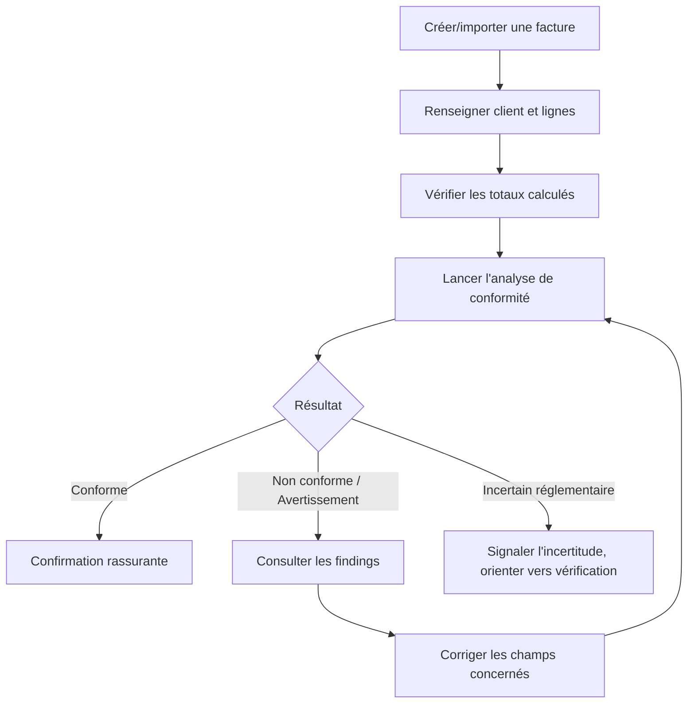
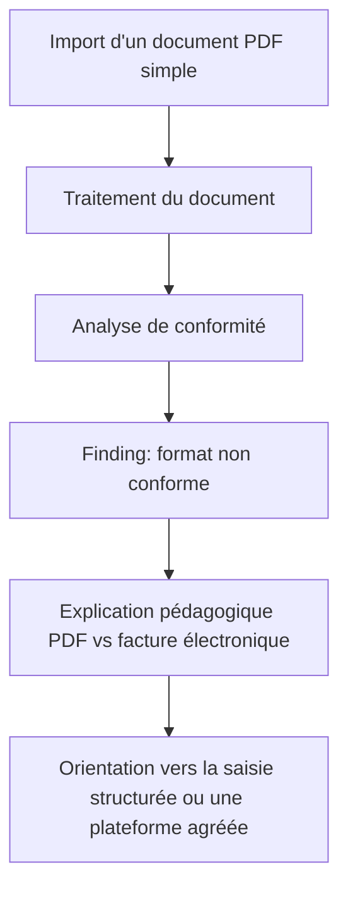

# Frontend Design System - Assistant de conformité à la facturation électronique

> Ce document définit le contrat de design et d'expérience utilisateur du produit, à partir de `01-intent-note.md` à `10-security-privacy.md`. Il ne contient ni code, ni CSS, ni configuration technique. Chaque page, composant ou pattern est justifié par une exigence déjà actée ; les décisions purement esthétiques (palette exacte, police exacte) ont été tranchées par le propriétaire du produit et sont documentées comme décisions actées (section 70), avec les points de détail encore à vérifier (validation du contraste WCAG, notamment) explicitement signalés plutôt que masqués.

## 1. Introduction

Ce design system répond à la question : à quoi doit ressembler l'application, comment doit-elle se comporter, et quelles règles garantissent une expérience cohérente sur l'ensemble du produit ? Il traduit visuellement la proposition de valeur posée dès `01-intent-note.md` - comprendre, vérifier, corriger - et le principe d'explicabilité qui structure l'ensemble du PRD (`04-product-requirements.md`, section 18) et de l'architecture (`06-technical-architecture.md`, section 8).

## 2. Design Goals

- Rendre une information réglementaire complexe (`02-regulatory-study.md`) compréhensible en quelques secondes par un utilisateur non spécialiste (`01-intent-note.md`, principe de pédagogie).
- Distinguer sans ambiguïté visuelle une erreur technique d'un résultat de conformité (`06-technical-architecture.md`, section 25 ; `08-api-specification.md`, section 46).
- Ne jamais présenter l'IA comme une autorité réglementaire (`04-product-requirements.md`, section 17).
- Rester utilisable et cohérent sur mobile, la cible gérant souvent son administratif en mobilité (`03-market-analysis.md`, section 3).
- Rester accessible par défaut (`09-test-strategy.md`, section 39 ; `10-security-privacy.md`, section 70).

## 3. Product Design Principles

| Principe                       | Explication                                                                                                                                                             |
| ------------------------------ | ----------------------------------------------------------------------------------------------------------------------------------------------------------------------- |
| **Clarity over decoration**    | Chaque élément visuel sert la compréhension ; rien n'est ajouté pour « faire moderne » (cohérent avec `01-intent-note.md`, rejet du jargon et de la complexité inutile) |
| **Progressive disclosure**     | L'information réglementaire est dense ; elle se révèle par niveaux (statut → explication → détail technique), jamais tout d'un bloc (section 29)                        |
| **Action-oriented interfaces** | Chaque écran répond à « que dois-je faire maintenant ? », pas seulement « quel est mon état » (`01-intent-note.md`, principe d'orientation action)                      |
| **Trust through transparency** | Chaque résultat de conformité est accompagné de sa source et de sa règle, jamais affirmé sans justification (`04-product-requirements.md`, section 18)                  |
| **Consistency over novelty**   | Un même concept (statut de conformité, erreur, action de correction) se présente toujours de la même façon, quel que soit l'écran                                       |
| **Calm error handling**        | Une non-conformité n'est pas un échec de l'utilisateur ; le ton reste rassurant, jamais alarmiste (cohérent avec `01-intent-note.md`, positionnement « rassurant »)     |
| **Accessible by default**      | L'accessibilité n'est pas une couche ajoutée après coup, mais une contrainte de conception dès le premier composant (section 44)                                        |
| **Honest about uncertainty**   | Un résultat incertain (`INCERTAIN_REGLEMENTAIRE`) est présenté comme tel, jamais maquillé en certitude (`04-product-requirements.md`, section 10, DEC-004)              |

## 4. Brand & Visual Direction

- **Personnalité** : sérieuse sans être froide ; experte sans être intimidante ; rassurante sans être infantilisante.
- **Ton visuel** : sobre, structuré, professionnel - plus proche d'un outil bancaire ou fiscal de confiance que d'une startup grand public colorée.
- **Perception recherchée** : « cet outil comprend ma situation et me dit exactement quoi faire » - jamais « cet outil me juge » ou « cet outil est trop compliqué pour moi ».
- **Niveau de formalité** : professionnel mais chaleureux dans le ton rédactionnel (section 51), formel dans la structure visuelle.
- **Densité** : modérée - suffisamment d'espace pour ne pas intimider, suffisamment d'information pour rester utile (pas un excès de blanc qui viderait le contenu de sens).
- **Style des illustrations** (si utilisées) : schématiques et fonctionnelles plutôt que décoratives - par exemple, un schéma explicatif d'un flux de facturation plutôt qu'une illustration abstraite sans rapport avec le contenu.
- **Style des icônes** : linéaires, simples, cohérentes (section 12).
- **Style des images** : éviter les photos de stock génériques (bureaux, poignées de main) qui n'ajoutent aucune valeur informative - préférer des captures ou schémas du produit lui-même dans les contenus marketing.

**Ce document ne fixe pas de charte graphique de marque définitive (logo, univers de marque complet)** : ce choix reste une décision de branding non couverte par les documents précédents. La palette fonctionnelle (couleurs primaire, sémantiques et de conformité), en revanche, est actée en section 5 - à valider en contraste WCAG avant implémentation définitive (section 70).

## 5. Color System

| Catégorie              | Rôle                                                           | Contrainte fonctionnelle                                                                                                                                               |
| ---------------------- | -------------------------------------------------------------- | ---------------------------------------------------------------------------------------------------------------------------------------------------------------------- |
| **Primary**            | Actions principales, éléments de marque                        | Doit rester distinct des couleurs sémantiques de conformité (ci-dessous), pour ne jamais être confondu avec un statut                                                  |
| **Secondary / Accent** | Mise en avant secondaire, liens                                | -                                                                                                                                                                      |
| **Success**            | Confirmations générales (hors conformité, ex. « client créé ») | Distinct visuellement de `COMPLIANT` (section suivante) même si la teinte de base peut être proche, pour éviter une confusion entre « action réussie » et « conforme » |
| **Warning**            | Avertissements généraux                                        | Aligné avec `WARNING` en conformité                                                                                                                                    |
| **Error**              | Erreurs techniques générales                                   | Doit être visuellement **distinct** de `NON_COMPLIANT` (voir section 27 - distinction structurante du produit)                                                         |
| **Info**               | Informations neutres                                           | -                                                                                                                                                                      |
| **Neutral**            | Background, surface, border, text, muted text, disabled        | Hiérarchie de gris/neutres suffisamment contrastée pour la lisibilité de documents financiers denses                                                                   |

**Valeurs retenues (décision produit, section 70)** : `Primary #00695C` (teal/vert-bleu profond), `Success #1B5E20`, `Warning #984501`, `Error #B71C1C`, `Info #01579B` - contraste WCAG vérifié en Phase 11 (`docs/12-roadmap.md`, section 6 de ce document) : `frontend/app/globals.css` documente les ratios mesurés dans les deux contextes d'usage réels (alerte à 10% d'opacité de fond, badge à 15%), jamais seulement contre un fond blanc plein. Quatre des six valeurs d'origine (DL-008) ont dû être assombries après un scan `@axe-core/playwright` automatisé (Phase 11) ayant révélé un ratio insuffisant (<4.5:1) sur `Success`/`Warning`/`Error`/`Info` dans ces deux contextes ; `Primary` et `Uncertain` n'ont pas eu besoin d'ajustement. Les valeurs Neutral et les teintes du système de conformité dédié (ci-dessous) restent à définir en implémentation, dans le respect de ces couleurs de base.

### Compliance colors (système dédié, distinct des couleurs sémantiques génériques)

| État                                           | Couleur (rôle fonctionnel)                                                                            | Principe                                                                                                                                                                                                                        |
| ---------------------------------------------- | ----------------------------------------------------------------------------------------------------- | ------------------------------------------------------------------------------------------------------------------------------------------------------------------------------------------------------------------------------- |
| `CONFORME`                                     | Teinte de succès dédiée                                                                               | Jamais utilisée pour un simple message de succès applicatif (« enregistré avec succès ») - réservée exclusivement aux résultats de conformité, pour que l'utilisateur associe cette couleur uniquement à « vous êtes en règle » |
| `AVERTISSEMENT`                                | Teinte d'avertissement                                                                                | Distincte de `A_VERIFIER` bien que proches sémantiquement - l'avertissement porte sur un point identifié, l'incomplet sur une absence de données                                                                                |
| `NON_CONFORME`                                 | Teinte d'erreur dédiée, **visuellement distincte** de l'erreur technique générale                     | Cohérent avec la règle absolue n°8 de la mission : ne jamais mélanger non-conformité et erreur technique                                                                                                                        |
| `A_VERIFIER`                                   | Teinte neutre/informative (ni succès, ni échec)                                                       | Reflète l'état `A_VERIFIER` du Compliance Engine (`04-product-requirements.md`, section 10) - une donnée manquante n'est jamais colorée comme une erreur                                                                        |
| `NON_APPLICABLE`                               | Neutre, discret                                                                                       | Ne doit pas attirer l'attention comme un problème                                                                                                                                                                               |
| `INCERTAIN_REGLEMENTAIRE`                      | Teinte distincte, signalant l'incertitude (par exemple un violet ou une teinte non utilisée ailleurs) | Doit être immédiatement reconnaissable comme différente des cinq autres états - c'est le seul état qui communique une incertitude de la source elle-même, pas du résultat                                                       |
| `NON_ANALYSEE` / `ANALYSE_EN_COURS`            | Neutre / animation discrète                                                                           | États de traitement, pas de résultat (`05-user-stories.md`, section 8)                                                                                                                                                          |
| Erreur technique (distincte de `NON_CONFORME`) | Teinte neutre-alerte (par exemple gris-orangé), **jamais la même couleur que `NON_CONFORME`**         | Contrainte structurante : l'utilisateur doit percevoir immédiatement, avant même de lire, qu'il s'agit d'un problème système et non d'un problème de sa facture                                                                 |

**Règle absolue, reprise de la mission** : la couleur n'est **jamais** l'unique moyen de communiquer un état. Chaque état de conformité est systématiquement accompagné d'un **label textuel** et d'une **icône** distincte (section 12), pour rester compréhensible en cas de daltonisme ou d'affichage en niveaux de gris (section 6).

## 6. Color Accessibility

- **Contraste** : chaque paire texte/fond utilisée dans un badge, une alerte ou un bouton doit respecter un contraste suffisant pour la lecture de texte normal et de texte de petite taille, conformément à la cible WCAG 2.2 AA (section 44).
- **Daltonisme** : les sept états de conformité/traitement (section 5) doivent rester distinguables sans couleur - c'est la raison structurante de l'exigence icône + label systématique. Éviter la paire rouge/vert comme seul distinguo entre deux états proches (par exemple `NON_CONFORME` vs `CONFORME` ne doivent jamais se distinguer uniquement par une teinte rouge/vert sans forme d'icône différente).
- **Mode sombre** : **non MVP** (décision produit, section 70) ; l'architecture de tokens (section 53) reste néanmoins conçue pour être compatible avec un ajout futur. Si implémenté ultérieurement, chaque couleur sémantique et de conformité devra avoir un équivalent testé en mode sombre avec le même niveau de contraste, pas une simple inversion automatique.
- **Utilisation dans les tableaux, formulaires, badges, alertes** : la palette de conformité doit rester lisible même en petite taille (badge dans une ligne de tableau dense, section 24) - pas seulement dans un grand encart de résultat.

## 7. Typography

- **Police principale** : **Inter** (décision produit, section 70) - police sans-serif humaniste, optimisée pour la lecture d'interface et de chiffres (les montants et TVA doivent rester parfaitement lisibles sans ambiguïté entre chiffres proches comme 3/8, 1/7).
- **Police secondaire** : non nécessaire au MVP - une seule famille typographique suffit pour un produit de cette nature, cohérent avec le principe de sobriété (section 4).
- **Fallback** : `system-ui, sans-serif` en cas d'échec de chargement d'Inter.

### Échelle typographique

| Niveau     | Usage                                                                                             |
| ---------- | ------------------------------------------------------------------------------------------------- |
| Display    | Titre de landing page uniquement (hors interface applicative)                                     |
| H1         | Titre de page (« Vos factures », « Résultat de l'analyse »)                                       |
| H2         | Titre de section au sein d'une page                                                               |
| H3         | Sous-section, titre de carte                                                                      |
| H4         | Titre de composant mineur                                                                         |
| Body Large | Texte d'explication mis en avant (par exemple l'explication d'un `ComplianceFinding`, section 29) |
| Body       | Texte courant, formulaires, tableaux                                                              |
| Body Small | Métadonnées secondaires (dates, identifiants techniques)                                          |
| Caption    | Légendes, notes de bas de composant                                                               |
| Label      | Libellés de champs de formulaire, badges                                                          |

**Montants et données numériques** : utilisation de chiffres à chasse fixe (tabular figures) dans les tableaux et récapitulatifs de montants, pour garantir l'alignement vertical des colonnes de chiffres - exigence fonctionnelle, pas esthétique, pour la lisibilité de tableaux financiers (section 24).

## 8. Spacing System

Échelle cohérente basée sur une unité de base, permettant une composition régulière à tous les niveaux (du padding d'un badge à l'espacement entre sections de page) : une progression de type 4 / 8 / 12 / 16 / 24 / 32 / 40 / 48 / 64 / 96 (valeurs conceptuelles, à ajuster en implémentation selon la grille technique retenue). Le principe structurant : chaque valeur est un multiple de la plus petite unité, pour que la composition reste toujours visuellement cohérente sans espacement arbitraire ajouté au cas par cas.

## 9. Border Radius

- **Small** : éléments compacts (badges, tags, boutons secondaires).
- **Medium** : boutons principaux, champs de formulaire.
- **Large** : cards, panneaux, conteneurs de contenu.
- **Pill** : badges de statut (section 26) - forme arrondie complète, pour distinguer visuellement un badge d'état d'un bouton d'action.
- **Modal** : cohérent avec « large », légèrement plus prononcé pour marquer la séparation avec le contenu sous-jacent.

**Principe** : coins modérément arrondis pour une impression moderne et accessible sans tomber dans un style trop « ludique », incohérent avec le sérieux recherché (section 4).

## 10. Shadows

| Niveau   | Usage                                                              |
| -------- | ------------------------------------------------------------------ |
| None     | Éléments plats intégrés au flux (lignes de tableau, texte courant) |
| Subtle   | Cards de contenu au repos, légère séparation du fond               |
| Medium   | Éléments interactifs au survol (card cliquable, dropdown ouvert)   |
| Elevated | Modales, popovers, éléments flottants au-dessus du contenu         |

**Principe** : les ombres marquent une hiérarchie de profondeur fonctionnelle (ce qui flotte au-dessus de quoi), jamais un effet décoratif - utilisées avec parcimonie, cohérent avec la sobriété recherchée.

## 11. Borders

- **Séparation** : bordure fine, couleur neutre discrète, pour délimiter des sections ou des lignes de tableau sans créer de bruit visuel.
- **Focus** : bordure (ou anneau de focus) nettement plus visible que la bordure par défaut, couleur distincte (primary), jamais supprimée pour un élément interactif (exigence d'accessibilité, section 44).
- **Erreur** : bordure de couleur erreur sur un champ de formulaire invalide (section 22), toujours accompagnée d'un message texte (jamais la bordure seule).
- **Sélection** : bordure ou fond distinct pour un élément sélectionné dans une liste ou un tableau (si la sélection multiple est implémentée).

## 12. Iconography

- **Bibliothèque** : **Lucide React** (décision produit, section 70), utilisée de façon cohérente sur l'ensemble du produit - un jeu d'icônes linéaires, simple et complet (couvrant à minima les six états de conformité, les actions CRUD, les catégories de documents).
- **Taille** : cohérente avec l'échelle typographique environnante (une icône dans un label de taille Body ne doit pas dominer visuellement le texte).
- **Stroke** : trait fin et régulier, cohérent avec la sobriété recherchée.
- **Alignement** : toujours aligné optiquement avec le texte adjacent, jamais décalé verticalement.
- **Règle d'utilisation** : une icône **accompagne** toujours un label textuel pour toute information fonctionnelle (statuts, section 5) - elle ne remplace jamais le texte seule, sauf pour des actions universellement reconnues et déjà accompagnées d'un `aria-label` (fermer, agrandir).

## 13. Layout System

- **Container** : largeur maximale du contenu principal pour éviter des lignes de texte ou des tableaux trop étirés sur grand écran, tout en s'adaptant pleinement en dessous.
- **Grid** : système de colonnes cohérent pour l'alignement des formulaires et des cards.
- **Gutters** : espacement horizontal cohérent avec l'échelle de la section 8.
- **Sections** : chaque page est composée de sections verticalement espacées de façon régulière, avec une hiérarchie de titres claire (section 7).

## 14. Responsive Strategy

Breakpoints conceptuels, sans valeurs figées arbitrairement mais correspondant aux usages réels de la cible (`03-market-analysis.md`, section 3, usage mobile fréquent) :

| Breakpoint    | Comportement général                                                                                                                                                                          |
| ------------- | --------------------------------------------------------------------------------------------------------------------------------------------------------------------------------------------- |
| Mobile        | Navigation en menu réductible (section 17), tableaux transformés en cartes (section 24), formulaires en une seule colonne, actions principales accessibles en bas d'écran ou en position fixe |
| Tablette      | Layout intermédiaire, certains tableaux peuvent rester tabulaires avec un nombre de colonnes réduit                                                                                           |
| Desktop       | Sidebar de navigation persistante (section 17), tableaux complets, formulaires potentiellement en plusieurs colonnes pour les champs courts                                                   |
| Large Desktop | Container à largeur maximale, pas d'étirement excessif du contenu                                                                                                                             |

## 15. Information Architecture

À tout moment, l'utilisateur doit pouvoir répondre à : **où suis-je ? que puis-je faire ? quelle est la prochaine action ?** - cohérent avec le principe « action-oriented » (section 3).

- **Navigation principale** : section 16.
- **Navigation secondaire** : au sein d'une section (par exemple, onglets « Détail » / « Historique des analyses » / « Documents » sur la page d'une facture).
- **Breadcrumbs** : utiles sur les pages de détail imbriquées (facture → analyse → finding), pour permettre un retour rapide sans dépendre uniquement du bouton retour du navigateur.
- **Actions principales** : toujours visuellement distinguées des actions secondaires (hiérarchie de boutons, section 21).

## 16. Navigation

Sections principales, dérivées directement du PRD et des User Stories (`04-product-requirements.md`, section 9 ; `05-user-stories.md`, section 4) - **aucune section « Factures » en tant que module de production/émission**, cohérent avec le périmètre strict du produit :

```text
Diagnostic (éligibilité)
Factures (à des fins d'analyse - vérification de conformité)
Clients
Historique des analyses
Dashboard
Notifications (P2)
Paramètres
```

**Absente volontairement** : toute section « Comptabilité », « Paiements », « CRM » - hors périmètre strict (`04-product-requirements.md`, section 30).

## 17. App Shell

```text
┌──────────────────────────────────────────┐
│ Header (logo, compte, notifications)      │
├──────────────┬─────────────────────────────┤
│ Sidebar       │ Main Content                │
│ (navigation   │ (contenu de la page,        │
│  principale)  │  actions contextuelles)     │
│               │                             │
└──────────────┴─────────────────────────────┘
```

- **Sidebar** : navigation principale (section 16), repliable, remplacée par un menu bas ou un menu hamburger sur mobile (section 14).
- **Header** : identité du compte connecté, accès rapide aux notifications (badge de compte, cohérent avec `05-user-stories.md` US-NOTIFICATION-001), menu de compte (paramètres, déconnexion).
- **Main content** : zone principale, structurée section par section (section 13).
- **Notifications** : accessibles depuis le header, sans quitter le contexte courant (dropdown plutôt que page dédiée pour une consultation rapide, page dédiée pour l'historique complet).
- **Account menu** : accès aux paramètres de compte (US-SETTINGS-001) et à la déconnexion.
- **Responsive** : sidebar masquée par défaut sur mobile, accessible via un menu, header simplifié.

## 18. Public vs Authenticated UI

**Public** : landing page (hors périmètre strict de ce document, relève d'un contenu marketing non couvert par les User Stories), connexion, inscription, récupération de mot de passe, pages légales (mentions, politique de confidentialité - contenu non rédigé ici, cf. `10-security-privacy.md`).

**Authenticated** : diagnostic, factures, clients, historique, dashboard, notifications, paramètres.

**Différences** : l'UI publique n'a pas de sidebar ni de shell applicatif complet - un layout centré, minimal, orienté conversion (inscription) ou action rapide (connexion). L'UI authentifiée utilise systématiquement l'App Shell (section 17).

## 19. Component Architecture

```text
Tokens (couleur, espacement, typographie - sections 5-12)
   ↓
Primitives (Button, Input, Badge, Icon - briques de base)
   ↓
Components (Form Field, Table Row, Alert, Modal)
   ↓
Composite Components (Compliance Finding Card, Invoice Line Editor)
   ↓
Patterns (Wizard de saisie de facture, flux de correction)
   ↓
Pages (assemblage complet, section 59)
```

Architecture volontairement simple (6 niveaux), sans sur-abstraction - cohérent avec la consigne de ne pas complexifier sans justification.

## 20. Core Components

Liste des composants fondamentaux nécessaires (justifiés par les parcours de `05-user-stories.md`) : Button, Link, Input, Textarea, Select, Checkbox, Radio, Switch, Date Picker, File Upload (US-INVOICE-001), Search (filtrage clients/factures), Badge (statuts, section 26), Tag, Avatar (compte utilisateur), Tooltip, Alert, Toast, Modal, Drawer, Dropdown, Tabs, Accordion (progressive disclosure, section 3), Pagination (`08-api-specification.md`, section 43), Table, Card, Empty State (section 33), Skeleton, Spinner (section 34).

**Non retenu au MVP** : composants de type Kanban, Calendrier complexe, Graphiques avancés (section 46) - aucun besoin identifié dans le PRD.

## 21. Button System

| Variante    | Usage                                                                                                                                                                     |
| ----------- | ------------------------------------------------------------------------------------------------------------------------------------------------------------------------- |
| Primary     | Action principale unique de l'écran (« Lancer l'analyse », « Enregistrer »)                                                                                               |
| Secondary   | Actions importantes mais non uniques (« Annuler », « Retour »)                                                                                                            |
| Outline     | Actions tertiaires dans un contexte dense                                                                                                                                 |
| Ghost       | Actions discrètes intégrées à une ligne de tableau ou une card                                                                                                            |
| Destructive | Suppression, actions irréversibles (section 37) - couleur distincte des statuts de conformité (jamais la même couleur que `NON_CONFORME`, pour ne pas créer de confusion) |
| Link        | Navigation inline, jamais utilisé pour une action mutante                                                                                                                 |

**États** : default, hover, focus (anneau visible, section 11), active, disabled (grisé, jamais simplement moins opaque sans changement de curseur), loading (spinner intégré, bouton désactivé pendant le chargement pour éviter une double soumission - cohérent avec l'idempotence de `08-api-specification.md`, section 20).

**Règle de hiérarchie** : un seul bouton `Primary` par section d'écran, pour que l'action principale reste toujours évidente (cohérent avec le principe « action-oriented », section 3).

## 22. Form System

- **Labels** : toujours visibles (jamais uniquement en placeholder, qui disparaît à la saisie et nuit à l'accessibilité).
- **Descriptions** : texte d'aide sous le label pour les champs nécessitant une clarification (par exemple, expliquer ce qu'est un SIREN pour un utilisateur non spécialiste, cohérent avec `01-intent-note.md`).
- **Placeholder** : exemple de format uniquement, jamais une information essentielle.
- **Required/Optional** : marquage explicite et cohérent (privilégier de marquer les champs optionnels plutôt que d'accumuler des astérisques sur la majorité des champs obligatoires, si la majorité des champs d'un formulaire sont requis).
- **Validation** : au blur ou à la soumission plutôt qu'à chaque frappe (évite de pénaliser l'utilisateur en cours de saisie), avec revalidation immédiate après une première erreur corrigée.
- **Erreurs** : message clair, positionné directement sous le champ concerné, formulé en indiquant **quoi corriger**, jamais un simple « champ invalide » (cohérent avec `08-api-specification.md`, section 15, format `field`/`issue`).
- **Succès** : discret, ne doit pas surcharger un formulaire dense (une coche subtile suffit, pas un message intrusif pour chaque champ valide).
- **Disabled/Loading** : cohérent avec la section 21.

**Règle centrale, reprise de la mission** : _une erreur doit expliquer ce qui est incorrect et comment le corriger_ - appliquée à tous les formulaires du produit, en écho direct au principe d'explicabilité qui gouverne aussi les résultats de conformité (section 29).

## 23. Form Accessibility

- Association explicite label/input (chaque champ interactif a un label associé, jamais un label visuel seul sans lien programmatique).
- `aria-describedby` pour relier un champ à son message d'erreur ou sa description d'aide.
- Erreurs annoncées aux technologies d'assistance lors de leur apparition (pas seulement visibles).
- Focus déplacé vers le premier champ en erreur lors d'une tentative de soumission invalide (section 45).
- Navigation clavier complète : tabulation dans l'ordre logique, aucun champ ou action inaccessible sans souris.

## 24. Tables

- **Headers** : clairement libellés, alignés selon le type de donnée (texte à gauche, chiffres à droite pour faciliter la comparaison verticale).
- **Tri** : sur les colonnes pertinentes uniquement (date, statut, montant - cohérent avec `08-api-specification.md`, section 16, limité aux champs indexés).
- **Filtres** : accessibles au-dessus du tableau, avec indication claire du nombre de résultats filtrés.
- **Pagination** : cohérente avec `08-api-specification.md` (section 43) - navigation par page, indication du total.
- **Sélection** : non nécessaire au MVP (aucune action de masse identifiée dans le PRD) - à réévaluer en Future Scope.
- **Actions** : accessibles en fin de ligne (icône ou menu contextuel), jamais l'unique moyen d'accéder au détail (la ligne elle-même doit rester cliquable pour la consultation).
- **Responsive** : sur mobile, **jamais une table horizontale scrollable illisible par défaut** - transformation en liste de cartes, chaque carte reprenant les colonnes prioritaires (par exemple pour une facture : client, montant, statut de conformité) et masquant les colonnes secondaires derrière une expansion.

## 25. Cards

Utilisées pour : résumer une entité complète dans une liste transformée pour mobile (section 24), regrouper une section logique d'un formulaire long (section 32), présenter un `ComplianceFinding` individuel (section 29). **Ne pas transformer chaque bloc d'information en card par réflexe** - un tableau dense de données reste préférable à une grille de cards pour une liste homogène sur desktop (cohérent avec la règle absolue n°73 de la mission, anti-pattern).

## 26. Status & Badge System

Système cohérent pour tout statut affiché dans le produit, avec la structure systématique : **couleur + icône + label** (jamais l'un sans les autres, section 5).

**Statuts d'`Invoice`** (`07-data-model.md`, section 29 - cycle de vie d'analyse, pas d'émission) :

```text
Brouillon (DRAFT)
Prête pour analyse (READY_FOR_ANALYSIS)
Analysée (ANALYZED)
```

**Statuts de conformité** (les six états, section 5) : `CONFORME`, `AVERTISSEMENT`, `NON_CONFORME`, `NON_APPLICABLE`, `A_VERIFIER`, `INCERTAIN_REGLEMENTAIRE`.

**Statuts de traitement documentaire** (`07-data-model.md`, section 14) : `UPLOADED`, `PROCESSING`, `PARSED`, `VALIDATED`, `FAILED` - `FAILED` utilise la couleur d'erreur technique, jamais la couleur `NON_CONFORME`.

**Aucun statut d'abonnement/intégration** n'est défini au MVP (modèle économique et intégrations non tranchés, `04-product-requirements.md` section 32 ; `06-technical-architecture.md` section 16).

## 27. Compliance Result UI

Composant central du produit. Chaque état doit transmettre, en un coup d'œil puis en détail progressif (section 3) :

| État                 | Ce que l'utilisateur doit comprendre immédiatement                                                                                                                                                           |
| -------------------- | ------------------------------------------------------------------------------------------------------------------------------------------------------------------------------------------------------------ |
| **Conforme**         | « Tout est correct » - ton positif, discret, ne nécessite pas d'action                                                                                                                                       |
| **Avertissement**    | « Un point mérite votre attention, sans blocage » - ton neutre-attentif                                                                                                                                      |
| **Non conforme**     | « Une action est nécessaire de votre part » - ton clair et direct, jamais alarmiste (cohérent avec section 3, calm error handling)                                                                           |
| **Erreur technique** | « L'analyse n'a pas pu être réalisée » - ton clairement différent des trois précédents, avec une action de nature différente (réessayer, contacter le support) plutôt qu'une action de correction de facture |

**Règle absolue, reprise explicitement de la mission** : **ne jamais mélanger visuellement `NON_CONFORME` et « erreur technique »** - couleurs, icônes et libellés strictement distincts (section 5), et l'action proposée à l'utilisateur diffère structurellement (corriger une donnée vs réessayer/contacter le support).

## 28. Compliance Finding UI

Composant affichant un problème individuel (`ComplianceFinding`, `07-data-model.md` section 18), avec **progressive disclosure** (section 3) :

**Niveau 1 (toujours visible)** : Severity (icône + couleur), Title (résumé en une phrase, en langage courant).

**Niveau 2 (visible en développant, ou déjà visible selon la densité de l'écran)** : Explanation (le « pourquoi » pédagogique), Recommendation (l'action de correction concrète, `04-product-requirements.md` FR-COMPLIANCE-003).

**Niveau 3 (accessible sur demande, pour l'utilisateur qui veut approfondir)** : Affected field, Current value, Expected value, Regulatory reference (renvoi à `02-regulatory-study.md`), Rule version (`08-api-specification.md`, section 48).

**Principe** : un utilisateur pressé obtient l'essentiel en un coup d'œil (niveau 1-2) ; un utilisateur qui veut vérifier la source obtient tout le détail (niveau 3), sans que ce détail encombre l'affichage par défaut.

## 29. Compliance Explainability

Patterns de rédaction et de structure pour expliquer un résultat, cohérents avec `04-product-requirements.md` (section 18-19) et le contenu de `02-regulatory-study.md` :

- **Pourquoi une règle échoue** : formulé en langage courant, jamais un simple code (« CLIENT_SIREN_MISSING » n'est jamais affiché seul à l'utilisateur - il reste un identifiant technique interne, traduit systématiquement en texte).
- **Quelle donnée est concernée** : le champ précis est identifié, si possible avec un lien direct vers ce champ dans le formulaire de la facture.
- **Comment corriger** : une action concrète et actionnable, idéalement un lien direct vers l'endroit où effectuer la correction.
- **Quelle règle a été utilisée** : accessible en détail (niveau 3, section 28), avec la référence à `02-regulatory-study.md`.
- **Quand la règle s'applique** : la date d'entrée en vigueur, particulièrement utile pour comprendre un changement de résultat entre deux analyses successives (`05-user-stories.md`, US-COMPLIANCE-006).

**À éviter systématiquement** : « Erreur de conformité » sans autre précision - chaque message doit toujours porter au minimum le niveau 1+2 de la section 28.

## 30. AI Assistant UI

- L'interface indique **explicitement et de façon persistante** que l'IA explique un résultat déjà produit par le moteur de conformité, sans jamais le remplacer (cohérent avec `04-product-requirements.md`, section 17).
- **Déclenchement** : à la demande de l'utilisateur (bouton « Expliquer autrement » ou équivalent sur un `ComplianceFinding`), pas une reformulation automatique systématique qui donnerait l'impression que l'IA est la source première.
- **États** : génération en cours (indicateur de chargement discret, section 34), réponse affichée, erreur/indisponibilité (repli immédiat vers le message par défaut du finding, `06-technical-architecture.md` section 14-15 ; `08-api-specification.md` section 35 - l'utilisateur ne doit jamais se retrouver sans aucune explication si l'IA échoue).
- **Retry** : possible, sans re-déclencher une nouvelle analyse de conformité (l'IA reformule, elle ne relance jamais le Compliance Engine).
- **Réponse non disponible** : présentée calmement, avec le message par défaut du moteur toujours visible en repli (jamais un écran vide).
- **Question libre** (US-AI-002) : zone de saisie clairement délimitée du résultat de conformité lui-même, pour ne jamais laisser penser que la question modifie le résultat affiché.

## 31. AI Trust & Transparency

Distinction visuelle systématique et permanente entre trois niveaux, jamais confondus dans l'interface :

```text
Règle réglementaire (source : 02-regulatory-study.md)
        ≠
Résultat du Compliance Engine (déterministe, section 27-28)
        ≠
Explication de l'assistant IA (reformulation, section 30)
```

**Mise en œuvre concrète** : le texte produit par l'IA doit toujours être visuellement encadré ou étiqueté distinctement (par exemple, un fond légèrement différent, un libellé « Explication assistée » ou équivalent), jamais présenté avec la même typographie et le même statut visuel que le message par défaut du `ComplianceFinding` - pour qu'un utilisateur ne puisse jamais confondre une reformulation IA avec le verdict officiel du moteur.

## 32. Invoice UI

- **Liste des factures** : tableau (desktop) / cartes (mobile, section 24), colonnes prioritaires : client, date, statut d'analyse, statut de conformité global.
- **Création** : voir Invoice Editor (section 33).
- **Modification** : cohérente avec la décision actée sur le statut `ANALYSIS_STALE` (harmonisée avec `07-data-model.md` et `08-api-specification.md`) - une facture modifiée après analyse ne crée jamais une nouvelle facture ou version, elle reste la même entité, mais son statut passe de `ANALYZED` à `ANALYSIS_STALE` dès qu'une donnée pertinente pour la conformité change. L'ancien résultat reste consultable dans l'historique (section 28). L'interface affiche explicitement l'invalidation - « Le résultat de conformité n'est plus à jour » accompagné d'un bouton « Relancer l'analyse » - jamais un changement silencieux (confirmation, section 37-38).
- **Détail** : affiche la facture, ses lignes, son client, ses documents associés, et son historique d'analyses (section 28, avec accès à chaque analyse passée).
- **Statut** : badge de statut d'analyse (section 26) et badge de statut de conformité global, visuellement distincts l'un de l'autre (un ne remplace pas l'autre).
- **Lignes** : affichées dans un tableau intégré, éditable en contexte (section 33).
- **Montants/TVA** : formatés selon les conventions françaises (section 53), alignés à droite, chiffres tabulaires (section 7).
- **Client** : affiché avec son type (professionnel français, particulier, étranger - `07-data-model.md` section 8), condition déterminante des règles applicables et donc affichée de façon visible, pas cachée dans un détail secondaire.
- **Documents** : liste des documents associés (section 20), avec leur statut de traitement.
- **Conformité** : accès direct au résultat le plus récent, avec lien vers l'historique complet.

## 33. Invoice Editor

Organisation progressive de la saisie, cohérente avec la structure exacte du gabarit fourni et alignée sur les entités du modèle de données (`07-data-model.md`) :

```text
Client (sélection ou création rapide)
   ↓
Informations générales (nature de l'opération, date)
   ↓
Lignes (description, quantité, prix, taux de TVA - plusieurs lignes possibles)
   ↓
Totaux (calculés automatiquement, jamais saisis manuellement - cohérent avec l'invariant de 07-data-model.md §11)
   ↓
Documents (import optionnel d'un fichier source)
   ↓
Lancement de l'analyse de conformité
```

**Différence assumée avec un éditeur de facturation classique** : aucune étape de « validation » ou « émission » n'existe dans ce parcours - la dernière étape mène à l'analyse de conformité, jamais à l'envoi d'un document à un client (cohérent avec le périmètre strict, `04-product-requirements.md` section 7 et 30). L'éditeur doit rester perçu comme un outil de vérification, pas de production.

## 34. Dashboard

Répond en priorité à quatre questions (reprises de la mission, cohérentes avec `04-product-requirements.md` section 20 et US-DASHBOARD-001) :

1. **Quel est mon état global de conformité ?** - indicateur synthétique en tête de page.
2. **Y a-t-il des problèmes de conformité ?** - liste des problèmes non résolus, avec accès direct à chacun.
3. **Que dois-je faire maintenant ?** - actions recommandées, dérivées directement des `ComplianceFinding` (`08-api-specification.md`, section 33).
4. **Qu'est-ce qui nécessite mon attention ?** - avertissements en cours, distincts des problèmes bloquants.

**À éviter** : un dashboard rempli de statistiques génériques (nombre total de factures, graphiques de volume) sans lien direct avec la conformité - cohérent avec la mission (« évite les dashboards remplis de statistiques sans utilité ») et avec le fait que le PRD classe le dashboard en P1, pas comme une fonctionnalité de reporting avancé.

## 35. Empty States

- **Aucune facture** : expliquer que l'analyse de conformité commence par l'ajout d'une première facture (import ou saisie), avec un CTA direct vers cette action - jamais un simple « Aucune donnée ».
- **Aucun problème détecté** (dashboard vide de problèmes) : message rassurant et positif (« Aucun problème détecté sur vos dernières analyses »), cohérent avec le ton du produit - jamais un écran vide silencieux qui laisserait planer un doute sur un dysfonctionnement.
- **Aucun diagnostic effectué** : orienter immédiatement vers le diagnostic d'éligibilité (US-COMPLIANCE-001), qui est le point d'entrée fonctionnel le plus fondamental du produit.
- **Aucune notification** : discret, non alarmant.

## 36. Loading States

- **Skeleton** : pour le chargement initial d'une page ou d'une liste, reflétant approximativement la structure du contenu à venir.
- **Spinner** : pour une action ponctuelle (soumission de formulaire, section 21).
- **Progress explicite pour les traitements longs** : cohérent avec `06-technical-architecture.md` (section 12) et `08-api-specification.md` (section 30) :

```text
Import du document
    ↓
Traitement en cours
    ↓
Analyse de conformité en cours
    ↓
Terminé
```

Chaque étape doit être visible et nommée, pas un simple spinner générique indéfini - l'utilisateur doit savoir ce qui se passe, cohérent avec `04-product-requirements.md` (section 14, Performance) et l'exigence de communiquer les états de progression.

- **Optimistic UI** : non recommandé pour le déclenchement d'une analyse de conformité (le résultat ne doit jamais être présumé avant confirmation du Compliance Engine - cela contredirait le principe de fiabilité du résultat) ; envisageable pour des actions à faible enjeu (marquer une notification comme lue).

## 37. Error States

Cinq catégories, cohérentes avec `06-technical-architecture.md` (section 25) et `08-api-specification.md` (section 46), chacune avec un pattern visuel distinct :

| Catégorie         | Pattern visuel                                                                                                                                                            |
| ----------------- | ------------------------------------------------------------------------------------------------------------------------------------------------------------------------- |
| Validation error  | Message inline sous le champ concerné (section 22), pas de blocage de toute la page                                                                                       |
| Business error    | Message contextuel (par exemple, tentative de modification d'une facture déjà analysée) avec explication et action alternative proposée                                   |
| Compliance result | **Jamais présenté comme une erreur** - un badge de statut (`NON_CONFORME`) intégré au flux normal de l'interface (section 27), pas un encart d'erreur système             |
| Technical error   | Message clairement distinct, ton d'excuse mesuré, action de réessai proposée, jamais de détail technique brut exposé (cohérent avec `10-security-privacy.md`, section 18) |
| Network error     | Message spécifique invitant à vérifier la connexion, avec retry automatique ou manuel selon le contexte                                                                   |

## 38. Confirmation Patterns

Confirmation requise pour : suppression d'un document (`10-security-privacy.md`, section 22, 39), suppression de compte, modification d'une facture déjà analysée qui invaliderait une analyse précédente (section 32), déconnexion **non** systématiquement confirmée (action réversible et peu coûteuse - ne pas sur-confirmer). **Ne pas demander de confirmation pour chaque petite action** (marquer une notification comme lue, filtrer un tableau) - cohérent avec la consigne de la mission.

## 39. Destructive Actions

- **Explicites** : le bouton et le libellé nomment clairement l'action (« Supprimer ce document », pas « OK »).
- **Difficiles à déclencher accidentellement** : action séparée visuellement des actions courantes (couleur destructive, section 21), jamais adjacente immédiate à un bouton fréquemment utilisé.
- **Correctement annoncées** : la confirmation (section 38) explique précisément ce qui sera supprimé et, cohérent avec `10-security-privacy.md` (section 39) et la décision actée, ce qui reste conservé : le fichier original est supprimé, mais le résultat de conformité (`ComplianceEvaluation`) est conservé lorsqu'il est nécessaire à la traçabilité, avec une mention explicite indiquant que le document source a été supprimé (par exemple : « Le document a été supprimé ; l'historique de son analyse reste consultable »). Les données dérivées contenant des données personnelles et non nécessaires à cette traçabilité sont supprimées ou anonymisées.

## 40. Notifications & Toasts

| Type           | Usage                                                                                                                                      |
| -------------- | ------------------------------------------------------------------------------------------------------------------------------------------ |
| Toast          | Confirmation temporaire d'une action réussie (« Client créé »), disparaît automatiquement                                                  |
| Inline message | Information liée directement à un contexte (erreur de champ, section 22 ; statut de traitement d'un document, section 36)                  |
| Alert          | Information importante persistante nécessitant l'attention mais pas une action immédiate (par exemple, rappel d'échéance sur le dashboard) |
| Modal          | Action nécessitant une intervention explicite avant de continuer (confirmation destructive, section 38)                                    |

**Distinction toast vs notification persistante (`Notification`, `05-user-stories.md` US-NOTIFICATION-001)** : un toast disparaît après l'action en cours ; une notification liée à une échéance réglementaire reste accessible dans le centre de notifications (section 17) jusqu'à ce que l'utilisateur la marque comme lue - elle ne doit jamais être uniquement un toast éphémère, une échéance réglementaire méritant une persistance.

## 41. Security UI

À partir de `10-security-privacy.md` :

- **Session expirée** : redirection claire vers la reconnexion avec un message explicite (« Votre session a expiré, veuillez vous reconnecter »), pas une erreur technique brute.
- **Accès refusé** (`404` masquant une ressource d'un autre tenant, `10-security-privacy.md` section 17) : présenté à l'utilisateur comme une ressource introuvable (« Cette facture n'existe pas ou n'est plus disponible »), jamais comme un message de permission qui laisserait deviner l'existence de la ressource ailleurs.
- **Compte verrouillé** (si le mécanisme de protection brute-force l'implique, `10-security-privacy.md` section 13) : message clair sur la raison et la marche à suivre.
- **Changement de mot de passe** : confirmation explicite, invalidation visible des autres sessions actives si applicable.
- **Suppression** : section 39.
- **Documents protégés** : aucune indication visuelle ne doit laisser penser qu'un document est accessible publiquement - toujours dans le contexte authentifié et tenant-scoped.

## 42. Privacy UI

- **Collecte de données** : les formulaires ne demandent que les champs justifiés (section 22), sans texte de justification intrusif à chaque champ - la transparence se fait via une politique de confidentialité accessible, pas via des tooltips systématiques.
- **Consentement** : si un consentement explicite s'avère nécessaire pour un traitement donné (dépendant des bases légales encore à confirmer, `10-security-privacy.md` section 41), prévoir un mécanisme de recueil clair, non pré-coché.
- **Gestion des préférences** : accessible depuis les paramètres de compte (US-SETTINGS-001).
- **Suppression/export** : accessible depuis les paramètres, avec le texte d'explication cohérent avec la tension documentée en `10-security-privacy.md` (section 39) - ne jamais promettre une suppression totale et immédiate si cela n'est pas garanti.
- **Informations liées à l'IA** : mention discrète mais accessible que certaines explications sont générées par une IA à partir d'un contexte limité (section 31), sans transformer chaque interaction en avertissement intrusif.

**Ce document n'écrit pas le texte juridique final** (politique de confidentialité) - il définit où et comment ces informations doivent être rendues accessibles dans l'interface.

## 43. Permission UI

**Rappel absolu, repris de la mission et de `10-security-privacy.md` (section 15)** : le frontend ne constitue jamais une frontière de sécurité - le masquage ou la désactivation d'une action dans l'interface est un confort d'expérience, jamais un contrôle de sécurité réel (l'autorisation réelle est vérifiée côté serveur à chaque requête).

Au MVP, un seul rôle existe (`OWNER`), donc peu de cas de permission différenciée sont pertinents. Patterns prévus pour l'évolution future (rôles multiples, `06-technical-architecture.md` section 39) :

- **Action interdite** : non affichée du tout si elle n'a structurellement aucun sens pour l'utilisateur courant.
- **Action masquée vs désactivée** : masquée si elle n'a jamais de sens pour ce rôle ; désactivée (grisée, avec explication au survol) si elle pourrait avoir du sens mais nécessite une condition non remplie (par exemple, lancer une analyse sur une facture incomplète).
- **Utilisateur non autorisé** (tentative d'accès à l'API d'administration, `08-api-specification.md` section 38) : ne devrait jamais être atteignable via l'interface standard, l'API d'administration n'étant pas exposée dans l'UI utilisateur.

## 44. Accessibility

**Cible : WCAG 2.2 AA**, cohérente avec la consigne et avec `09-test-strategy.md` (section 39).

- **Clavier** : navigation complète sans souris pour tous les parcours critiques (`05-user-stories.md`), en particulier la consultation d'un résultat de conformité et son explication.
- **Focus** : visible systématiquement (section 11), jamais supprimé par une réinitialisation de style globale.
- **Contrastes** : section 6.
- **Labels** : section 23.
- **ARIA** : utilisé pour enrichir la sémantique là où le HTML natif ne suffit pas (statuts dynamiques, section 45), jamais pour compenser une structure HTML incorrecte.
- **Lecteurs d'écran** : les six états de conformité (section 5) et les catégories d'erreur (section 37) doivent être annoncés de façon distincte et compréhensible, pas seulement visuellement différenciés.
- **Motion** : section 46.
- **Erreurs** : section 22-23.
- **Tableaux** : en-têtes correctement associés aux cellules, pour une lecture cohérente par lecteur d'écran même en version desktop tabulaire.
- **Navigation** : structure de titres logique (H1 unique par page, hiérarchie H2/H3 cohérente), landmarks de navigation.

## 45. Focus Management

- **Ouverture d'une modale** : focus déplacé automatiquement vers le premier élément interactif de la modale (ou son titre), piégé à l'intérieur tant qu'elle est ouverte.
- **Fermeture d'une modale** : focus restitué à l'élément qui avait déclenché son ouverture.
- **Navigation entre pages** : focus déplacé vers le titre de la nouvelle page (H1), pour que les utilisateurs de lecteur d'écran perçoivent le changement de contexte.
- **Erreurs de formulaire** : focus déplacé vers le premier champ en erreur (section 23).
- **Notifications/toasts** : annoncées via une zone `aria-live`, sans déplacer le focus (ne pas interrompre l'action en cours de l'utilisateur pour une notification non bloquante).

## 46. Motion & Animation

**Philosophie** : animation subtile et fonctionnelle, jamais décorative - chaque animation doit servir un feedback utile (transition d'état, confirmation d'action) ou une orientation spatiale (ouverture d'un panneau depuis son point d'origine), avec une durée courte. Éviter toute animation qui retarderait la compréhension d'un résultat de conformité (aucune animation d'entrée superflue sur un `ComplianceFinding`, l'urgence de compréhension primant sur l'effet visuel).

**`prefers-reduced-motion`** : respecté systématiquement - toute animation non essentielle est supprimée ou réduite au minimum pour les utilisateurs ayant activé cette préférence système.

## 47. Responsive Data-Dense UI

Priorisation de l'information plutôt que simple réduction de taille de texte (cohérent avec la consigne) : sur mobile, une ligne de facture affiche en priorité client + montant + statut de conformité, les colonnes secondaires (date de création, numéro interne) étant accessibles en développant la carte (section 24-25). Le même principe s'applique au détail d'un `ComplianceFinding` : le niveau 1-2 (section 28) reste toujours visible sans défilement horizontal, le niveau 3 s'accède par une action explicite.

## 48. Charts & Data Visualization

**Aucun graphique n'est identifié comme nécessaire au MVP** dans les documents précédents (`04-product-requirements.md`, section 20, dashboard volontairement simple pour le MVP). Si un graphique devait être introduit en V1 (par exemple, évolution du nombre de problèmes de conformité résolus dans le temps), il devrait respecter : palette cohérente avec la section 5 (jamais une palette de graphique disjointe du reste du système), légendes explicites plutôt qu'une couleur seule, tooltips accessibles au clavier, gestion explicite de l'état « aucune donnée » (section 35), alternative textuelle pour les lecteurs d'écran. **Non créé simplement parce qu'il serait visuellement attractif**, cohérent avec la consigne de la mission.

## 49. Date & Number Formatting

Conventions françaises (`fr-FR`), cohérentes avec `08-api-specification.md` (section 17-18) :

- **Dates** : format jour/mois/année pour l'affichage (la date technique ISO 8601 de l'API n'est jamais affichée telle quelle à l'utilisateur).
- **Montants** : séparateur décimal virgule, séparateur de milliers espace, devise affichée explicitement (€), jamais un montant sans son unité.
- **Pourcentages** (taux de TVA) : affichés avec le symbole %, format cohérent avec les conventions françaises.
- **Nombres** : séparateur de milliers espace, cohérent avec l'usage français.

## 50. Regulatory Language

Principe central, repris de la mission : le wording ne doit **jamais** affirmer plus que ce que le résultat du Compliance Engine garantit réellement. À proscrire : « Votre facture est légalement parfaite », « Vous êtes en règle à 100 % » - préférer une formulation fidèle au résultat, par exemple « Aucun problème détecté sur les points vérifiés » plutôt qu'une garantie absolue, cohérent avec les limitations explicitement posées dans `04-product-requirements.md` (section 28) et `10-security-privacy.md`. Pour un résultat `INCERTAIN_REGLEMENTAIRE`, le wording doit explicitement signaler l'incertitude plutôt que de la masquer sous un ton faussement assuré.

## 51. Content Design

- **Ton** : clair, professionnel, humain, direct - jamais froid ni excessivement familier.
- **Labels** : verbes d'action clairs (« Analyser cette facture », pas « Soumettre »).
- **Boutons** : décrivent l'action précise, jamais un simple « OK »/« Valider » générique lorsqu'une formulation plus explicite est possible.
- **Erreurs** : cohérentes avec les sections 22, 29, 37 - toujours orientées solution.
- **Descriptions** : évitent le jargon juridique non expliqué (cohérent avec `01-intent-note.md`) - un terme technique nécessaire (SIREN, franchise en base) est toujours accompagné d'une explication accessible la première fois qu'il apparaît dans un parcours.
- **Confirmations** : section 38.
- **Empty states** : section 35.
- **Notifications** : section 40.

## 52. Internationalization

**Décision produit actée (section 70)** : le MVP cible exclusivement la France, en **français uniquement** (`locale = fr-FR`, `currency = EUR`) - ce n'est plus une zone non tranchée mais un périmètre délibérément restreint. Le design ne doit toutefois pas rendre une future internationalisation impossible : les textes ne sont jamais codés en dur dans la structure visuelle (prévoir une longueur de texte variable pour les libellés, les traductions futures pouvant être plus longues) ; les formats de date/montant (section 49) sont traités comme des paramètres régionaux, pas des constantes ; la structure des règles réglementaires (`07-data-model.md`, section 15, `jurisdiction`) prévoit déjà une portée géographique. L'ajout d'une autre langue (l'anglais notamment) reste une décision future non engagée à ce stade - seule l'architecture doit rester compatible avec un tel ajout.

## 53. Design Tokens

Catégories de tokens à définir en implémentation (valeurs précises non fixées ici, structure posée) :

```text
color.brand.*
color.semantic.*
color.compliance.*
color.neutral.*
spacing.*
typography.family / typography.size.* / typography.weight.* / typography.lineHeight.*
radius.*
shadow.*
border.*
breakpoint.*
motion.duration.* / motion.easing.*
zIndex.*
```

**Logique de nommage** : chaque token de couleur de conformité (`color.compliance.conforme`, `color.compliance.nonConforme`, etc.) doit rester distinct des tokens sémantiques génériques (`color.semantic.success`, `color.semantic.error`) même si leur valeur visuelle de base peut être proche - cette séparation au niveau des tokens eux-mêmes garantit que le système de conformité reste modifiable indépendamment du système d'alertes générique.

## 54. Component States Matrix

| Composant          | Default                                  | Hover                                                   | Focus                                             | Active                           | Disabled                      | Loading                                                          | Error                                                                                                |
| ------------------ | ---------------------------------------- | ------------------------------------------------------- | ------------------------------------------------- | -------------------------------- | ----------------------------- | ---------------------------------------------------------------- | ---------------------------------------------------------------------------------------------------- |
| Button             | Section 21                               | Légère variation de teinte                              | Anneau visible                                    | Variation de teinte plus marquée | Grisé, curseur non-interactif | Spinner intégré, désactivé                                       | N/A (un bouton n'a pas d'état erreur propre)                                                         |
| Input              | Bordure neutre                           | N/A                                                     | Bordure primary                                   | N/A                              | Fond grisé, non éditable      | Indicateur de chargement si validation asynchrone                | Bordure erreur + message (section 22)                                                                |
| Select             | Bordure neutre                           | Légère variation                                        | Bordure primary                                   | Menu ouvert                      | Grisé                         | Indicateur si options chargées dynamiquement                     | Bordure erreur + message                                                                             |
| File Upload        | Zone de dépôt neutre                     | Surbrillance au survol d'un fichier glissé              | Bordure primary au focus clavier                  | Zone active pendant le dépôt     | Grisé                         | Barre de progression (section 36)                                | Message d'erreur explicite (format invalide, taille excessive - `10-security-privacy.md` section 22) |
| Checkbox           | Case vide                                | Légère surbrillance                                     | Anneau visible                                    | Coché                            | Grisé                         | N/A                                                              | Bordure erreur si requis et non coché                                                                |
| Table              | Lignes alternées ou séparées par bordure | Ligne survolée en surbrillance                          | Cellule/ligne focusable au clavier si interactive | Ligne sélectionnée si applicable | N/A                           | Skeleton de lignes (section 36)                                  | Ligne d'erreur si une donnée est invalide (cas rare, plutôt géré au niveau formulaire)               |
| Compliance Finding | Affichage niveau 1-2 (section 28)        | Léger changement au survol si cliquable pour développer | Anneau visible si focusable                       | Développé (niveau 3)             | N/A                           | N/A (le finding est déjà un résultat, pas un état de chargement) | N/A (un finding `NON_CONFORME` n'est pas lui-même en erreur, il est un résultat)                     |

## 55. Component Documentation Standard

Chaque composant, au moment de son implémentation, doit être documenté selon la structure : Nom du composant, Objectif (pourquoi il existe), Variantes, Props/Inputs attendus, États (section 54), Exigences d'accessibilité spécifiques, Usage recommandé, Do/Don't (section 56). Cette structure garantit qu'aucun composant n'est ajouté sans justification claire de son rôle, cohérent avec la règle absolue n°2 de la mission.

## 56. Do / Don't

**Boutons** - Do : un seul bouton primary par section. Don't : plusieurs boutons primary en concurrence visuelle sur un même écran.

**Statuts de conformité** - Do : toujours coupler couleur + icône + label. Don't : un badge coloré seul sans texte.

**Erreurs** - Do : expliquer quoi corriger. Don't : afficher un code d'erreur brut à l'utilisateur.

**IA** - Do : étiqueter visiblement toute reformulation IA. Don't : afficher une explication IA avec la même apparence qu'un résultat officiel du moteur.

**Tableaux mobiles** - Do : transformer en cartes priorisées. Don't : forcer un défilement horizontal illisible.

**Dashboard** - Do : afficher des actions concrètes liées à la conformité. Don't : afficher des statistiques génériques sans lien avec l'action.

## 57. Frontend Architecture Alignment

Cohérent avec `06-technical-architecture.md` (section 28, ADR-007) : ce design system respecte la séparation posée entre modules frontend alignés sur les Epics (`05-user-stories.md`), le state management distinguant session/données métier/traitements en cours (nécessaire pour les états de la section 36), et l'API client centralisé gérant la distinction erreur technique/résultat de conformité de façon homogène (section 37). **Framework confirmé : Next.js + TypeScript + Tailwind CSS v4** (décision produit) - ce document reste néanmoins écrit indépendamment de cette technologie de rendu : les tokens (section 53), composants et patterns qu'il définit sont directement traduisibles en composants Next.js/Tailwind, mais ne présupposent aucune bibliothèque de composants tierce au-delà de ce socle. **Décision produit actée (section 70)** : la bibliothèque de primitives accessibles retenue au-dessus de Tailwind CSS v4 est **Radix UI**, complétée par des composants internes ; la bibliothèque d'icônes retenue est **Lucide React** (section 12).

## 58. Design System vs Component Library

Ce document est le **Design System** : règles, tokens, principes, patterns, contrat UX. Il ne constitue pas la **Component Library** (implémentation technique des composants dans un framework donné), qui en découle mais relève d'un travail d'implémentation distinct, non couvert ici (cohérent avec la consigne de ne générer aucun code).

## 59. Page Inventory

| Page                                | Objectif                                              | Utilisateur        | CTA principal                     | Composants clés                                                  |
| ----------------------------------- | ----------------------------------------------------- | ------------------ | --------------------------------- | ---------------------------------------------------------------- |
| Connexion / Inscription             | Accéder au produit                                    | Tous               | Se connecter / Créer un compte    | Form System (section 22)                                         |
| Configuration entreprise            | Renseigner statut TVA et taille (US-COMPANY-001/002)  | Nouvel utilisateur | Enregistrer                       | Form System, Compliance Result UI (diagnostic immédiat)          |
| Diagnostic d'éligibilité            | Répondre à « suis-je concerné ? » (US-COMPLIANCE-001) | Persona 1, 2       | Comprendre mon calendrier         | Compliance Result UI (section 27)                                |
| Liste des factures                  | Vue d'ensemble des factures analysées                 | Tous               | Ajouter une facture               | Table/Cards (section 24), Status Badge                           |
| Éditeur de facture                  | Saisir/importer une facture à analyser                | Persona 1          | Lancer l'analyse                  | Invoice Editor (section 33), File Upload                         |
| Détail facture / Résultat d'analyse | Consulter le résultat et corriger                     | Persona 1          | Corriger / Relancer l'analyse     | Compliance Finding UI (section 28), AI Assistant UI (section 30) |
| Liste des clients                   | Gérer les clients associés aux factures               | Persona 1, SB      | Ajouter un client                 | Table/Cards, Form System                                         |
| Historique                          | Consulter les analyses passées (US-HISTORY-001)       | Tous               | Consulter une analyse             | Table paginée, Compliance Result UI                              |
| Dashboard                           | Vue synthétique de conformité (US-DASHBOARD-001)      | Persona SB         | Traiter un problème prioritaire   | Dashboard patterns (section 34)                                  |
| Notifications                       | Consulter les rappels d'échéance (P2)                 | Tous               | Marquer comme lue                 | Notification list                                                |
| Paramètres                          | Gérer le compte (US-SETTINGS-001/002)                 | Tous               | Enregistrer / Supprimer le compte | Form System, Confirmation Patterns                               |

**Aucune page « Émission de facture », « Comptabilité » ou « Paiement »** n'est créée - hors périmètre strict (section 16).

## 60. Page Templates

```text
Dashboard Template        - synthèse + actions prioritaires (section 34)
List Template              - table/cards + filtres + pagination (section 24)
Detail Template             - entité + sections contextuelles + actions (section 32)
Form Template                - saisie progressive + validation (section 22)
Wizard Template               - Invoice Editor (section 33), étapes séquentielles
Analysis Result Template       - Compliance Result + Findings (sections 27-28)
Settings Template                - sections de compte/organisation (US-SETTINGS)
```

## 61. UX Patterns

- **Recherche** : sur les listes de clients/factures, avec résultat instantané ou à la validation selon le volume.
- **Filtrage/Tri/Pagination** : section 24.
- **Création** : toujours accessible depuis un CTA visible en tête de liste.
- **Édition** : en contexte (inline pour les champs simples) ou via un formulaire dédié (pour l'ensemble d'une facture, section 33).
- **Suppression** : section 39.
- **Import/Upload** : section 36, avec repli explicite vers la saisie manuelle en cas d'échec (`05-user-stories.md`, US-INVOICE-001).
- **Analyse** : déclenchement explicite (jamais automatique sans action utilisateur, pour ne pas surprendre), avec état de progression (section 36).
- **Correction** : accès direct depuis un `ComplianceFinding` vers le champ à corriger (section 29).
- **Confirmation/Notifications** : sections 38, 40.

## 62. Critical User Flows





Ces flows correspondent directement à US-COMPLIANCE-002/003/004/006 et US-COMPLIANCE-005 (`05-user-stories.md`).

## 63. Security & Privacy UX

Reprise synthétique des sections 41-43 : ne jamais exposer de donnée sensible au-delà du nécessaire à l'écran ; confirmations systématiques pour les actions sensibles (section 38-39) ; messages d'erreur ne révélant jamais de détail d'implémentation (section 37, 41) ; permissions reflétées dans l'UI mais jamais considérées comme la frontière de sécurité réelle (section 43) ; gestion claire des sessions expirées (section 41) ; documents traités comme confidentiels par défaut, jamais un lien de partage public généré sans contrôle.

## 64. Testing & Design System

À partir de `09-test-strategy.md` (section 39, 41) : les exigences testables de ce design system incluent la présence systématique de label + icône pour chaque statut de conformité (section 5, vérifiable automatiquement en test d'accessibilité) ; la navigation clavier complète des parcours critiques (section 44) ; le comportement responsive des tableaux (section 24) ; la distinction visuelle effective entre erreur technique et résultat de conformité (section 27, testable en vérifiant l'absence de couleur partagée) ; l'annonce correcte des erreurs de formulaire aux lecteurs d'écran (section 23).

## 65. Visual Regression

Composants et pages méritant une surveillance de régression visuelle particulière, du fait de leur criticité fonctionnelle ou de leur complexité : le Dashboard (section 34), l'Invoice Editor (section 33), le Compliance Result / Finding UI (sections 27-28, le plus critique - une régression visuelle y romprait directement la distinction erreur/conformité), les tableaux responsive (section 24), les formulaires principaux (configuration entreprise, client, facture).

## 66. Design QA

Checklist avant livraison d'une interface :

```text
□ Responsive (mobile, tablette, desktop)
□ Navigation clavier complète
□ États de focus visibles
□ États d'erreur conformes (technique vs conformité, section 27/37)
□ États de chargement définis (section 36)
□ Empty states définis (section 35)
□ Accessibilité (contrastes, labels, ARIA - section 44)
□ Espacement conforme à l'échelle (section 8)
□ Typographie conforme à l'échelle (section 7)
□ Couleurs sémantiques et de conformité correctement utilisées, jamais confondues (section 5)
□ Comportement mobile validé (pas de tableau illisible, section 24)
□ États de permission cohérents (section 43)
□ IA visuellement distincte du résultat officiel (section 31)
```

## 67. Design System Governance

Adaptée à un développeur solo : les tokens (section 53) ne sont modifiés qu'après une revue explicite de leur impact sur l'ensemble des composants qui les utilisent (un changement de couleur de conformité, en particulier, doit être vérifié sur l'ensemble des écrans qui l'exploitent). Un nouveau composant n'est créé que lorsqu'un pattern se répète au moins deux fois de façon identique ; sinon, une composition ad hoc des primitives existantes est préférée. Un composant est déprécié en le marquant explicitement comme tel dans sa documentation (section 55) avant suppression, jamais supprimé brutalement si encore utilisé. Chaque changement notable de token ou de composant est documenté (quoi, pourquoi) même sans processus formel de revue par une équipe.

## 68. Versioning

```text
Design System v1 (MVP)
   ↓ ajout de tokens ou composants (non cassant)
v1.x
   ↓ changement de comportement ou de structure d'un composant existant (cassant pour les pages qui l'utilisent)
v2 (migration des pages concernées documentée)
```

Aucun processus de versionnement formel plus complexe (semver strict publié, changelog public) n'est nécessaire au MVP pour un développeur solo - une discipline de documentation des changements notables suffit.

## 69. Anti-Patterns

À éviter explicitement : couleurs arbitraires hors du système de tokens (section 53) ; marges non alignées sur l'échelle d'espacement (section 8) ; plusieurs styles de bouton pour une même action selon l'écran ; composants dupliqués avec de légères variations non justifiées ; texte trop petit pour les montants ou informations réglementaires ; tableaux illisibles sur mobile (section 24) ; toute erreur affichée uniquement en rouge sans texte (section 5) ; modales excessives pour des actions non sensibles (section 38) ; dashboard surchargé de métriques sans action associée (section 34) ; animations décoratives sans fonction (section 46) ; confusion visuelle entre résultat de conformité et explication IA (section 31) - ce dernier point étant spécifique et particulièrement critique pour ce produit.

## 70. Questions ouvertes - état après décisions produit (2026)

> Les points ci-dessous ont été tranchés par le propriétaire du produit en 2026, en clôture des questions de design laissées ouvertes lors de la rédaction initiale de ce document. Les décisions retenues sont des **décisions produit** ; certains détails d'implémentation (validation précise du contraste WCAG, notamment) restent à vérifier au moment de la construction effective des composants.

| Question initiale                                                                         | Décision retenue                                                                                                                                                                                                                                                                                            | Statut                                                                                          |
| ----------------------------------------------------------------------------------------- | ----------------------------------------------------------------------------------------------------------------------------------------------------------------------------------------------------------------------------------------------------------------------------------------------------------- | ----------------------------------------------------------------------------------------------- |
| Palette de couleurs exacte (valeurs précises)                                             | **Primary `#00695C`** (teal/vert-bleu profond), **Success `#1B5E20`**, **Warning `#984501`**, **Error `#B71C1C`**, **Info `#01579B`** (section 5). La charte de marque complète (logo, univers visuel) reste hors périmètre de ce document.                                                                 | Résolu - palette fonctionnelle actée ; contraste WCAG vérifié en Phase 11 (section 5-6) |
| Police typographique exacte                                                               | **Inter**, avec `system-ui, sans-serif` en fallback (section 7).                                                                                                                                                                                                                                            | Résolu                                                                                          |
| Mode sombre                                                                               | **Non MVP** ; l'architecture de tokens (section 53) est conçue pour rester compatible avec un ajout futur (section 6).                                                                                                                                                                                      | Résolu                                                                                          |
| Bibliothèque de composants UI complémentaire à Tailwind et bibliothèque d'icônes précises | **Tailwind CSS v4** + composants internes + **Radix UI** (primitives accessibles) + **Lucide React** (icônes) - aucun framework UI imposant son propre design (sections 12, 57).                                                                                                                            | Résolu                                                                                          |
| Nécessité de graphiques en V1                                                             | **Non MVP** - le dashboard V1 se limite à des KPI simples, listes, alertes, conformité et actions (sections 34, 48).                                                                                                                                                                                        | Résolu                                                                                          |
| Internationalisation (langue, devise autre que EUR)                                       | **Français uniquement au MVP** (`locale = fr-FR`, `currency = EUR`), architecture compatible avec un ajout ultérieur de l'anglais (section 52).                                                                                                                                                             | Résolu pour le périmètre MVP - calendrier d'une éventuelle autre langue non engagé              |
| Comportement précis lors de la modification d'une facture déjà analysée (section 32, 37)  | La facture ne crée jamais une nouvelle entité/version : son statut passe de `ANALYZED` à **`ANALYSIS_STALE`** dès qu'une donnée pertinente pour la conformité change. L'interface affiche « Le résultat de conformité n'est plus à jour » + bouton « Relancer l'analyse », jamais un changement silencieux. | Résolu                                                                                          |
| Sélection multiple et actions de masse sur les tableaux (section 24)                      | **Non au MVP.**                                                                                                                                                                                                                                                                                             | Résolu                                                                                          |

## 71. Impact sur la Roadmap

## Informations nécessaires à la Roadmap

À l'attention de `12-roadmap.md`, classement conceptuel du travail nécessaire à l'implémentation de ce design system :

```text
Foundation
   - Design tokens (section 53), typographie (section 7), palette (section 5-6), espacement (section 8), radius/shadows/borders (sections 9-11)

Core Components
   - Button, Input, Select, Badge, Alert, Modal, Table, Card, Empty State, Skeleton (section 20), avec leur matrice d'états (section 54)

Patterns
   - Form System complet (section 22-23), Status & Badge System (section 26), Compliance Result / Finding UI (sections 27-29) - priorité la plus élevée compte tenu de leur centralité produit

Pages
   - App Shell et navigation (sections 16-17), pages de la section 59, dans l'ordre de priorité du MVP (`04-product-requirements.md` section 8) : Diagnostic, Éditeur de facture, Résultat d'analyse, Liste des factures, avant Dashboard et Paramètres (P1)

Polish & QA
   - Accessibilité complète (section 44), responsive fin (sections 14, 47), AI Assistant UI (section 30-31, dépend de la disponibilité de la couche IA elle-même), visual regression (section 65), Design QA (section 66)
```

Ce séquencement reflète directement les priorités déjà établies dans `04-product-requirements.md` (section 8, P0/P1/P2) et `05-user-stories.md` (section 17) : les composants et pages liés au triptyque comprendre/vérifier/corriger sont à construire avant le dashboard, les notifications ou le mode sombre.
