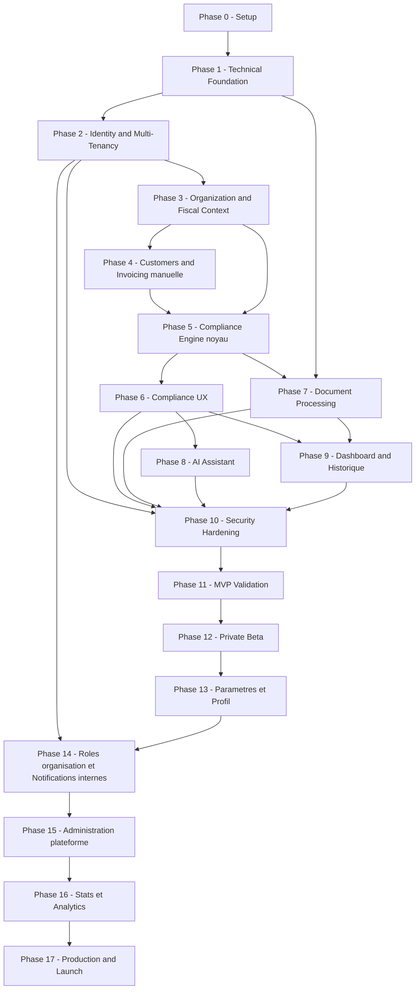

# Product Roadmap - Assistant de conformité à la facturation électronique

> Ce document transforme `01-intent-note.md` à `11-frontend-design-system.md` en un plan de réalisation séquencé, pour un développeur solo ou une très petite équipe. Aucune date précise n'est fabriquée : la roadmap raisonne en phases et dépendances, pas en calendrier. Aucun périmètre nouveau n'est introduit - chaque phase renvoie à une exigence déjà actée dans les documents précédents.

## 1. Introduction

Cette roadmap répond à : que construire, dans quel ordre, pourquoi cet ordre, et quand une phase peut-elle être considérée comme terminée ? Elle part du principe que le composant le plus critique et le plus risqué du produit - le Compliance Engine - doit être validé tôt et solidement, avant que l'effort ne se disperse sur des fonctionnalités périphériques (dashboard avancé, notifications, IA).

## 2. Roadmap Principles

- **Les dépendances réelles priment sur l'ordre chronologique intuitif** (section 11).
- **Le Compliance Engine n'est pas une feature CRUD** : il reçoit un traitement dédié, avec son propre chemin de validation (section 18).
- **Vertical slices plutôt que couches horizontales complètes** : chaque fonctionnalité livrée est utilisable de bout en bout (backend + API + frontend + tests) plutôt que d'attendre que tout le backend soit fini avant de commencer le frontend (section 14).
- **La sécurité et l'isolation multi-tenant sont intégrées dès la fondation**, pas ajoutées en fin de projet (section 22).
- **Aucune date n'est inventée** : la progression se mesure en phases franchies et en critères de sortie remplis, pas en jours calendaires (section 46).
- **Le risque réglementaire est traité tôt** : le moteur de conformité doit être validé avant d'investir dans le raffinement de l'expérience autour de lui (section 33).

## 3. Current Product State

Douze documents de conception sont produits (`01` à `11`, plus le présent document). **Aucun code n'existe encore.** Le projet se situe au tout début de la phase « Technical Foundation » (section 9).

## 4. Target State

Un MVP réellement utilisable par le persona primaire (`03-market-analysis.md`, section 4 ; `04-product-requirements.md`, section 3) : un utilisateur peut créer un compte, configurer son entreprise, obtenir un diagnostic d'éligibilité, importer ou saisir une facture, l'analyser, comprendre chaque non-conformité détectée, la corriger et confirmer qu'elle est résolue - le tout dans une interface accessible, sécurisée et dont les résultats de conformité sont traçables et explicables.

## 5. Product Strategy

```text
Idea (documents 01-11)
   ↓
Technical Foundation (section 15)
   ↓
Internal Prototype (parcours de bout en bout, sans polish)
   ↓
MVP (P0 complet, cf. section 6-7)
   ↓
Private Beta (quelques utilisateurs ciblés, section 29)
   ↓
Public Beta (ouverture plus large)
   ↓
Production (commercialisable)
   ↓
Post-MVP (section 37)
```

## 6. MVP Definition

Le MVP est atteint lorsque le parcours suivant est intégralement fonctionnel, sécurisé et testé (dérivé de `05-user-stories.md`, section 3, User Story Map) :

```text
Créer un compte (US-AUTH-001)
        ↓
Configurer son entreprise - statut TVA, taille (US-COMPANY-001/002)
        ↓
Obtenir un diagnostic d'éligibilité (US-COMPLIANCE-001)
        ↓
Créer un client (US-CUSTOMER-001/002)
        ↓
Importer ou saisir une facture (US-INVOICE-001/002)
        ↓
Lancer une analyse de conformité (US-COMPLIANCE-002)
        ↓
Comprendre le résultat et chaque problème détecté (US-COMPLIANCE-003/004/005)
        ↓
Corriger et relancer l'analyse (US-COMPLIANCE-006)
```

Ce parcours n'inclut délibérément **aucune émission ou transmission réelle de facture** (`04-product-requirements.md`, section 7 et 30) - il se termine par la confirmation qu'une facture est conforme, pas par son envoi à un client.

## 7. MVP Scope

| Fonctionnalité                                          |                      MVP | Priorité | Justification                                                                    |
| ------------------------------------------------------- | -----------------------: | -------- | -------------------------------------------------------------------------------- |
| Authentification (inscription, connexion, récupération) |                      Oui | P0       | Condition d'accès à tout le reste (`04-product-requirements.md` FR-AUTH-001/002) |
| Configuration entreprise (statut TVA, taille)           |                      Oui | P0       | Condition du diagnostic d'éligibilité (FR-COMPANY-001/002)                       |
| Diagnostic d'éligibilité                                |                      Oui | P0       | Répond au JTBD le plus fondamental (FR-DIAGNOSTIC-001)                           |
| Gestion minimale des clients                            |                      Oui | P0       | Nécessaire pour qualifier une facture (US-CUSTOMER-001/002)                      |
| Import/saisie de facture                                |                      Oui | P0       | FR-INVOICE-001                                                                   |
| Analyse de conformité + résultats détaillés             |                      Oui | P0       | Cœur du produit (FR-COMPLIANCE-001 à 004)                                        |
| Distinction PDF simple / facture électronique conforme  |                      Oui | P0       | US-COMPLIANCE-005, différenciation centrale (`03-market-analysis.md` section 18) |
| Correction et relance d'analyse                         |                      Oui | P0       | US-COMPLIANCE-006                                                                |
| Historique des analyses                                 |                      Oui | P1       | US-HISTORY-001, non bloquant pour valider la proposition de valeur               |
| Dashboard                                               | Oui (version simplifiée) | P1       | US-DASHBOARD-001                                                                 |
| Assistant IA (reformulation)                            | Oui (version restreinte) | P1       | US-AI-001/002, le Compliance Engine doit fonctionner sans elle                   |
| Gestion de clientèle mixte B2B/B2C                      |                      Oui | P2       | US-COMPLIANCE-007, cas fréquent mais différable                                  |
| Notifications d'échéance                                |               Non au MVP | P2       | US-NOTIFICATION-001                                                              |
| Notifications internes d'équipe                         | Non au MVP, engagée Phase 14 | P1   | US-NOTIFICATION-003, décision produit du 21/08/2026 (DEC-009)                    |
| Paramètres de compte avancés                            | Non au MVP, engagée Phase 13 | P1   | US-SETTINGS-001/002                                                              |
| Rôles multiples / cabinet comptable                     | Non au MVP, engagée Phase 14 | P1   | `04-product-requirements.md` section 21.1, décision produit du 21/08/2026 (DEC-009) - persona secondaire C réouvert plus tôt que prévu |
| Administration plateforme (support, notifications ciblées, santé applicative) | Non au MVP, engagée Phase 15 | P1 | `04-product-requirements.md` section 21.2, DEC-010, ADR-009 |
| Statistiques et graphiques d'usage (surface admin uniquement) | Non au MVP, engagée Phase 16 | P2 | FR-ANALYTICS-001/002, DEC-011 - ne rouvre pas DL-008 (dashboard client) |
| Intégration plateforme agréée / outil Factur-X tiers    |                      Non | Future   | `06-technical-architecture.md` section 16                                        |

## 8. MVP Exclusions

Explicitement hors MVP, cohérent avec `04-product-requirements.md` (section 30) : émission ou transmission réelle de factures, comptabilité, paie, CRM, paiement intégré, gestion de rôles multiples, notifications au-delà d'un socle minimal, internationalisation, mode sombre, graphiques de dashboard avancés, intégrations externes actives (IA exceptée, en tant que dépendance interne encapsulée), sélection multiple/actions de masse sur les tableaux.

## 9. Product Phases

```text
Phase 0  - Project Setup
Phase 1  - Technical Foundation
Phase 2  - Identity & Multi-Tenancy
Phase 3  - Organization & Fiscal Context
Phase 4  - Customers & Invoicing (saisie manuelle)
Phase 5  - Compliance Engine (noyau + diagnostic d'éligibilité)
Phase 6  - Compliance UX (résultats, findings, correction)
Phase 7  - Document Processing (import, extraction, distinction PDF)
Phase 8  - AI Assistant (reformulation)
Phase 9  - Dashboard & Historique
Phase 10 - Security & Privacy Hardening
Phase 11 - MVP Validation
Phase 12 - Private Beta
Phase 13 - Paramètres & Profil utilisateur
Phase 14 - Rôles d'organisation & Notifications internes
Phase 15 - Administration plateforme & Notifications avancées
Phase 16 - Stats & Analytics métier
Phase 17 - Production Readiness & Public Launch
```

**Phases 13 à 16 ajoutées par décision produit du 21/08/2026** (après la Phase 12, avant l'ex-Phase 13 renumérotée en Phase 17) - l'utilisateur souhaite une application couvrant la gestion d'équipe, l'administration plateforme et les statistiques d'usage avant la mise en production, ce qui revient explicitement sur plusieurs décisions de simplicité du MVP (rôle unique, pas de graphiques, notifications minimales - voir DEC-009/010/011 de `04-product-requirements.md`).

**Écart assumé par rapport au gabarit de la mission** : la phase « Invoicing » est fusionnée avec « Customers » (Phase 4) et scindée entre saisie manuelle (Phase 4) et import documentaire (Phase 7, après le Compliance Engine), car la saisie manuelle est nécessaire pour valider le moteur de conformité (Phase 5) sans dépendre du traitement documentaire, plus complexe et à risque (`06-technical-architecture.md` section 11).

## 10. Phase Details

**Phase 0 - Project Setup**
Objective : disposer d'un dépôt de code structuré et d'un environnement local fonctionnel.
Business Value : aucune valeur utilisateur directe, condition de tout le reste.
Scope : structure de projet, conventions, environnement local (section 14), initialisation Symfony (backend) et Next.js (frontend).
Dependencies : aucune.
Deliverables : dépôt initialisé, README, structure `backend/` (Symfony), `frontend/` (Next.js/TypeScript/Tailwind CSS v4), `infrastructure/`, `docker/` (Docker Compose : PostgreSQL, Redis, Nginx).
Tests : aucun test métier ; vérification que l'environnement démarre.
Security : gestion des secrets dès le départ (`10-security-privacy.md`, section 27) - aucun secret commité, même à ce stade.
Definition of Done : un développeur peut cloner le dépôt et lancer l'application localement via `docker compose up`.
Risks : sous-estimé si négligé - un mauvais départ (pas de linter, pas de structure claire) coûte cher plus tard.
Exit Criteria : environnement local démarrable, pipeline GitHub Actions minimal exécutant au moins un lint.

**Phase 1 - Technical Foundation**
Objective : poser les fondations techniques du monolithe modulaire Symfony (`06-technical-architecture.md`, section 5-6, ADR-007).
Business Value : aucune valeur utilisateur directe.
Scope : squelette backend Symfony avec frontières de modules en namespaces (`src/Identity`, `src/Organization`, `src/Customer`, `src/Invoicing`, `src/Compliance`, `src/Document`, `src/AI`, `src/Notification`, `src/Shared`), base de données PostgreSQL initialisée avec le multi-tenant à discriminant (`07-data-model.md`, section 4) via les migrations Doctrine, squelette frontend Next.js avec App Shell (`11-frontend-design-system.md`, section 17), Redis provisionné (Docker Compose), CI/CD GitHub Actions minimale (section 25).
Dependencies : Phase 0.
Deliverables : backend Symfony démarrable avec un endpoint de santé, base de données PostgreSQL migrée avec les premières tables (Organization, User, Membership), frontend Next.js affichant l'App Shell vide.
Tests : premier test d'intégration vérifiant la connexion à PostgreSQL.
Security : isolation tenant posée au niveau de la couche d'accès aux données Doctrine dès cette phase (`10-security-privacy.md`, section 16) - pas ajoutée après coup.
Definition of Done : squelette backend/frontend communiquant, base de données migrée.
Risks : sous-dimensionner les frontières de modules ici coûte cher à corriger plus tard (`06-technical-architecture.md`, section 7).
Exit Criteria : un appel API de bout en bout (Next.js → API REST Symfony → PostgreSQL → réponse) fonctionne.

**Phase 2 - Identity & Multi-Tenancy**
Objective : permettre à un utilisateur de créer un compte, se connecter, et être rattaché à une organisation.
Business Value : première brique du parcours MVP (US-AUTH-001/002/003).
Scope : inscription, connexion, récupération de compte, authentification JWT (access token + refresh token, `06-technical-architecture.md` ADR-007 ; `10-security-privacy.md` section 12), `Membership`, isolation tenant systématique (`10-security-privacy.md`, section 16-17).
Dependencies : Phase 1.
Deliverables : endpoints `/auth/*` dont `/auth/refresh` (`08-api-specification.md`, section 7, 23), pages de connexion/inscription (`11-frontend-design-system.md`, section 18), bundle Symfony d'émission/validation JWT configuré (access token en mémoire côté Next.js, refresh token en cookie `HttpOnly`).
Tests : tests d'authentification (`09-test-strategy.md`, section 24), premiers tests multi-tenant (section 22, à ce stade avec seulement la structure `User`/`Organization`).
Security : hashing des mots de passe (`10-security-privacy.md`, section 13), rate limiting sur `/auth/login` (section 18).
Definition of Done : un utilisateur peut créer un compte, se connecter, être associé à une organisation vide.
Risks : SR-01, SR-03 (`10-security-privacy.md`, section 66) - l'isolation tenant et l'authentification sont les deux risques les plus critiques du produit, à valider ici avant qu'aucune donnée métier n'existe.
Exit Criteria : TC-AUTH-001 passant ; deux comptes créés ne peuvent voir aucune donnée l'un de l'autre (test préliminaire d'isolation).

**Phase 3 - Organization & Fiscal Context**
Objective : permettre la configuration du statut TVA et de la taille de l'entreprise, et produire un premier diagnostic d'éligibilité.
Business Value : répond au JTBD le plus fondamental du produit - « suis-je concerné ? » (US-COMPLIANCE-001).
Scope : `FiscalContext` historisé (`07-data-model.md`, section 7), `EligibilityDiagnostic`, premières règles réglementaires codées : assujettissement en franchise en base, calendrier différencié par taille (`02-regulatory-study.md`, sections 5-6).
Dependencies : Phase 2.
Deliverables : `PATCH /organizations/current`, `GET /eligibility-diagnostics/current` (`08-api-specification.md`, sections 24, 29), page de configuration entreprise et page de diagnostic (`11-frontend-design-system.md`, section 59).
Tests : REG-001, REG-009 (`09-test-strategy.md`, section 9).
Security : audit de toute modification du contexte fiscal (`10-security-privacy.md`, section 33).
Definition of Done : un utilisateur configuré en franchise en base voit explicitement qu'il reste concerné par la réforme.
Risks : erreur d'interprétation réglementaire à ce stade se propagerait à tout le reste (`09-test-strategy.md`, section 59) - première étape nécessitant une revue humaine explicite (`09-test-strategy.md`, section 56).
Exit Criteria : REG-001 et REG-009 passent ; le diagnostic reflète fidèlement `02-regulatory-study.md`, sections 5-6.

**Phase 4 - Customers & Invoicing (saisie manuelle)**
Objective : permettre la création d'un client et la saisie manuelle d'une facture.
Business Value : prépare la matière première du Compliance Engine (Phase 5).
Scope : `Customer` (US-CUSTOMER-001/002), `Invoice`/`InvoiceLine` par saisie manuelle uniquement (US-INVOICE-002) - **pas encore d'import de document** (reporté en Phase 7).
Dependencies : Phase 3.
Deliverables : endpoints `customers`, `invoices` (POST/GET/PATCH, `08-api-specification.md` sections 26-27), formulaires correspondants (`11-frontend-design-system.md`, section 22, 33).
Tests : cohérence des montants (`09-test-strategy.md`, section 15, 17), transitions d'état `DRAFT → READY_FOR_ANALYSIS` (section 25).
Security : isolation tenant étendue à ces nouvelles entités (section 22 de `09-test-strategy.md`).
Definition of Done : un utilisateur peut créer un client et saisir une facture complète, structurée.
Risks : sous-estimer la complexité de la gestion multi-taux de TVA (REG-005).
Exit Criteria : REG-005 passe ; une facture saisie manuellement est disponible pour analyse.

**Phase 5 - Compliance Engine (noyau)**
Objective : construire le moteur déterministe capable de produire les six états de conformité sur un jeu de règles initial couvrant les mentions obligatoires les plus importantes.
Business Value : **cœur absolu de la proposition de valeur** (`01-intent-note.md`).
Scope : `RegulatoryRule`/`RuleVersion` (`07-data-model.md`, sections 15-16), sélection et évaluation de règles (`06-technical-architecture.md`, section 8-9), `ComplianceAnalysis`/`ComplianceFinding`/`ContextSnapshot`, règles initiales : SIREN client, catégorie d'opération, distinction PDF non structuré (celle-ci anticipée ici au niveau des règles même si le traitement documentaire complet vient en Phase 7).
Dependencies : Phase 4 (facture disponible), Phase 3 (contexte fiscal disponible).
Deliverables : `POST /invoices/{id}/compliance-analyses`, `GET .../findings` (`08-api-specification.md`, sections 29-30).
Tests : **priorité absolue** - sections 10-16 de `09-test-strategy.md` : tests unitaires par règle, déterminisme (section 11), Golden Test Cases (section 14 de `09-test-strategy.md`).
Security : SEC-AUDIT-001 (`10-security-privacy.md`, section 63) - chaque analyse auditée dès cette phase.
Definition of Done : le moteur produit des résultats corrects, déterministes et audités sur le jeu de règles initial.
Risks : **le plus grand risque du projet** (`09-test-strategy.md`, section 59) - une mauvaise interprétation réglementaire ici affecterait tout le produit. Validation humaine obligatoire avant de considérer cette phase terminée (`09-test-strategy.md`, section 56).
Exit Criteria : REG-001 à REG-004, REG-007, REG-009, REG-010 passent ; le déterminisme est vérifié par test dédié (`09-test-strategy.md` section 11) ; revue humaine de chaque règle contre `02-regulatory-study.md` effectuée.

**Phase 6 - Compliance UX**
Objective : rendre les résultats du Compliance Engine compréhensibles et actionnables.
Business Value : transforme un résultat technique en expérience de compréhension (`01-intent-note.md`, `03-market-analysis.md` section 18 - différenciation centrale).
Scope : Compliance Result UI, Compliance Finding UI avec progressive disclosure (`11-frontend-design-system.md`, sections 27-29), relance d'analyse après correction (US-COMPLIANCE-006).
Dependencies : Phase 5.
Deliverables : page de résultat d'analyse, composant Finding, parcours de correction complet.
Tests : E2E-002, E2E-003 (`09-test-strategy.md`, section 38).
Security : revue de non-fuite d'information cross-tenant sur cette UI.
Definition of Done : un utilisateur comprend, sans aide extérieure, pourquoi une facture est non conforme et comment la corriger.
Risks : UX confuse rendrait le moteur inutile même s'il est correct.
Exit Criteria : E2E-002 et E2E-003 passent ; test manuel de compréhension par un profil non technique (`09-test-strategy.md`, section 42).

**Phase 7 - Document Processing**
Objective : permettre l'import d'un document (PDF, éventuellement Factur-X) en complément de la saisie manuelle.
Business Value : couvre le persona 1, qui dispose déjà de factures existantes plutôt que de ressaisir (`05-user-stories.md`, US-INVOICE-001).
Scope : upload, validation technique (magic bytes, `10-security-privacy.md` section 22), traitement asynchrone (`06-technical-architecture.md`, section 12-13), extraction limitée au périmètre du MVP, distinction PDF simple/structuré (US-COMPLIANCE-005), ajout du **Validator Container Mustang** au `docker-compose.yml` (`06-technical-architecture.md`, ADR-008, section 30) - service isolé, jamais intégré au runtime PHP, appelé par le backend via HTTP/process pour la validation technique fine de Factur-X/UBL/CII.
Dependencies : Phase 5 (le Compliance Engine doit exister pour recevoir les données extraites), Phase 1 (file de tâches et `docker-compose.yml` déjà en place, étendu ici avec le service Mustang).
Deliverables : `POST /documents`, `DocumentProcessingRecord`, repli vers la saisie manuelle en cas d'échec, service `mustang` ajouté au `docker-compose.yml` (conteneur Java isolé, sans port exposé publiquement, appelé uniquement depuis le réseau Docker interne par le backend).
Tests : REG-006 ; sécurité documentaire (`09-test-strategy.md`, section 19) ; sécurité XML si Factur-X est couvert (`10-security-privacy.md`, section 23).
Security : SEC-DOC-001, SEC-DOC-002 (`10-security-privacy.md`, section 63) - **bloquants**.
Definition of Done : un document PDF simple est correctement identifié comme non conforme au format, avec repli fonctionnel vers la saisie manuelle en cas d'échec d'extraction.
Risks : sous-estimation de la complexité du parsing (`06-technical-architecture.md`, section 39) - périmètre volontairement restreint pour limiter ce risque.
Exit Criteria : REG-006 passe ; E2E-004 passe ; les contrôles XXE sont vérifiés si un format XML est supporté.

**Bilan à l'implémentation (backend)** : livré - `POST/GET/DELETE /documents`, `GET /documents/{id}/content`, `Document`/`DocumentProcessingRecord` (modèle historique multi-tentatives), `App\Shared\Storage\StorageInterface` (première abstraction de stockage du projet), pipeline asynchrone complet via Symfony Messenger + Redis (service `worker` ajouté au `docker-compose.yml`), service `mustang` (Validator Container, conteneur Java isolé construit depuis `docker/mustang/`, jamais de port publié), `DocumentFormatRuleChecker` câblé dans le Compliance Engine, `RuleVersion` v2 de `format-facture-electronique` (`confidence_level` MOYEN → ÉLEVÉ, `02-regulatory-study.md` section 23), fermeture de l'écart D2 (`Idempotency-Key` désormais honorée sur `POST /invoices`). **Différé explicitement** : traitement effectif UBL/CII (détectés, `FORMAT_NOT_SUPPORTED` - décision produit, `06-technical-architecture.md` section 11) ; aucun endpoint/bouton de reessai sur un `Document` en échec (le modèle de données le permettrait, mais aucune fonctionnalité de reessai n'est implémentée cette phase - le seul chemin est un nouvel upload). Frontend (Invoice Editor, page Documents, composants d'upload/progression) : voir plan Phase 7 pour le détail restant à livrer.

**Phase 8 - AI Assistant**
Objective : ajouter une couche de reformulation pédagogique, strictement en aval du Compliance Engine déjà validé.
Business Value : améliore l'accessibilité de l'explication (P1, non bloquante).
Scope : AI Gateway (`06-technical-architecture.md`, section 15), minimisation du contexte transmis (`10-security-privacy.md` section 29), comportement de repli.
Dependencies : Phase 5 et 6 (un résultat fiable et déjà bien présenté doit exister avant de le reformuler).
Deliverables : `POST /compliance-findings/{id}/explanations`, `POST /assistant/questions` (`08-api-specification.md`, section 35).
Tests : `09-test-strategy.md`, sections 29-31 (fidélité, absence d'invention, non-régression).
Security : SEC-AI-001, SEC-AI-002 (`10-security-privacy.md`, section 63) - **bloquants**.
Definition of Done : la reformulation IA est fidèle au résultat déterministe, jamais un nouveau verdict ; le repli fonctionne en cas d'indisponibilité du fournisseur.
Risks : SR-05, SR-06 (`10-security-privacy.md`, section 66) - prompt injection, fuite de contexte.
Exit Criteria : TC-AI-001 passant ; aucune contradiction détectée entre reformulation et résultat sur le jeu d'évaluation (`09-test-strategy.md`, section 30).

**Bilan à l'implémentation (backend)** : livré - module `App\AI\` (`AIProviderInterface`/`MistralProvider`, `AIGateway`, `ComplianceFindingExplanationContext` en DTO minimal jamais l'entité `ComplianceFinding`), `POST /compliance-findings/{id}/explanations` et `POST /assistant/questions` implémentés **synchrones** (décision Phase 8, corrigeant `08-api-specification.md` section 35 qui indiquait `Async: Oui` - même précédent que la Phase 5 sur `POST /invoices/{id}/compliance-analyses`), vérification email désormais réellement appliquée mais **uniquement sur ces deux endpoints** (écart préexistant sur Document/Compliance laissé tel quel, dette explicite pour la Phase 10), rate limiter dédié `ai_assistant` (`config/packages/rate_limiter.yaml`, 30/heure par organisation, partagé entre les deux endpoints), garde-fou anti-injection de prompt sur les champs du `ComplianceFinding` (testé), ancrage complet de `02-regulatory-study.md` pour `/assistant/questions` via une copie build-time synchronisée (`backend/src/AI/Resources/regulatory_study_context.md`, `backend/bin/sync-regulatory-context.php`, vérifiée par un test de hash qui échoue en cas de divergence). Audit (`COMPLIANCE_FINDING_EXPLAINED`, `ASSISTANT_QUESTION_ASKED`) sans jamais persister le prompt ni le texte généré. **Différé explicitement** : évaluation automatisée de la qualité/fidélité des réponses IA contre un jeu de référence (LLM-as-judge ou équivalent, hors périmètre - `09-test-strategy.md` section 30 reste une vérification manuelle documentée, pas un test CI bloquant) ; optimisation `prompt_cache_key` de Mistral (évaluée comme non nécessaire au MVP). Frontend : voir plan Phase 8 pour le détail (bouton « Expliquer autrement » sur `ComplianceFindingCard`, composant `AssistantQuestionForm` sur la page facture).

**Phase 9 - Dashboard & Historique**
Objective : offrir une vue d'ensemble et un accès à l'historique des analyses.
Business Value : P1, utile mais non bloquante pour la proposition de valeur centrale.
Scope : `GET /dashboard`, `GET /compliance-analyses` paginé (`08-api-specification.md`, sections 33, 41).
Dependencies : Phase 6.
Deliverables : page Dashboard, page Historique (`11-frontend-design-system.md`, section 59).
Tests : E2E-006 (non-rétroactivité d'une nouvelle version de règle, `09-test-strategy.md` section 38).
Security : filtrage tenant sur la pagination (`10-security-privacy.md`, section 16).
Definition of Done : un utilisateur retrouve l'historique de ses analyses avec la règle et la version exactes appliquées à chaque fois.
Risks : faible.
Exit Criteria : E2E-006 passe.

**Bilan à l'implémentation** : livré - `GET /dashboard` (`App\Compliance\Engine\Controller\GetDashboardController`) et `GET /compliance-analyses` organisation-wide, paginé, filtrable par `global_result`/`from`/`to` (`App\Compliance\Engine\Controller\ListComplianceAnalysisHistoryController`, contrat désormais documenté en `08-api-specification.md` section 29 bis - écart de spécification comblé, l'endpoint n'était référencé qu'implicitement dans la matrice Endpoint → User Story avant cette phase). Deux décisions produit explicitement validées et documentées (`08-api-specification.md` section 33) : `DashboardGlobalStatus` (`App\Compliance\Engine\Enum\DashboardGlobalStatus`) est un enum dédié à 4 valeurs (`AUCUNE_ANALYSE`, `CONFORME`, `AVERTISSEMENT`, `ATTENTION_REQUISE`), jamais une réutilisation de `ComplianceResult` ; le bucketing `open_issues_count` (`NON_CONFORME`/`A_VERIFIER`/`INCERTAIN_REGLEMENTAIRE`) / `warnings_count` (`AVERTISSEMENT` seul) est calculé par `App\Compliance\Engine\Service\DashboardAggregator`, une vue de lecture pure sur la **dernière `ComplianceAnalysis` `COMPLETED` de chaque `Invoice`** (`App\Compliance\Engine\Repository\ComplianceAnalysisRepository::findLatestCompletedPerInvoice()`, pattern DQL "greatest-n-per-group" en `NOT EXISTS`, jamais un `GROUP BY` ré-apparié côté PHP) - distincte de l'historique complet exposé par `GET /compliance-analyses`, qui ne perd jamais aucune analyse passée (US-COMPLIANCE-006). `recommended_actions` ne retient que les findings à `correction_action` non vide, dédupliqués par message, plafonnés à 5, ordre déterministe. Frontend : pages `/dashboard` et `/history` (liste paginée + détail `/history/{id}` en lecture seule, réutilisant `ComplianceResultSummary`/`ComplianceFindingCard` déjà construits en Phase 6 - nécessaire car `InvoiceDetail` n'affiche jamais que la dernière analyse d'une facture, insuffisant pour US-HISTORY-001), composant `DashboardStatusBadge` (nouveau, distinct de `ComplianceResultBadge`). Isolation tenant vérifiée par test sur les deux endpoints.

**E2E-006** (`09-test-strategy.md` section 38 ; Exit Criteria de cette phase) livré, pas différé : `App\Tests\Functional\Compliance\RuleVersionNonRetroactivityTest` publie une v2 réelle de `mention-siren-client` par le même mécanisme que `backend/migrations/Version20260820100002.php` (UPDATE SQL direct sur `effective_until`, RuleVersion n'exposant aucun setter, ADR-003 - jamais un mock), puis vérifie qu'une `ComplianceAnalysis` déjà persistée sous la v1 reste strictement inchangée (`rule_version_id`, résultat, message et `correction_action` figés) tandis qu'une nouvelle analyse sur la même facture bascule sur la v2. Nettoyage explicite en fin de test (neutralisation de la v2 par fenêtre de validité nulle, jamais une suppression - une `ComplianceFinding` réelle la référence désormais, contrainte de clé étrangère) pour ne pas polluer les autres tests de la suite, `mention-siren-client` étant un référentiel global partagé par tout le processus de test. Voir section 25 de ce document pour la précision apportée sur le statut de ce cas particulier vis-à-vis du socle E2E complet (Phase 11).

**Phase 10 - Security & Privacy Hardening**
Objective : consolider l'ensemble des contrôles de sécurité avant toute exposition à des utilisateurs réels.
Business Value : condition de confiance, non négociable pour un produit manipulant des données financières.
Scope : ensemble de `10-security-privacy.md` - headers de sécurité (section 47), CORS strict (section 21), rate limiting calibré (section 18), scanning de dépendances (section 48), revue des secrets (section 27), sauvegardes testées (section 54).
Dependencies : toutes les phases précédentes (transverse).
Deliverables : checklist de production sécurité complétée (`10-security-privacy.md`, section 68).
Tests : `09-test-strategy.md`, sections 32-33 ; tests multi-tenant exhaustifs sur l'ensemble des ressources désormais existantes (TC-TENANT-001).
Security : c'est l'objet même de la phase.
Definition of Done : checklist de la section 68 de `10-security-privacy.md` cochée, avec preuve pour chaque point (pas de case cochée sans justification).
Risks : sous-traiter cette phase trop tard découvrirait des failles structurelles difficiles à corriger - mitigé par le fait que l'isolation tenant et l'authentification ont déjà été construites dès les Phases 1-2, cette phase consolide plutôt qu'elle ne découvre.
Exit Criteria : aucune vulnérabilité critique ouverte (`10-security-privacy.md`, section 62) ; tests de sécurité bloquants passants.

**Bilan à l'implémentation** : livré - deux décisions de périmètre actées avant l'implémentation, cohérentes avec le principe « hardener ce qui existe, jamais inventer une fonctionnalité pour fermer un trou de sécurité ou de test » : (1) **Application/CI uniquement** - tout ce qui dépend d'un hébergeur réel (HTTPS forcé, chiffrement au repos, isolation staging/production, monitoring/alerting d'infrastructure) reste marqué `DIFFÉRÉ - Phase 17 - nécessite une infrastructure hébergée` dans `10-security-privacy.md` (section 68), jamais coché par anticipation ni silencieusement retiré ; (2) **`/admin/rule-versions` hors périmètre** - jamais construit pour fermer l'écart de `09-test-strategy.md` section 23, documenté comme dette connue à la place (voir cette section).

Backend : `App\Shared\Http\SecurityHeadersListener` (`X-Content-Type-Options`, `Referrer-Policy`, `Permissions-Policy`, `X-Frame-Options`, `Content-Security-Policy`) et `App\Shared\Http\HstsHeaderListener` (`Strict-Transport-Security`, désactivé par défaut via `HSTS_ENABLED=false` - préparé, jamais présenté comme actif tant qu'aucun domaine HTTPS réel n'existe) ; CORS complété (`Idempotency-Key`, `If-Match`, `X-Request-ID` en `allow_headers`/`expose_headers`, écart avec `10-security-privacy.md` section 21 fermé) ; deux nouveaux rate limiters organisation-scoped (`compliance_analysis_trigger` 60/heure, `document_upload` 30/heure, `backend/config/packages/rate_limiter.yaml`, justifiés en commentaire - jamais un chiffre choisi sans raison écrite) ; `App\Shared\Security\EmailVerificationGuard` (extraction du `requireVerifiedEmail()` jusqu'ici dupliqué dans les deux services IA, Phase 8) désormais branché aussi sur `App\Document\Service\UploadDocumentService` et `App\Compliance\Engine\Service\RunComplianceAnalysisService` - ferme la dette explicite notée au bilan de la Phase 8 ; `GET /audit-events` implémenté (`App\Shared\Audit\Controller\ListAuditEventsController`, `docs/08-api-specification.md` section 39, jamais construit avant cette phase bien que `AuditLogEntry`/`AuditLogger` existent depuis la Phase 3) - exclut structurellement les événements globaux (`organization_id NULL`), vérifié par insertion directe en base (aucun chemin applicatif n'en produit encore) ; `App\Tests\Integration\MultiTenant\TenantIsolationTest` étendu (TC-TENANT-008, `GET /audit-events`) ; nouveaux tests `testEmailNotVerifiedReturns403`/`testRateLimitReturns429AfterExhaustingLimiter` sur Document/Compliance, symétriques aux tests IA déjà existants. Extension de `EmailVerificationGuard` à ces deux services : dette Phase 8 fermée, mais a nécessité d'ajouter `markEmailVerified()` (voire, pour un cas isolé, un nouveau `markEmailUnverified()` test-only dans `App\Tests\Support\ApiTestCase`, mutation SQL directe - même patron que `RuleVersionNonRetroactivityTest` pour `RuleVersion`) dans l'ensemble des tests fonctionnels touchant déjà ces deux endpoints (Document, Compliance, Invoicing, MultiTenant) - suite complète revérifiée verte (201 tests) après ce changement.

Qualité/sécurité du code : `phpstan/phpstan` + `phpstan/phpstan-symfony` ajoutés (`backend/phpstan.neon`, niveau 6) - première analyse statique de ce backend. Les 21 erreurs d'une première exécution complète ont été inspectées une à une avant toute génération de baseline (jamais à l'aveugle) : 20 sont des faux positifs structurels sur des entités Doctrine hydratées par réflexion ORM ou écrites en SQL direct (PHPStan ne peut pas les tracer), documentées et baselinées (`backend/phpstan-baseline.neon`, commentaire d'origine) ; la 21e (`App\Organization\Service\ConfigureOrganizationService::toApiFieldNames`, paramètre typé sur la classe concrète `ConstraintViolationList` au lieu de l'interface `ConstraintViolationListInterface`) était un vrai problème de typage, corrigé directement dans le code plutôt que baselinée.

CI (`​.github/workflows/lint.yml`) : `composer audit` et `npm audit --audit-level=high` (job `backend-lint`/`frontend-lint`, aucune vulnérabilité trouvée au moment de l'implémentation) ; job `secret-scan` (`gitleaks/gitleaks-action@v3`, checkout historique complet isolé dans son propre job) ; job `codeql` (`github/codeql-action@v4`) - **limité au frontend JavaScript/TypeScript** : PHP n'est pas un langage supporté par CodeQL (vérifié à l'implémentation), donc **aucun SAST sécurité dédié n'existe pour le backend PHP** à ce stade (PHPStan reste une analyse de qualité/typage, jamais un SAST sécurité à lui seul - distinction documentée explicitement dans `10-security-privacy.md` section 49 pour ne jamais la présenter comme réglée). Dette technique connue, structurelle à l'écosystème actuel, pas une négligence de cette phase.

Frontend : `frontend/next.config.ts` - headers de sécurité statiques (approche "sans nonce" retenue après vérification de la documentation Next.js 16.3.1 officielle : l'approche à base de nonce, via `proxy.ts`, exigerait de forcer le rendu dynamique sur l'ensemble des pages, un changement d'architecture bien plus large qu'un ajout de headers - toutes les pages de FactuSentinel étant déjà authentifiées et propres à un utilisateur, la génération statique n'y apporte de toute façon aucun bénéfice réel). Vérifié en conditions réelles (navigateur, `curl` via Nginx) : headers présents, aucune violation CSP, aucune régression fonctionnelle.

Sauvegardes (`docker/backup/backup.sh`, `restore.sh`, `README.md`) : `pg_dump` + archive du stockage documentaire local, assemblés puis chiffrés (`gpg --symmetric`, AES256 - préféré à `age` car déjà présent par défaut sur la quasi-totalité des systèmes Linux, aucune nouvelle dépendance à installer, critère décisif pour un développeur solo). Gestion de la clé documentée comme point de sécurité à part entière (jamais stockée avec l'archive). **Clôture l'item de risque « Stratégie de sauvegarde du stockage documentaire local (ADR-007) avant tout volume significatif »** (section 51, Open Questions) : procédure testée manuellement de bout en bout (sauvegarde réelle → déchiffrement → restauration dans une base et un répertoire jetables, jamais l'environnement de développement partagé → vérification de cohérence croisée `Document.storage_reference` ↔ fichier réellement présent ↔ `Invoice`/`DocumentProcessingRecord` sans référence orpheline) - pas seulement une présence de données. Aucune automatisation périodique (cron/systemd) : dépend d'un hébergeur non choisi, reste Phase 17.

**Différé explicitement** (au-delà des deux décisions de périmètre déjà actées ci-dessus) : automatisation périodique des sauvegardes ; gestion/rotation de clé de production ; l'ensemble des points RGPD de la checklist section 68 (juridiques, non techniques, hors périmètre de cette phase).

**Phase 11 - MVP Validation**
Objective : vérifier que l'ensemble du parcours MVP (section 6) fonctionne de bout en bout, avec la qualité attendue.
Business Value : porte d'entrée vers la validation produit réelle (section 35).
Scope : exécution complète des six parcours E2E (`09-test-strategy.md`, section 38), revue d'accessibilité (`11-frontend-design-system.md`, section 44), Design QA (section 66).
Dependencies : Phases 1 à 10.
Deliverables : rapport de validation MVP.
Tests : l'ensemble des Release Gates de `09-test-strategy.md` (section 45) et `10-security-privacy.md` (section 62).
Security : dernière revue avant Private Beta.
Definition of Done : les six parcours E2E passent sans intervention manuelle, tous les Release Gates bloquants sont au vert.
Risks : découverte tardive d'un problème d'intégration entre phases développées séparément.
Exit Criteria : voir section 49 (Release Gates).

**Bilan à l'implémentation** : livré - le rapport complet est `docs/13-mvp-validation-report.md`
(nouveau document, jamais fondu dans ce fichier - la roadmap documente ce qui a été construit,
le rapport documente si le MVP fonctionne réellement et quelles preuves l'attestent). Résumé :
les cinq parcours E2E restants (E2E-001 à E2E-005, `09-test-strategy.md` section 38 - E2E-006
déjà clos en Phase 9) sont désormais automatisés avec **Playwright** (Chromium), pilotant
l'UI réelle de bout en bout contre la pile complète (`docker-compose.yml` +
`docker-compose.e2e.yml`, nouvel overlay ajoutant **Mailpit** - test-only, jamais en
production - pour récupérer par API le lien de vérification d'email, condition requise par
`EmailVerificationGuard` avant upload/analyse depuis la Phase 10). Nouveau job CI `e2e`
(`.github/workflows/lint.yml`). Scans `@axe-core/playwright` intégrés aux specs (accessibilité
automatisée, complétée par une revue manuelle documentée pour ce qu'axe ne peut pas juger -
voir le rapport, section 4).

Deux anomalies P0 découvertes et corrigées en cours de route (première fois que frontend et
backend sont exercés ensemble par un navigateur réel) : `frontend/proxy.ts` ne laissait jamais
un utilisateur sans session atteindre `/verify-email` (redirection silencieuse vers `/login`,
compte jamais vérifié) - la page `/verify-email/{id}` elle-même n'existait d'ailleurs pas
encore, alors que son contrat est documenté depuis la Phase 2 (`08-api-specification.md`
section 7) ; et 4 des 6 couleurs sémantiques (`success`/`warning`/`error`/`info`) échouaient
au contraste WCAG 2.2 AA dans leurs contextes d'usage réels (badges/alertes à opacité
réduite), assombries avec une marge réelle (`frontend/app/globals.css`,
`11-frontend-design-system.md` mis à jour en conséquence). Voir le rapport (sections 8-9) pour
le détail complet.

Un troisième écart, Design QA cette fois (tableaux Factures/Clients/Historique non
transformés en cartes sur mobile, `11-frontend-design-system.md` section 24), a d'abord été
consigné comme dette **volontairement différée** (cohérent avec le principe « ne jamais
inventer de fonctionnalité pour fermer un écart de checklist » déjà appliqué en Phase 10),
avant d'être explicitement demandé comme correction à part entière par décision produit - la
Phase 11 devant servir à fermer les écarts qui empêchent une validation honnête du MVP, pas
seulement ceux prévus dès le départ. Fermé dans cette même phase : `InvoiceList.tsx`,
`CustomerList.tsx` et `ComplianceAnalysisHistory.tsx` exposent désormais chacun un second
rendu (liste de cartes sous `sm:hidden`, tableau existant inchangé sous `hidden sm:block`),
vérifié par lecture directe du CSS calculé dans un navigateur réel et par les 5 specs E2E
(`filter({ visible: true })` ajouté aux locators dont le contenu est désormais dupliqué entre
les deux rendus - `getByText` ne filtre pas par visibilité, contrairement à `getByRole`,
comportement Playwright documenté). Aucune capture d'écran à une largeur mobile réelle n'a en
revanche pu être obtenue (outil de contrôle navigateur indisponible pour changer effectivement
la largeur de rendu dans cette session) - voir le rapport, section 10, pour ce point restant à
confirmer visuellement.

**DL-011** (section 50) tranche la décision laissée ouverte par la Security Roadmap (section
23) : test d'intrusion non requis avant la Private Beta, requis avant la Phase 17.

**Verdict** : MVP validé pour l'entrée en Private Beta (Phase 12) - voir
`docs/13-mvp-validation-report.md` section 11 pour le détail des Release Gates et les limites
explicitement non couvertes (build de production Next.js toujours cassé en amont, revue
d'accessibilité manuelle complète non effectuée, performance non testée).

**Phase 12 - Private Beta**
Objective : confronter le produit à des utilisateurs réels du persona primaire.
Business Value : valide les hypothèses de `03-market-analysis.md` (section 23) - en particulier, que la cible est prête à utiliser un outil distinct de son logiciel de facturation existant.
Scope : quelques utilisateurs ciblés, feedback structuré (section 36).
Dependencies : Phase 11.
Deliverables : retours collectés et catégorisés (section 36).
Tests : monitoring actif (`10-security-privacy.md`, section 36), pas de nouveaux tests automatisés spécifiques.
Security : surveillance renforcée pendant cette phase d'exposition à des utilisateurs réels.
Definition of Done : un nombre suffisant d'utilisateurs a complété le parcours MVP sans blocage critique.
Risks : hypothèse de valeur invalidée (`03-market-analysis.md`, section 23) - signal à prendre au sérieux plutôt qu'à ignorer.
Exit Criteria : aucun bug critique non résolu ; retours suffisamment positifs pour poursuivre (jugement produit, pas un seuil chiffré arbitraire).

**Bilan à l'implémentation** : le plan d'exécution complet (accès, protocole de session,
formulaire de feedback, limitations assumées) est `docs/14-private-beta-plan.md` (nouveau
document, même esprit que `docs/13-mvp-validation-report.md` pour la Phase 11). Voir DL-012
(section 50) pour les deux décisions de périmètre actées avant l'implémentation. Résumé
technique : aucun hébergement public n'a été provisionné - accès via la stack Docker existante
exposée temporairement par un Cloudflare Quick Tunnel pointant sur `nginx` uniquement, jamais
directement sur `next dev` ni le backend (nouvel overlay `docker-compose.beta.yml`, sur le
modèle de `docker-compose.e2e.yml`, réutilisant Mailpit plutôt qu'un nouveau fournisseur email
réel). Un correctif permanent (pas seulement bêta) a été nécessaire et appliqué à cette
occasion : `backend/config/packages/framework.yaml` (`trusted_proxies: PRIVATE_SUBNETS`,
`trusted_headers` limités à `x-forwarded-for`/`x-forwarded-proto`) et
`docker/nginx/default.conf` (résolution de l'IP/schéma réels via `CF-Connecting-IP` avec repli
sur `$remote_addr`/`$scheme` en accès direct, en écrasant - jamais en accumulant - la valeur
transmise à Symfony) - sans cela, `login_throttling` et les logs de sécurité n'auraient vu que
l'adresse de nginx, jamais celle de l'appelant réel, quel que soit l'environnement. Détail et
justification complète en `docs/10-security-privacy.md` (section 21) et `docs/14`. Bug distinct
découvert lors de la vérification, initialement signalé comme hors périmètre puis corrigé sur
demande explicite (voir `docs/14` section 4, `docs/10-security-privacy.md` section 36) :
`login_throttling` (`security.yaml`) ne bloquait aucune tentative de connexion répétée -
`App\Shared\Security\AuthFailureEnvelopeListener` écrasait systématiquement la
`TooManyLoginAttemptsAuthenticationException` levée par Symfony en un `401` générique
indiscernable d'un échec d'identifiants ordinaire. Corrigé (réponse `429` avec `Retry-After`,
sans révéler d'information sur le compte), test de régression ajouté
(`LoginControllerTest::testRepeatedFailedLoginsAreThrottledWith429`).

**Phase 13 - Paramètres & Profil utilisateur**
Objective : permettre à l'utilisateur de gérer les informations de son propre compte.
Business Value : complète l'expérience produit avant la mise en production - couverture jugée nécessaire par décision produit du 21/08/2026, indépendamment de la validation de la proposition de valeur centrale déjà acquise en Phase 11.
Scope : `US-SETTINGS-001/002` (`05-user-stories.md`) - consulter/modifier les informations de compte, demander la suppression du compte.
Dependencies : Phase 12.
Deliverables : `PATCH /users/me`, `DELETE /users/me` (`08-api-specification.md`), page Paramètres (`11-frontend-design-system.md`).
Tests : tests fonctionnels standards (modification, suppression, erreurs de validation) - aucune extension de `09-test-strategy.md` nécessaire au-delà des catégories déjà couvertes (Authentication/API Testing).
Security : la suppression de compte respecte les mêmes contraintes de conservation légale que le reste du produit (`10-security-privacy.md`, sections 38-39) - aucune promesse de suppression immédiate et totale.
Definition of Done : un utilisateur peut consulter/modifier ses informations de compte et demander sa suppression.
Risks : faible - fonctionnalité déjà entièrement spécifiée, aucune décision architecturale nouvelle.
Exit Criteria : `US-SETTINGS-001/002` couvertes par des tests fonctionnels passants.

**Bilan à l'implémentation** : `PATCH /users/current` et `DELETE /users/current` (nom conservé
depuis la Phase 2 plutôt que le raccourci informel `/users/me` employé dans le libellé des
Deliverables ci-dessus - contrat déjà documenté, testé, `08-api-specification.md` section 23).
`User.deleted_at` (soft delete, `07-data-model.md` section 30) découvre à l'implémentation que
l'index unique historique `uniq_user_email` (Phase 1) portait sur toute la table : un email de
compte supprimé restait donc indisponible pour une nouvelle inscription, contraire à la
« perte d'accès » attendue de `10-security-privacy.md` (section 39) - corrigé par un index
unique partiel `WHERE deleted_at IS NULL`, même patron que `uniq_fiscal_contexts_current_per_organization`
(Phase 3). Une modification d'email ou de mot de passe exige systématiquement `current_password`
(défense en profondeur non explicitement exigée par la documentation mais cohérente avec ses
principes, appliquée aussi à `DELETE /users/current`) ; un changement de mot de passe révoque
tous les refresh tokens (`10-security-privacy.md` section 14) ; un changement d'email remet
`email_verified_at` à `null` et redéclenche `VerifyEmailMailer`. Un compte soft-deleted perd
l'accès dès la requête authentifiée suivante : `UserRepository::findOneByEmail()`/
`loadUserByIdentifier()` l'excluent désormais, et le firewall JWT stateless recharge
l'utilisateur via ce même provider à chaque requête (jamais seulement au login) - vérifié
contre `lexik/jwt-authentication-bundle` avant d'en dépendre. Portée volontairement limitée :
`Organization`/`Customer`/`Invoice` de l'utilisateur supprimé ne sont ni supprimées ni
anonymisées par cette phase (aucun mécanisme de soft delete sur `Organization` à ce stade,
aucune exigence documentée de suppression en cascade). Frontend : premier usage de `radix-ui`
`AlertDialog` (déjà présent au `package.json` depuis la Phase 1 comme la primitive `DropdownMenu`
de `Header.tsx`, jamais installé jusqu'ici) pour la confirmation de suppression de compte ;
ajout du variant `destructive` à `components/ui/Button.tsx` (anticipé mais non implémenté avant
cette phase) ; correctif nécessaire de `lib/api/client.ts` (`parseEnvelope` ne gérait pas une
réponse `204 No Content` sans corps - premier appel `DELETE` réel câblé depuis le frontend).

**Phase 14 - Rôles d'organisation & Notifications internes**
Objective : permettre à une organisation de fonctionner à plusieurs, avec des rôles différenciés, et de communiquer en interne.
Business Value : réouvre le persona secondaire C (cabinet comptable, `03-market-analysis.md` section 4) plus tôt que prévu par décision produit assumée (DEC-009, `04-product-requirements.md` section 21) ; prérequis architectural à la Phase 15.
Scope : rôles `OWNER`/`ADMIN`/`COLLABORATOR` portés par `Membership` (`07-data-model.md` section 5) ; invitation/gestion/retrait de membres (`EPIC-TEAM`, `05-user-stories.md`) ; notification d'un `OWNER`/`ADMIN` vers les membres de son organisation (US-NOTIFICATION-003) ; sélection d'organisation active (`POST /auth/select-organization`, `08-api-specification.md` section 9) pour les utilisateurs appartenant à plusieurs organisations.
Dependencies : Phase 2 (Identity & Multi-Tenancy), Phase 13.
Deliverables : `08-api-specification.md` section 25 (Team/Membership API) et extension de la section 34 (Notifications API) ; matrice de permissions publiée dans `04-product-requirements.md` section 21.1 ; pages Gestion d'équipe et composeur de notification (`11-frontend-design-system.md`).
Tests : matrice d'autorisation par rôle exhaustive (`09-test-strategy.md` section 23, extension Phase 14) - un scénario positif et un scénario négatif par action de la matrice, pas un test générique.
Security : révision du threat model (`10-security-privacy.md` section 15, 17) - élévation de privilège intra-organisation testée explicitement ; aucune régression sur l'isolation multi-tenant existante (Phase 2, ADR-004), qui reste inchangée par cette phase.
Definition of Done : un `OWNER` peut inviter un collaborateur, lui attribuer un rôle, et lui envoyer une notification ; la matrice de permissions est appliquée sans exception.
Risks : introduire un bug d'autorisation intra-organisation en étendant un mécanisme jusqu'ici mono-rôle - mitigé par la centralisation déjà en place (`06-technical-architecture.md` section 19) et par la densité de tests exigée ci-dessus.
Exit Criteria : matrice de permissions testée exhaustivement (positif/négatif par action) ; aucune régression sur les tests d'isolation multi-tenant existants (TC-TENANT-*).

**Bilan à l'implémentation** : livré - `Role` étendu à `OWNER`/`ADMIN`/`COLLABORATOR`,
`App\Shared\Security\OrganizationPermissionVoter` (Voter unique, matrice codée en dur,
additif à `TenantFilter`, jamais un remplacement), nouvelles entités `Invitation` et
`Notification` (module `App\Notification\`, jamais sous `Shared/` - fonctionnalité métier,
pas un élément transverse). Deux décisions de documentation comblées à l'implémentation, sans
contredire de décision déjà actée (gaps de spécification, pas des révisions) : matrice
`team:read` (les trois rôles peuvent consulter la liste des membres, seule la gestion reste
restreinte - `04-product-requirements.md` section 21.1 mise à jour) et endpoints
d'acceptation d'invitation `GET /invitations/{token}` / `POST /invitations/{token}/accept`,
absents de la version initiale de `08-api-specification.md` section 25 (US-TEAM-001 ne
décrivait que l'émission côté `OWNER`/`ADMIN`, jamais le parcours de l'invité).

**Point de sécurité le plus significatif de cette phase** (identifié en cours
d'implémentation, au-delà de ce que le plan initial anticipait) : un `User` pouvant désormais
avoir plusieurs `Membership`, le claim `org` d'un JWT ne pouvait plus être traité comme
suffisant à lui seul. `App\Shared\Security\TenantFilterActivationListener` revalide
désormais, à chaque requête authentifiée, que l'utilisateur a réellement un `Membership`
actif sur l'organisation revendiquée par le token (`App\Shared\Exception\
OrganizationMembershipMismatchException`, 401, distincte de la violation d'invariant interne
que reste `AuthenticatedIdentityWithoutOrganizationException` à zéro `Membership`). Corollaire
direct, découvert en traçant le comportement réel des bundles installés (`gesdinet/jwt-refresh-token-bundle`
3.0.0, `lexik/jwt-authentication-bundle` 3.2.0, jamais supposé de mémoire) : sans propagation
de l'organisation active sur le refresh token lui-même, `POST /auth/select-organization`
n'aurait duré que la vie de l'access token en cours (quelques minutes) avant de revenir
silencieusement au défaut. `App\Identity\Entity\RefreshToken::$organizationId` (nouvelle
colonne) et `App\Shared\Security\PropagateOrganizationToRefreshTokenListener` (priorité -10
sur `Events::AUTHENTICATION_SUCCESS`, après la rotation du token par le bundle) ferment ce
point - vérifié empiriquement sur deux rafraîchissements consécutifs réels (pas seulement en
théorie), en plus des tests automatisés.

Migration (`Version20260821133610`) élaguée manuellement du diff auto-généré par
`doctrine:migrations:diff` : la commande proposait aussi de supprimer, sans jamais les
recréer, les index uniques partiels déjà en place (`uniq_user_email` depuis la Phase 13,
`uniq_fiscal_contexts_current_per_organization` depuis la Phase 3) - limitation déjà connue du
comparateur de schéma Doctrine sur les index partiels créés en SQL brut, pas un écart réel à
corriger. Retirées de la migration appliquée plutôt qu'exécutées aveuglément.

Tests : `App\Tests\Functional\Identity\TeamAuthorizationTest` (matrice combinée rôle x
tenant, y compris le cas `OrganizationMembershipMismatchException` explicite), `App\Tests\
Functional\Identity\InvitationLifecycleTest` (expirée, révoquée, déjà acceptée, déjà membre,
mauvais compte, jeton invalide - jamais seulement le chemin heureux),
`App\Tests\Functional\Notification\NotificationIsolationTest` (`recipient_user_id` filtre
systématiquement en plus de `organization_id`, jamais à sa place). Suite complète revérifiée
verte (235 tests) après ce changement, `App\Tests\Integration\MultiTenant\TenantIsolationTest`
inclus sans modification de ses assertions.

Frontend : pages `/team` (membres, invitation, changement de rôle, retrait, composeur de
notification), `/select-organization`, `/invitations/[token]` (aperçu public + acceptation),
`/notifications` (centre de notifications, bouton cloche du Header désormais câblé) ;
`Sidebar` filtre désormais "Équipe" par rôle (confort d'affichage, le backend revalide
systématiquement). Vérifié en conditions réelles dans un navigateur (inscription, connexion,
invitation, aperçu public, liste des membres) en plus des tests de composants.

**Différé explicitement** : aucune préférence d'organisation persistée au-delà du refresh
token de la session en cours (ex. "dernière organisation utilisée" restaurée sur un nouvel
appareil/après déconnexion complète) - non demandé par la documentation existante, pas
construit par anticipation.

**Revue de complétude (21/08/2026, avant clôture de la phase)** : une vérification explicite
« cette phase est-elle réellement à 100% ? » a révélé cinq écarts, tous fermés dans la
foulée plutôt que silencieusement ignorés :

1. `GET /notifications` était documenté "(paginé)" (`08-api-specification.md` section 34)
   mais implémenté sans pagination - `App\Notification\Repository\NotificationRepository::paginate()`
   ajoutée (même patron que `App\Customer\Repository\CustomerRepository::paginate()`).
2. `notification:read`/`notification:update` figuraient dans la même colonne "Permission"
   que les permissions par rôle (`team:invite`, etc.) sans jamais l'être - clarifié dans
   `08-api-specification.md` section 34 et `10-security-privacy.md` section 15 : ce sont des
   contrôles de propriété de ressource (`recipient_user_id`), jamais une entrée de la matrice
   de rôle vérifiée par le Voter.
3. La matrice de permissions n'avait été reprise que dans `04-product-requirements.md`
   section 21.1, jamais mirée dans `10-security-privacy.md` section 15 comme l'exigeait déjà
   l'entrée initiale de cette phase - fait.
4. `GET /invitations/{token}` et `POST /invitations/{token}/accept` (seuls endpoints de
   cette phase où l'appelant n'appartient encore à aucune organisation) n'avaient aucune
   limite de débit - `limiter.invitation_token_access` ajouté (20/15 minutes par IP, même
   clé que `password_reset_request`).
5. Aucun test E2E ne couvrait le parcours équipe/invitation/notification -
   **E2E-007** ajouté (`docs/09-test-strategy.md` section 38,
   `frontend/e2e/specs/e2e-007-team-invitation.spec.ts`), décision explicitement validée par
   l'utilisateur pour ce périmètre supplémentaire.

**E2E-007 a immédiatement justifié sa construction** : sa toute première exécution réelle
(pas une simulation) a révélé un bug bloquant invisible à tous les niveaux de test inférieurs
- `frontend/proxy.ts` ne laissait jamais un utilisateur anonyme atteindre
`/invitations/{token}` (absent de `ALWAYS_ACCESSIBLE_PATHS`, à la différence de
`/verify-email`), rebondissant systématiquement vers `/login` avant que l'invité n'ait
jamais vu l'aperçu de son invitation - un utilisateur réel suivant le lien reçu par email
aurait été bloqué à la toute première étape. Corrigé dans la même revue ; les six autres
parcours E2E (E2E-001 à E2E-005 déjà existants, plus E2E-007) revérifiés verts après ce
correctif partagé.

**Phase 15 - Administration plateforme & Notifications avancées**
Objective : donner à l'opérateur de la plateforme les moyens de support, modération, communication et surveillance applicative à travers toutes les organisations.
Business Value : capacité opérationnelle jugée nécessaire par décision produit (DEC-010) pour exploiter le produit au-delà d'un cercle de bêta-testeurs restreint.
Scope : rôle `PlatformAdministrator`, structurellement séparé (`06-technical-architecture.md`, ADR-009) ; consultation/suspension des organisations et comptes ; audit trail cross-tenant ; notifications ciblées/segmentées/diffusées (`sender_type=PLATFORM_ADMIN`) ; health monitoring **applicatif uniquement** (taux d'échec Compliance Engine, jobs asynchrones en échec, volume/coût IA, `/api/health`) - explicitement pas de monitoring d'infrastructure réelle, qui reste Phase 17.
Dependencies : Phase 14 (le modèle de rôles d'organisation doit exister avant d'introduire un rôle qui les traverse tous).
Deliverables : module backend `PlatformAdmin` (`06-technical-architecture.md` section 6) ; `08-api-specification.md` section 38.2 (Platform Administration API) ; entités `PlatformAdministrator`/`AiCallLogEntry` (`07-data-model.md`) ; nouvelle section « Sécurité de l'administration plateforme » dans `10-security-privacy.md` (section 17 bis) ; surface front dédiée (application séparée ou route strictement isolée, décision de coût actée en début de phase).
Tests : isolation cross-tenant entre jetons `PlatformAdministrator` et jetons tenant-scoped (`09-test-strategy.md` section 22, extension critique) ; complétude de l'audit trail sur chaque action cross-tenant ; tests de la logique de segmentation.
Security : **MFA obligatoire** pour `PlatformAdministrator`, sans exception ; audit systématique de tout accès cross-tenant ; **test d'intrusion ciblé de cette surface avant son activation** (`10-security-privacy.md` section 61, précision Phase 15) - DL-011 ne s'applique pas telle quelle à cette phase, qui constitue précisément le « changement architectural important » que sa clause anticipait.
Definition of Done : un `PlatformAdministrator` peut consulter/suspendre une organisation, envoyer une notification ciblée à un segment, et consulter la santé applicative - chaque action journalisée.
Risks : **le risque de sécurité le plus élevé de toute la roadmap post-MVP** - une isolation mal construite entre ce rôle et les rôles tenant-scoped exposerait toutes les organisations simultanément ; mitigé par une identité structurellement séparée (ADR-009) et le pentest ciblé exigé avant activation.
Exit Criteria : pentest ciblé réalisé sans vulnérabilité critique ouverte ; isolation cross-tenant/tenant-scoped testée et vérifiée dans les deux sens ; audit trail complet vérifié sur un scénario de bout en bout.

**Bilan à l'implémentation** : livré à un niveau explicitement scindé en deux (revue utilisateur
du 24/08/2026, avant même le début de l'implémentation) - voir "Definition of Done à deux
niveaux" ci-dessous, jamais une seule notion de "terminé" pour une phase dont le risque est
qualifié plus haut de "le plus élevé de toute la roadmap post-MVP".

Module `App\PlatformAdmin\` complet : entité `PlatformAdministrator` (globale, hors modèle
tenant, `revoked_at` ajouté en cours d'implémentation - voir plus bas), `PlatformAdminMfaChallenge`
(ticket MFA à usage unique, non prévu par la documentation initiale, ajouté pour fermer
explicitement l'exigence "l'état intermédiaire mfa_required n'est jamais lui-même un moyen de
contournement"), `AiCallLogEntry` (`App\AI\Entity\`), `Organization.suspended_at`. MFA : TOTP via
`spomky-labs/otphp` 11.5.0 (vérifié activement maintenu, compatible PHP 8.4 - `../CLAUDE.md`
section 21), secret chiffré au repos par `sodium_crypto_secretbox` (libsodium natif, aucune
dépendance ajoutée). Les 7 endpoints de `08-api-specification.md` section 38.2 sont implémentés,
plus `GET /platform-admin/me` (écart de spécification comblé à l'implémentation, même patron que
les gaps fermés en revue de complétude Phase 14 - nécessaire à la restauration de session côté
frontend, jamais documenté explicitement en section 38.2).

**Authentification structurellement séparée (ADR-009), deux découvertes réelles en cours
d'implémentation, aucune supposée résolue sans vérification** :
1. `lexik/jwt-authentication-bundle` 3.2 ne permet pas de configurer une seconde paire de clés
   via `lexik_jwt_authentication.yaml` (`secret_key`/`public_key` sont globaux au bundle) - un
   second trousseau JWT complet (`RawKeyLoader`, `LcobucciJWSProvider`, `LcobucciJWTEncoder`,
   `JWTManager`, `JWTAuthenticator`, `AuthenticationSuccessHandler`) est câblé manuellement dans
   `backend/config/services.yaml` (`platform_admin_jwt.*`), en réutilisant les classes du bundle
   plutôt qu'en les réimplémentant - vérifié contre le code source réellement installé avant
   d'écrire cette configuration (revue utilisateur du 24/08/2026, qui l'exigeait explicitement).
2. Un bug de compilation du conteneur Symfony (`InlineServiceDefinitionsPass`) videait
   silencieusement le contenu d'un service référencé uniquement à l'intérieur d'un argument de
   tableau imbriqué : le claim obligatoire `typ: platform_admin`
   (`App\Shared\Security\PlatformAdminTypeClaimEnrichment`) n'était en pratique jamais embarqué
   dans les jetons émis, découvert par un test fonctionnel qui échouait sur l'appel authentifié
   suivant plutôt que sur l'émission du jeton elle-même. Corrigé en marquant le service
   `platform_admin_jwt.payload_enrichment` `public: true` (l'exempte de l'optimisation
   d'inlining défectueuse) - jamais contourné en devinant une autre cause.

`App\Shared\Security\TenantFilterActivationListener` (Phase 2) étendu avec un garde explicite :
`lexik_jwt_authentication.on_jwt_authenticated` est un événement global, partagé par les deux
firewalls - ce listener ignore désormais proprement (early return, jamais une exception) tout
principal qui n'est pas un `App\Identity\Entity\User`, condition nécessaire pour qu'un
`PlatformAdministrator` authentifié n'y déclenche jamais `AuthenticatedIdentityWithoutOrganizationException`
à tort. C'est aussi ce qui garantit que `tenant_filter` n'est **jamais** activé pour ce rôle : pas
par un mécanisme dédié, simplement parce que ce listener (seul point d'activation du filtre) ne
s'exécute jamais pour ce principal - vérifié par un test Doctrine direct (TC-TENANT-009,
`App\Tests\Integration\MultiTenant\TenantIsolationTest`), pas seulement au niveau HTTP.

**Révision de modèle de données, tranchée explicitement plutôt que glissée en cours de route**
(`07-data-model.md` section 21, mis à jour en conséquence) : une notification `PLATFORM_ADMIN`
porte `organization_id = null` par construction (portée cross-tenant), ce qui est incompatible
avec `App\Shared\Doctrine\TenantScopedInterface` (retour `Uuid` non nullable) qu'`App\Notification\
Entity\Notification` implémentait depuis la Phase 14. `Notification` cesse donc d'implémenter
cette interface (même choix qu'`AuditLogEntry`, jamais tenant-scoped pour la même raison) ; la
protection automatique de `TenantFilter` est remplacée par une règle de lecture explicite dans
`App\Notification\Repository\NotificationRepository` (`recipient_user_id = :user AND
(organization_id = :currentOrg OR organization_id IS NULL)`), centralisée au même endroit qu'avant
- un audit explicite de tous les chemins de lecture de cette entité (mené avant la modification,
exigé par le plan) a confirmé qu'aucun autre `QueryBuilder`/`find*`/accès direct n'existe.

**Definition of Done à deux niveaux (décision explicite de l'utilisateur, jamais une seule
notion de "terminé" pour cette phase)** :
- **Niveau 1, implémentation complète - atteint** : les 7 endpoints + `GET /platform-admin/me`
  sont implémentés, testés (51 tests fonctionnels/unitaires dédiés `App\Tests\Functional\
  PlatformAdmin\*`, `App\Tests\Unit\PlatformAdmin\PlatformAdminMfaServiceTest`, plus les
  extensions de `TenantIsolationTest` et `NotificationIsolationTest` existants), suite complète du
  projet revérifiée verte (273 tests backend, 86 tests frontend), documentation mise à jour. Côté
  frontend : route isolée `/platform-admin/*` (nouveau groupe de routes distinct, jamais
  l'App Shell tenant), `PlatformAdminAuthProvider` séparé, cookie de refresh dédié
  (`platform_admin_refresh_token`, jamais `refresh_token`).
- **Niveau 2, porte d'activation - non atteint, risque accepté explicitement (mise à jour
  Phase 17, 27/08/2026)** : aucun test d'intrusion réel n'a été réalisé (hors de portée
  d'un agent IA), et **aucun ne sera réalisé** - décision finale de l'éditeur, faute de
  budget et de disponibilité (`docs/17-pentest-scope.md`). La surface est **effectivement
  active en production** (`https://factusentinel.joeltech.fr/platform-admin/login`),
  l'éditeur ayant choisi, en connaissance de cause, de ne pas la restreindre techniquement
  en l'absence de ce test - un risque assumé consciemment, jamais un défaut silencieux ni
  une conclusion selon laquelle ce risque serait nul ou validé. La revue de sécurité
  manuelle approfondie menée en fin de Phase 15 (`skill security-review`, détail
  ci-dessous) reste un filet complémentaire, jamais un substitut à ce pentest.

**Revue de sécurité manuelle de fin de phase (`skill security-review`)** : une analyse ciblée du
diff complet de la phase a identifié un écart réel, jamais un faux positif - sévérité moyenne,
CSRF : `App\Shared\Security\RefreshOriginCheckListener` (Phase 8, vérification Origin/Referer sur
`/auth/refresh`) n'avait jamais été étendu au second firewall introduit par cette phase,
laissant `POST /api/v1/platform-admin/auth/refresh` sans cette protection alors qu'il partage
exactement la même exposition (cookie `platform_admin_refresh_token`, `SameSite=Lax`) sur
l'identité la plus sensible du produit. Corrigé dans le même passage : le listener couvre
désormais les deux chemins de refresh (`REFRESH_PATHS`) ; deux tests de régression ajoutés
(`testRefreshWithoutMatchingOriginIsRejected`, `testRefreshWithMatchingOriginRotatesTheToken`,
`App\Tests\Functional\PlatformAdmin\PlatformAdminAuthenticationTest`). Effet de bord découvert en
écrivant ces tests, corrigé dans la foulée : `/api/v1/platform-admin/auth/refresh` n'avait pas de
route Symfony enregistrée (même mécanisme que celui déjà documenté pour `/auth/login`/`/auth/refresh`
tenant - un `check_path` d'authenticator sur firewall stateless nécessite une route réelle, sans
quoi le `RouterListener` lève "No route found" avant que l'authenticator n'intercepte la requête) -
fermé en ajoutant ce chemin à `App\Shared\Controller\UnreachableAuthController`, patron déjà
établi, jamais une nouvelle approche. Aucune autre vulnérabilité de sévérité haute ou moyenne
retenue par cette revue (seuil de confiance >80 %, faux positifs filtrés explicitement).

**Différé explicitement** : Phase 16 (Stats & Analytics), qui réutilise cette même autorisation ;
un mécanisme de configuration formalisant la porte d'activation (ex. un indicateur d'environnement
dédié) n'a pas été construit par anticipation - resterait à trancher au moment de lever cette
porte, jamais avant.

**Phase 16 - Stats & Analytics métier**
Objective : donner à l'opérateur de la plateforme une vue agrégée de l'usage réel du produit.
Business Value : éclaire les décisions produit post-MVP (adoption, taux de conformité, volume) sans attendre un besoin business formalisé.
Scope : statistiques agrégées (organisations, utilisateurs, analyses, taux de conformité) et leur évolution temporelle (`US-ANALYTICS-001/002`) - restreint à la surface d'administration plateforme, le dashboard utilisateur final restant inchangé (DL-008 non rouvert).
Dependencies : Phase 15 (réutilise la même autorisation `PlatformAdministrator`, jamais un accès distinct).
Deliverables : `08-api-specification.md` section 38.3 (Platform Analytics API) ; agrégation construite sur le patron `DashboardAggregator` déjà existant (Phase 9) ; premiers graphiques du produit dans la zone d'administration (`11-frontend-design-system.md`).
Tests : exactitude des agrégations sur un jeu de données connu (pas de nouveau mécanisme d'agrégation à valider, réutilisation du patron Phase 9).
Security : même autorisation stricte que la Phase 15 (`platform:analytics:read`) - risque modéré, lecture seule, mais données agrégées sensibles à l'échelle de la plateforme entière (nombre d'organisations, volumes, coûts IA).
Definition of Done : un `PlatformAdministrator` visualise les statistiques d'usage et leur évolution dans le temps.
Risks : faible techniquement (lecture seule) ; risque produit résiduel si les statistiques exposées s'avéraient trop grossières pour être réellement actionnables - non bloquant, itérable après coup.
Exit Criteria : `US-ANALYTICS-001/002` couvertes par des tests fonctionnels passants.

**Bilan à l'implémentation** : livré à deux niveaux, comme la Phase 15 (revue utilisateur avant
implémentation) - jamais une seule notion de "terminé" pour une extension de la surface
Platform Admin.

**Niveau 1, implémentation complète - atteint** : `GET /platform-admin/analytics/summary` et
`GET /platform-admin/analytics/trends` livrés (`08-api-specification.md`, section 38.3, schémas
complétés à l'implémentation - la section ne portait initialement qu'un tableau d'endpoints
sans contrat). Aucune nouvelle entité : agrégation en lecture seule sur `Organization`/`User`
(entités globales, lues directement - même précédent que `ListOrganizationsController`/
`GetOrganizationController`, Phase 15) et `ComplianceAnalysis` (tenant-scoped, lu via une
nouvelle interface `ComplianceAnalyticsReaderInterface` dédiée, séparée de
`ComplianceHealthReaderInterface` - même patron de suspension explicite de `tenant_filter` que
`ComplianceHealthReader`/`AiUsageReader`, Phase 15). Décisions actées avant l'implémentation
(revue utilisateur) : taux de conformité = `conforme / completed` (analyses `FAILED` exclues du
numérateur et du dénominateur, jamais comptées comme un résultat métier) ; fenêtre `trends`
fixe de 90 jours glissants en UTC (pas de `?since`/`?until` au MVP de cette phase), calcul
délégué à un agrégateur pur `PlatformAnalyticsTrendAggregator` (sans dépendance DB, même esprit
que `DashboardAggregator`) testé unitairement sur le contrat exact de fenêtre (90 buckets,
zéros explicites, ordre chronologique) sans jamais toucher la base de données. Tests fonctionnels
vérifiant explicitement l'agrégation cross-tenant elle-même (deux organisations distinctes dont
les utilisateurs/analyses s'additionnent bien dans une même réponse), pas seulement
l'autorisation - point soulevé en revue utilisateur, jamais tenu pour acquis du seul fait que
l'accès est refusé à un jeton tenant-scoped. 286 tests backend (273 + 13 dédiés à cette phase,
dont le correctif décrit ci-dessous), 90 tests frontend (86 + 4), tous verts.

**Correctif d'audit, décidé en revue utilisateur plutôt que laissé en dette** :
`GET /platform-admin/health` (US-PLATFORMADMIN-005, Phase 15) relisait des indicateurs
cross-tenant sans jamais l'auditer, en violation de `10-security-privacy.md` section 17 bis
("chaque lecture ou écriture cross-tenant est journalisée, sans exception") - écart découvert
en préparant les endpoints Analytics de cette phase. Corrigé ici plutôt que documenté comme
dette : nouvel `EventType::PLATFORM_HEALTH_VIEWED` dédié (jamais une réutilisation de
`PLATFORM_AUDIT_TRAIL_VIEWED`, réservé à la consultation de l'audit trail lui-même), test de
régression fonctionnel dédié qui interroge une `AuditLogEntry` réellement persistée.

**Premiers graphiques du produit** (`11-frontend-design-system.md`, section 48, non requis au
MVP) : bibliothèque **Recharts** retenue après vérification (peer deps compatibles React 19/
Next.js 16 App Router, SSR pris en charge, maintenue activement) - installation réelle
(`npm install recharts`) plutôt qu'une version présupposée, résolue en `3.10.1` au moment de
l'implémentation, `package.json`/`package-lock.json` commités avec la version effectivement
installée. Empreinte réelle non minimisée : 37 paquets ajoutés (dépendances internes de
Recharts v3 - familles `d3-*`, `redux`/`immer`/`reselect` pour son état interne). Aucune couche
`Chart` générique créée par anticipation - seulement les deux composants concrets nécessaires
à cette phase, une éventuelle factorisation restant conditionnée à un besoin réel en Phase 17+.
Alternative textuelle systématique (table de données `sr-only`) pour chaque graphique,
indépendante des limites d'accessibilité clavier propres à la bibliothèque, plutôt qu'une
dépendance complète au seul `accessibilityLayer` de Recharts.

**Écart de documentation constaté, signalé plutôt que corrigé silencieusement** :
`frontend/CLAUDE.md` (section 10) liste encore les valeurs de palette *avant* l'ajustement
WCAG de la Phase 11 (`Success #2E7D32`, `Warning #ED6C02`, `Error #D32F2F`, `Info #0288D1`),
alors que `app/globals.css` et la racine `../CLAUDE.md` portent déjà les valeurs assombries
réellement actives (`#1b5e20`, `#984501`, `#b71c1c`, `#01579b`). Non corrigé dans cette phase
(hors périmètre Analytics) - à mettre à jour explicitement, pas silencieusement, dans une tâche
dédiée à la documentation frontend.

**Différé explicitement, hérité de la Phase 15, non rouvert par cette phase** : le **Niveau 2
(porte d'activation)** de la surface Platform Admin reste non atteint - aucun test d'intrusion
réel n'a eu lieu. La surface reste interdite en production tant que ce test n'a pas eu lieu et
produit une preuve documentée, y compris pour les deux endpoints Analytics ajoutés ici, qui
réutilisent exactement cette même surface (jamais un accès distinct moins strict).

**Phase 17 - Production Readiness & Public Launch**
Objective : ouvrir le produit plus largement.
Business Value : mise sur le marché réelle.
Scope : checklist complète de la section 43, validation juridique des points signalés « à confirmer juridiquement » dans `10-security-privacy.md`.
Dependencies : Phase 16.
Deliverables : produit en production, documentation opérationnelle à jour.
Tests : ensemble de la stratégie de tests en continu (`09-test-strategy.md`, section 46, pipeline CI/CD).
Security : revue finale, éventuel test d'intrusion (`10-security-privacy.md`, section 61).
Definition of Done : checklist de la section 43 intégralement complétée.
Risks : questions juridiques non tranchées avant cette phase (section 51) bloqueraient un lancement commercial serein.
Exit Criteria : validation juridique obtenue sur les points critiques (bases légales, conservation) ; checklist de production complète.

**État réel (Bloc A de cette phase, réalisé)** : hébergeur comparé et confirmé (OVHcloud,
sous réserve de vérification finale de l'offre au provisionnement) ; une vulnérabilité
critique Next.js trouvée et corrigée en cours d'audit (`hotfix/nextjs-16.3.3-avif-rce`,
fusionnée dans `main`) ; build de production frontend réparé (deux bugs indépendants,
dont un jusque-là invisible faute de Release Gate `next build`, désormais ajouté) ; audit
de sécurité interne avec un correctif réel (`reuse_detection` du refresh token, bug amont
du bundle identifié et contourné par un compilateur pass projet) ; antivirus sur upload
implémenté et testé contre le vrai service ; sauvegarde automatisée (un défaut de
persistance découvert et corrigé au passage) ; monitoring auto-hébergé préparé ; pipeline
CI/CD complet (`deploy.yml`, GHCR, staging automatique, production sur validation
manuelle). Documents `docs/15` à `docs/17` produits. **Rien de tout cela ne constitue le
Bloc B** (provisionnement réel, validation juridique, pentest réel) - voir le plan Phase
17 complet pour le détail, jamais une case de la section 43 cochée sur cette seule base.

## 11. Dependency Graph



## 12. Critical Path

```text
Technical Foundation (Phase 1)
        ↓
Identity & Multi-Tenancy (Phase 2)
        ↓
Organization & Fiscal Context (Phase 3)
        ↓
Customers & Invoicing manuelle (Phase 4)
        ↓
Compliance Engine - noyau (Phase 5)
        ↓
Compliance UX (Phase 6)
        ↓
Security Hardening (Phase 10, transverse mais bloquant avant validation)
        ↓
MVP Validation (Phase 11)
```

Le Compliance Engine (Phase 5) et sa mise en compréhension (Phase 6) constituent le **véritable chemin critique** du projet : tout le reste (documents, IA, dashboard) est secondaire par rapport à la fiabilité et à la clarté de ce noyau, cohérent avec le principe fondamental de `09-test-strategy.md` (section 1).

## 13. Parallel Work

```text
Une fois Phase 1 terminée :
   ├── Frontend Foundation (App Shell, routing) - en parallèle du backend Phase 2-3
   ├── Design System token implementation (11-frontend-design-system.md, section 53) - en parallèle, dès que la Phase 1 fournit un frontend démarrable
   └── Test Infrastructure (fixtures, section 54 de 09-test-strategy.md) - en parallèle, dès la Phase 2

Une fois Phase 5 terminée (Compliance Engine noyau validé) :
   ├── Phase 6 (Compliance UX) et Phase 7 (Document Processing) peuvent progresser en parallèle,
     Phase 7 dépendant du noyau du moteur mais pas de l'UX de présentation des résultats
```

**Non parallélisable** : Phase 5 (Compliance Engine) ne peut pas être menée en parallèle de sa propre validation par des tests et une revue réglementaire (`09-test-strategy.md`, section 56) - cette validation fait partie intégrante de la phase elle-même, pas une étape séparée ultérieure.

## 14. Vertical Slices

Chaque phase métier (3 à 9) est conçue comme une tranche verticale complète - backend, API, frontend, tests, sécurité - plutôt que de développer tout le backend avant de commencer le frontend. Exemple pour la Phase 4 :

```text
Feature: Saisie manuelle de facture
 ├── Backend: entités Invoice/InvoiceLine, validation des invariants de montants
 ├── API: POST/GET/PATCH /invoices
 ├── Frontend: formulaire de saisie (11-frontend-design-system.md, section 33)
 ├── Tests: validation, cohérence des montants (REG-005)
 └── Security: isolation tenant sur ces nouvelles entités
```

Cette approche permet d'obtenir un parcours partiellement utilisable dès la Phase 4, plutôt que d'attendre la fin du projet pour la première démonstration de bout en bout.

## 15. Technical Foundation

Travaux de la Phase 1 (`06-technical-architecture.md`, sections 4-6, 30-32), sur la base de la **stack technique retenue** (ADR-007) : dépôt Git avec structure `backend/`, `frontend/`, `infrastructure/`, `docker/` ; backend Symfony (PHP) organisé selon les frontières de modules déjà définies (`src/Identity`, `src/Organization`, `src/Customer`, `src/Invoicing`, `src/Compliance`, `src/Document`, `src/AI`, `src/Notification`, `src/Shared`) ; frontend Next.js + TypeScript + Tailwind CSS v4 ; PostgreSQL comme base de données relationnelle, avec les premières migrations Doctrine (`Organization`, `User`, `Membership`) ; Redis provisionné dès cette phase pour la file de tâches (Symfony Messenger) même si aucun job métier n'existe encore ; conteneurisation Docker (backend, frontend, PostgreSQL, Redis) via Docker Compose pour le développement local ; Nginx en reverse proxy local, cohérent avec la configuration cible de production ; pipeline CI GitHub Actions exécutant lint et tests unitaires dès le premier commit ; environnements local et CI configurés (`06-technical-architecture.md`, section 31) ; gestion des secrets par variables d'environnement dès le départ (`10-security-privacy.md`, section 27) ; logging de base. **Pas de monitoring avancé, pas de stack d'observabilité complète à ce stade** (section 41 de ce document) - proportionné à un projet qui démarre.

## 16. Backend Roadmap

```text
Foundation (Phase 1)
   ↓
Authentication (Phase 2)
   ↓
Multi-tenancy (Phase 2, posé structurellement dès le départ)
   ↓
Organization & Fiscal Context (Phase 3)
   ↓
Customers (Phase 4)
   ↓
Invoicing - saisie manuelle (Phase 4)
   ↓
Compliance Engine (Phase 5)
   ↓
Documents (Phase 7)
   ↓
AI Gateway (Phase 8)
   ↓
Dashboard / Audit exposé (Phase 9)
   ↓
Notifications (Post-MVP ou fin de Phase 9 si le temps le permet, P2)
```

## 17. Frontend Roadmap

```text
Design tokens & foundations (11-frontend-design-system.md, section 5-12) - en parallèle de Phase 1-2
   ↓
App Shell & routing & authentification (Phase 2)
   ↓
Configuration entreprise & diagnostic (Phase 3)
   ↓
Clients & Invoice Editor - saisie manuelle (Phase 4)
   ↓
Compliance Result & Finding UI (Phase 6)
   ↓
Document upload UI (Phase 7)
   ↓
AI Assistant UI (Phase 8)
   ↓
Dashboard & Historique (Phase 9)
   ↓
Paramètres de compte (fin de Phase 9 ou Post-MVP selon le temps disponible)
```

## 18. Compliance Engine Roadmap

```text
Compliance Domain (frontières et concepts, 06-technical-architecture.md section 8-9)
   ↓
Rule Model (RegulatoryRule, structure conceptuelle, 07-data-model.md section 15)
   ↓
Rule Versioning (RuleVersion, immutabilité, ADR-003)
   ↓
Evaluation Engine (sélection + évaluation, six états)
   ↓
Findings (ComplianceFinding, message figé, action de correction)
   ↓
Historical Context (ContextSnapshot, non-rétroactivité)
   ↓
Regression Tests (09-test-strategy.md, section 13)
   ↓
Regulatory Validation (revue humaine contre 02-regulatory-study.md, section 56)
```

Ce chemin correspond directement à la Phase 5, traité comme un sous-projet à part entière plutôt qu'une simple fonctionnalité backend - cohérent avec la règle absolue n°8 de la mission.

## 19. Regulatory Rules Implementation

Pour chaque groupe de règles identifié dans `02-regulatory-study.md` (mentions obligatoires, éligibilité, qualification d'opération) :

```text
Analyse de la section correspondante de 02-regulatory-study.md
        ↓
Implémentation de la RuleVersion (conditions, sévérité, source_reference, confidence_level)
        ↓
Tests unitaires dédiés (section 10 de 09-test-strategy.md)
        ↓
Validation humaine (correspondance règle codée / source réglementaire)
        ↓
Documentation (Regulatory Traceability Matrix, 09-test-strategy.md section 52)
        ↓
Versionnement (première version active)
```

**Ordre de priorité des groupes de règles** : mentions obligatoires les plus documentées (SIREN client, catégorie d'opération) et éligibilité (assujettissement/franchise, calendrier) en premier (Phase 3 et 5), car ce sont les cas directement liés aux confusions les plus documentées du marché (`03-market-analysis.md`, section 14) ; les cas plus complexes (clientèle mixte, international) en Phase 5 tardive ou Post-MVP (P2, cohérent avec `04-product-requirements.md` section 8).

## 20. Golden Test Dataset

Étape dédiée, intégrée à la fin de la Phase 5, avant de considérer le Compliance Engine comme fiable (cohérent avec `09-test-strategy.md`, section 14) : constitution du jeu de scénarios de référence couvrant les cas nominaux des personas primaires, les scénarios REG-001 à REG-010 (`09-test-strategy.md`, section 9), et tout cas limite découvert pendant le développement. **Cette étape doit être terminée et stable avant l'entrée en Phase 6** - construire l'UX de présentation des résultats sur un moteur dont les résultats de référence ne sont pas encore stabilisés serait un travail à refaire.

## 21. Document Processing Roadmap

```text
Upload + validation technique (magic bytes, taille) - début Phase 7
   ↓
Stockage objet + référence opaque
   ↓
Détection PDF simple vs structuré (nécessaire dès le début pour US-COMPLIANCE-005)
   ↓
Extraction limitée au périmètre du MVP (mentions de base)
   ↓
Traitement asynchrone (job, statut, section 26 de 06-technical-architecture.md)
   ↓
Association à l'Invoice existante
   ↓
Sécurité (XXE si XML, section 23 de 10-security-privacy.md)
   ↓
Tests (section 18-19 de 09-test-strategy.md)
```

## 22. AI Roadmap

```text
AI Gateway (abstraction `AIService`/`MistralProvider`, provider-agnostic, 06-technical-architecture.md section 15)
   ↓
Context Preparation (minimisation stricte à partir d'un ComplianceFinding, jamais une facture entière)
   ↓
Prompt Security (séparation instruction/donnée, 10-security-privacy.md section 31)
   ↓
Provider Integration (Mistral, via l'abstraction `AIService`/`MistralProvider` - fournisseur et abstraction désormais confirmés, `06-technical-architecture.md` ADR-007 ; conformité contractuelle - DPA, localisation des données - à finaliser avant Phase 17, section 51)
   ↓
Output Validation (jamais un canal d'écriture vers une donnée métier)
   ↓
UI (11-frontend-design-system.md, section 30-31)
   ↓
Evaluation (jeu de référence, 09-test-strategy.md section 30)
```

**Développée après que le Compliance Engine soit fiable** (Phase 8, après Phase 5-6), conformément à la consigne - aucune justification identifiée dans les documents précédents ne justifierait une inversion de cet ordre.

## 23. Security Roadmap

**Security Foundation** (Phase 1-2, dès le départ) : hashing des mots de passe, isolation tenant structurelle, gestion des secrets, HTTPS.

**Security Hardening** (Phase 10) : headers de sécurité, CORS strict, rate limiting calibré, scanning de dépendances, chiffrement au repos, sécurité documentaire et XML complète, audit trail complet.

**Pre-Production Security Review** (fin de Phase 10 / début Phase 11) : checklist complète (`10-security-privacy.md`, section 68). **Résolu (DL-011, Phase 11)** : test d'intrusion non requis avant la Private Beta - le déclencheur textuel de la section 61 est la première mise en production **commerciale** (Phase 17), jamais la Private Beta elle-même (validation d'hypothèses produit, pas une mise sur le marché, section 29).

## 24. Privacy Roadmap

```text
Data mapping (10-security-privacy.md, section 9) - dès la Phase 3-4, au fur et à mesure que les entités personnelles apparaissent
   ↓
Minimisation appliquée dès la conception (transverse, chaque phase)
   ↓
Rétention & suppression - conservation de la facture originale **actée à 10 ans** (`02-regulatory-study.md` section 23) ; mécanismes techniques posés en Phase 4-7 (soft/hard delete, 07-data-model.md section 30) ; durées de conservation des données techniques dérivées (distinctes de la conservation légale de la facture) et bases légales précises restant à confirmer juridiquement avant Phase 17
   ↓
Droits RGPD - processus opérationnel construit en Phase 10-11
   ↓
Fournisseurs & DPA - évalués au moment du choix effectif de chaque fournisseur (Phase 7 pour stockage/email, Phase 8 pour l'IA)
   ↓
Transferts internationaux - évalués si un fournisseur hors UE est retenu (Phase 8 principalement)
   ↓
AIPD - **screening de nécessité obligatoire avant mise en production** (décision actée) ; AIPD complète réalisée uniquement si ce screening la juge requise, à finaliser avant Phase 17 (`10-security-privacy.md`, section 46)
```

**À confirmer juridiquement** avant la Phase 17 (Production) : bases légales précises (section 41 de `10-security-privacy.md`), durées de conservation des données dérivées - distinctes des 10 ans désormais actés pour la facture elle-même (section 38), qualification responsable/sous-traitant (section 43), et nécessité finale d'une AIPD complète (dépend du résultat du screening).

## 25. Testing Roadmap

Les tests ne sont **pas repoussés à la fin** - chaque phase métier (3 à 9) inclut ses propres tests dans sa Definition of Done (section 10). Séquencement de la mise en place des catégories transverses :

```text
Unit tests - dès Phase 1 (discipline dès le premier module)
Integration tests - dès Phase 2 (base de données, isolation tenant)
API tests - dès Phase 2 (endpoints d'authentification)
Contract tests - dès que 08-api-specification.md commence à être implémenté (Phase 2)
Compliance regression / Golden Test Cases - Phase 5, condition de sortie de cette phase
E2E - introduits progressivement à partir de Phase 4, complets en Phase 11
Security tests - dès Phase 2 (authentification, isolation), renforcés en Phase 10
Performance tests - Phase 10-11, non bloquants au MVP (09-test-strategy.md, section 45)
Visual regression - à partir de Phase 6 (Compliance Result UI, la plus critique visuellement)
Accessibility tests - intégrés progressivement à chaque composant frontend, vérifiés formellement en Phase 11
```

**Précision (Phase 9, décision produit)** : E2E-006 (non-rétroactivité d'une nouvelle version de règle, section 38) fait exception à la ligne "E2E - complets en Phase 11" ci-dessus - la fiche de la Phase 9 (section 10 de ce document) en fait explicitement un Exit Criterion de cette phase, cohérent avec le fait qu'il valide directement l'invariant d'immutabilité historique (ADR-003) que cette même phase (Dashboard/Historique) met pour la première fois en pratique côté utilisateur. Livré et vérifié en Phase 9 (voir Bilan ci-dessus), avant le reste du socle E2E (E2E-001 à E2E-005), qui reste complet en Phase 11 comme prévu - cette exception ne change ni la portée ni le calendrier des cinq autres parcours.

## 26. CI/CD Roadmap

Pipeline exécuté via **GitHub Actions** (`06-technical-architecture.md`, ADR-007), introduit progressivement :

```text
Phase 0-1 : Lint + Unit tests au commit
Phase 2+  : + Integration tests + API tests
Phase 5   : + Compliance regression (bloquant dès cette phase)
Phase 7   : + Security scanning (upload, dépendances)
Phase 10  : + E2E complet + tests de sécurité bloquants
Phase 11+ : pipeline complet, incluant déploiement staging et tests d'acceptation avant production
```

Cohérent avec le pipeline cible de `09-test-strategy.md` (section 46) - introduit progressivement plutôt que d'un seul bloc.

## 27. Environment Roadmap

| Environnement | Mis en place                                       | Objectif                                                     |
| ------------- | -------------------------------------------------- | ------------------------------------------------------------ |
| Local         | Phase 0                                            | Développement quotidien                                      |
| CI            | Phase 1                                            | Validation automatique                                       |
| Test          | Phase 2 (dès que des tests d'intégration existent) | Exécution étendue avant fusion                               |
| Staging       | Phase 10-11                                        | Validation proche des conditions réelles, avant Private Beta |
| Production    | Phase 17                                           | Usage réel                                                   |

Cohérent avec `06-technical-architecture.md` (section 31) et `10-security-privacy.md` (section 53) - chaque environnement introduit avec ses propres secrets et données, jamais partagés entre eux.

## 28. Milestones

```text
M0 - Documentation de conception complète (ce document)
M1 - Technical Foundation prête (fin Phase 1)
M2 - Premier parcours de bout en bout : compte → entreprise → diagnostic (fin Phase 3)
M3 - Compliance Engine Alpha : premières règles évaluées correctement en interne (fin Phase 5, avant validation humaine complète)
M4 - Compliance MVP : moteur validé, UX de résultat fonctionnelle (fin Phase 6)
M5 - MVP complet : parcours entier avec documents et sécurité durcie (fin Phase 10-11)
M6 - Private Beta lancée (Phase 12)
M6 bis - Application complète (équipes, administration plateforme, analytics) prête (fin Phase 16)
M7 - Production Ready / Lancement (Phase 17)
```

## 29. Release Strategy

**Internal Alpha** - utilisée uniquement par le développeur, dès la fin de la Phase 6 (parcours saisie manuelle complet). Objectif : valider le parcours soi-même avant toute exposition externe. Niveau de qualité : fonctionnel mais non poli, bugs non bloquants tolérés.

**Private Beta** - quelques utilisateurs ciblés du persona primaire (Phase 12), après MVP Validation. Objectif : valider les hypothèses produit (section 35). Niveau de qualité : MVP complet, sécurité durcie. Risques acceptables : bugs mineurs d'UX, absence de fonctionnalités P1/P2 non bloquantes. Critère de passage : Release Gates de la section 49 tous au vert.

**Public Beta** - ouverture plus large, après un cycle de retours de la Private Beta jugé suffisamment positif (jugement produit, pas un seuil chiffré arbitraire ici). Niveau de qualité : proche de la production, avec un discours explicite de « beta » auprès des utilisateurs pour gérer les attentes.

**Production** - produit commercialisable (Phase 17), après validation juridique des points en suspens (section 24).

## 30. Backlog Structure

```text
Epic (ex. Compliance)
 └── Feature (ex. Analyse de conformité d'une facture)
      └── User Story (ex. US-COMPLIANCE-002, 05-user-stories.md)
           └── Task (ex. Implémenter l'endpoint POST /invoices/{id}/compliance-analyses ; Écrire les tests unitaires REG-001)
```

Exemple concret, dérivé directement des documents précédents :

```text
EPIC: Compliance

Feature: Analyse de conformité d'une facture

US-COMPLIANCE-002 (05-user-stories.md) :
En tant qu'utilisateur, je veux lancer une analyse de conformité sur une facture,
afin de savoir si elle respecte les règles applicables à ma situation.

Tasks:
- Modéliser ComplianceAnalysis / ComplianceFinding (07-data-model.md)
- Implémenter le moteur de sélection/évaluation de règles (06-technical-architecture.md §8-9)
- Endpoint POST /invoices/{id}/compliance-analyses (08-api-specification.md §29-30)
- Tests unitaires par règle + déterminisme (09-test-strategy.md §10-11)
- Frontend : déclenchement + affichage du résultat (11-frontend-design-system.md §27)
```

Ce niveau de détail (tâches, pas micro-tâches) est celui attendu de ce document ; le détail plus fin relève de l'outil de gestion de backlog utilisé en développement, pas de cette roadmap.

## 31. Prioritization

Reprise directe de la classification déjà établie dans `04-product-requirements.md` (P0/P1/P2/Future) et `05-user-stories.md`, sans introduire une méthode de priorisation concurrente. P0 = MVP (section 7) ; P1 = important mais non bloquant ; P2 = utile, différable ; Future = hors périmètre engagé.

## 32. Risk-Based Prioritization

Certaines tâches sont priorisées pour leur **risque**, pas seulement leur valeur utilisateur immédiate :

- **Isolation tenant** (Phase 2) - construite avant que toute donnée métier sensible n'existe, car une erreur ici serait la plus coûteuse à corriger a posteriori.
- **Compliance Engine** (Phase 5) - validé avant tout raffinement d'expérience autour de lui, car une erreur réglementaire non détectée tôt se propagerait silencieusement.
- **Sécurité documentaire** (Phase 7) - le traitement de fichiers non fiables est une source de risque disproportionnée à sa valeur utilisateur apparente, traité avec la même rigueur que le Compliance Engine.

## 33. Technical Spikes

| Sujet                    | Question                                                                                               | Hypothèse                                                                | Expérimentation                                                                                        | Décision attendue                                                        |
| ------------------------ | ------------------------------------------------------------------------------------------------------ | ------------------------------------------------------------------------ | ------------------------------------------------------------------------------------------------------ | ------------------------------------------------------------------------ |
| Parsing Factur-X/UBL/CII | Quel niveau d'extraction est réaliste pour un développeur solo au MVP ?                                | Un périmètre restreint (détection de structure + quelques champs) suffit | Test avec un échantillon de fichiers réels de plusieurs éditeurs (`03-market-analysis.md`, section 10) | Périmètre exact d'extraction à couvrir en Phase 7                        |
| Traitement asynchrone    | Le volume attendu justifie-t-il une file de tâches dédiée dès le MVP ?                                 | Oui, même minimale, pour l'extraction documentaire                       | Test de charge simple sur un traitement synchrone vs asynchrone simulé                                 | Confirmation du besoin posé en `06-technical-architecture.md` section 13 |
| Fournisseur IA           | Quel fournisseur respecte les critères de `10-security-privacy.md` (section 30) à un coût acceptable ? | Plusieurs fournisseurs candidats existent                                | Comparaison sur le jeu d'évaluation de `09-test-strategy.md` (section 30)                              | Choix du fournisseur avant Phase 8                                       |

## 34. Regulatory Spikes

```text
Question réglementaire (schéma général, illustré ci-dessous par des cas désormais résolus en amont)
        ↓
Recherche source officielle complémentaire si nécessaire (au-delà de 02-regulatory-study.md)
        ↓
Validation (revue humaine)
        ↓
Décision documentée
        ↓
Rule implementation (Phase 3 ou 5)
        ↓
Tests dédiés
```

**Spikes réglementaires identifiés initialement comme nécessaires avant la Phase 3-5** : la donnée précise déterminant `company_size_category` et la granularité de `vat_exemption_reason` sont désormais **résolues en amont** (décisions produit), et n'ont donc plus besoin d'un spike dédié avant l'implémentation des règles correspondantes :

- `company_size_category` est dérivée des critères INSEE (`employees_count`, `annual_turnover`, `annual_balance_sheet_total`) ; le statut fiscal « micro-entreprise » n'est pas synonyme automatique de la catégorie statistique INSEE « microentreprise » - distinction à documenter explicitement dans le modèle (`07-data-model.md`).
- `vat_exemption_reason` est porté au niveau de la facture (pas de la ligne) pour le MVP ; une granularité par ligne pourra être ajoutée plus tard si la réglementation l'exige dans certains scénarios.

## 35. Product Validation

| Dimension  | Question                                           | Quand la valider                                                                                                                                                                                                                          |
| ---------- | -------------------------------------------------- | ----------------------------------------------------------------------------------------------------------------------------------------------------------------------------------------------------------------------------------------- |
| Problème   | Le problème existe-t-il réellement ?               | Déjà partiellement validé par `03-market-analysis.md` (section 14, données de marché convergentes) - à confirmer par les retours de Private Beta                                                                                          |
| Solution   | Le produit résout-il le problème ?                 | Private Beta (Phase 12)                                                                                                                                                                                                                   |
| Usability  | Les utilisateurs comprennent-ils les résultats ?   | Internal Alpha et Private Beta, via observation directe                                                                                                                                                                                   |
| Compliance | Les résultats sont-ils fiables ?                   | Continue, dès Phase 5, via la validation humaine et la Regulatory Traceability Matrix                                                                                                                                                     |
| Business   | Les utilisateurs sont-ils prêts à utiliser/payer ? | Post-MVP, une fois le modèle Freemium + abonnement Pro (provisoire, DL-009) validé auprès de 5 à 10 utilisateurs réels - prix et taux de conversion non encore fixés (`04-product-requirements.md`, section 32 ; `03-market-analysis.md`) |

## 36. Beta Feedback

Catégories de retours à collecter pendant la Private/Public Beta : bug, UX, fonctionnalité manquante, doute sur la conformité d'un résultat (catégorie la plus sensible - à traiter avec la même rigueur que la validation humaine de la Phase 5), performance, sécurité. **Aucune demande n'est automatiquement transformée en priorité** : chaque retour est confronté au périmètre déjà défini (`04-product-requirements.md`, section 30) avant d'être éventuellement intégré au backlog Post-MVP (section 37).

## 37. Post-MVP Opportunities

**Ceci n'est pas un engagement, seulement des opportunités identifiées dans les documents précédents** : intégration avec des outils de validation Factur-X existants ou des plateformes agréées (`06-technical-architecture.md`, section 16, `03-market-analysis.md` section 9) ; ouverture vers le segment cabinet comptable, persona secondaire C (`04-product-requirements.md`, section 21) ; gestion de rôles multiples ; notifications d'échéance enrichies ; gestion approfondie de la clientèle mixte B2B/B2C ; internationalisation ; mode sombre ; graphiques de dashboard avancés.

## 38. Explicitly Out of Scope

Repris de `04-product-requirements.md` (section 30) et confirmé pour cette roadmap : émission ou transmission réelle de factures, rôle de plateforme agréée, comptabilité complète, paie, gestion des notes de frais et achats fournisseurs, CRM, paiement intégré. **Aucune de ces fonctionnalités n'apparaît dans aucune phase de cette roadmap, y compris Post-MVP** - leur ajout éventuel nécessiterait une réévaluation complète de la vision (`01-intent-note.md`).

## 39. Technical Debt

**Dette intentionnelle acceptée** : périmètre d'extraction documentaire volontairement restreint en Phase 7 (accepté pour aller vite, à enrichir Post-MVP si le besoin est confirmé) ; absence de cache au MVP (`06-technical-architecture.md`, section 21, acceptée tant que le volume reste faible) ; gestion de rôles limitée à un seul rôle (acceptée, structure prête pour extension).

**Dette accidentelle à surveiller** : aucune identifiée a priori - cette catégorie s'alimentera au fil du développement réel, pas anticipée artificiellement ici.

Pour toute dette intentionnelle : priorité de remboursement basse tant qu'elle ne bloque pas une fonctionnalité P0/P1, réévaluée à chaque changement de phase.

## 40. Documentation Debt

Documents à maintenir à jour à mesure que le produit évolue, avec le déclencheur de mise à jour : `04-product-requirements.md` (nouvelle fonctionnalité ou changement de périmètre), `06-technical-architecture.md` (nouvelle décision architecturale, nouvel ADR), `07-data-model.md` (nouvelle entité ou changement de schéma), `08-api-specification.md` (nouvel endpoint ou changement de contrat), `09-test-strategy.md` (nouvelle catégorie de règle réglementaire), `10-security-privacy.md` (nouveau fournisseur externe, changement de traitement de données), `11-frontend-design-system.md` (nouveau composant ou pattern). **Aucun document n'est figé** : chaque évolution significative du produit doit se refléter dans le document source correspondant, pas seulement dans le code.

## 41. Observability Roadmap

```text
Phase 1 : logs applicatifs de base
Phase 2 : logs d'authentification et d'erreurs
Phase 5 : métriques de latence et de taux d'échec du Compliance Engine (06-technical-architecture.md, section 23)
Phase 7 : monitoring des jobs asynchrones (échecs, dead-letter)
Phase 8 : métriques de coût et de volume d'appels IA
Phase 10 : alerting sur les événements de sécurité (10-security-privacy.md, section 36-37)
Phase 17 : monitoring auto-hébergé (Uptime Kuma, docker/monitoring/README.md) - disponibilité (HTTP/TCP, expiration TLS) et sauvegardes (moniteur push) ; connectivité Redis/Mustang ajoutée à GET /platform-admin/health
```

**Pas de stack d'observabilité disproportionnée au MVP** - logs et métriques de base suffisent pour un développeur solo, cohérent avec `06-technical-architecture.md` (section 23).

**Phase 18 (27/08/2026) - révision explicite de la décision ci-dessus** : la décision "pas
de stack disproportionnée au MVP" reste valable pour un besoin de production, mais l'objectif
de la Phase 18 est différent et assumé par l'éditeur - apprendre concrètement à instrumenter
une API réelle (métriques, logs centralisés, traces distribuées), pas combler un manque de
production. Portée : **production uniquement** (staging garde ses outils actuels - logs
Docker, `/api/health`, Uptime Kuma) ; les deux environnements tournant sur le même VPS,
doubler la stack aurait été une mauvaise optimisation pour un objectif d'apprentissage.
Construction séquentielle, un signal à la fois, mesuré avant de passer au suivant : Alloy +
Loki (logs) → Prometheus (métriques) → Grafana (dashboards) → OpenTelemetry + Tempo
(traces). Détail complet des choix et journal des étapes : `docs/19-observability-architecture.md`.

- Étape 1 (logs) : **fait**. Promtail (EOL 2 mars 2026) jamais retenu - Alloy à la place.
  `symfony/monolog-bundle` ajouté (JSON structuré sur `stderr` en production, recette
  Symfony standard), `App\Shared\Logging\RequestContextProcessor` corrèle chaque ligne de
  log à `request_id` (et `organization_id`/`user_id` quand authentifiée). Filtrage Alloy par
  projet Compose vérifié empiriquement nécessaire (l'argument `relabel_rules` seul de
  `loki.source.docker` ne suffit pas à exclure les conteneurs de l'autre environnement
  partageant le même socket Docker - la liste de cibles elle-même doit être filtrée en
  amont, voir `docker/observability/README.md`).
- Étape 2 (métriques) : **fait**. Prometheus + `promphp/prometheus_client_php` +
  `artprima/prometheus-metrics-bundle`, `GET /api/metrics` protégé par jeton dédié (jamais
  le firewall JWT tenant - un firewall Symfony séparé a été nécessaire, un simple
  `access_control` ne suffisait pas). `App\Shared\Metrics\MetricsRecorder` instrumente
  analyses de conformité/imports de documents/appels IA aux points réels du pipeline, et
  réutilise `PlatformHealthAggregator` pour les jauges de santé - jamais de logique dupliquée.
  Métriques hôte via Alloy (`prometheus.exporter.unix` + `remote_write`). Détail complet :
  `docs/19-observability-architecture.md`, `docker/observability/README.md`.
- Étape 3 (dashboards/alerting) : **fait**. Datasources et trois dashboards Grafana
  provisionnés en code, cinq règles d'alerte reprenant la grille de sévérité
  `10-security-privacy.md` §37 (niveau "Critique" explicitement non couvert - pas dérivable
  de métriques génériques). Point de contact Telegram configuré manuellement une fois (même
  bot que Uptime Kuma), jamais par fichier - un secret de bot n'a pas d'équivalent au
  `credentials_file` de Prometheus côté Grafana. Détail complet :
  `docs/19-observability-architecture.md`, `docker/observability/README.md`.

## 42. Operational Readiness

Avant la Phase 17 (Production) : sauvegardes testées (`10-security-privacy.md`, section 54), procédure de restauration documentée et testée (section 37 de `09-test-strategy.md`), monitoring et alerting actifs (section 41 de ce document), processus de réponse aux incidents documenté même de façon simple (`10-security-privacy.md`, section 55), documentation opérationnelle à jour (section 40), stratégie de déploiement et de rollback définie (`06-technical-architecture.md`, section 32).

## 43. Production Readiness Checklist

```text
Architecture           - Frontieres de modules respectees, ADR a jour
Database                - Migrations a jour, contraintes d'integrite verifiees
Backend                  - Tous les modules P0 implementes et testes
Frontend                  - Parcours MVP complet, Design QA passee (11-frontend-design-system.md §66)
API                        - Conforme a 08-api-specification.md, contract tests passants
Compliance                  - Golden Test Cases stables, validation humaine effectuee, Regulatory Traceability Matrix a jour
Security                     - Checklist de 10-security-privacy.md §68 completee
Privacy                       - Bases legales et retention confirmees juridiquement
Tests                          - Release Gates de 09-test-strategy.md §45 tous au vert
Infrastructure                  - Environnements isoles, secrets distincts
Monitoring                       - Alerting actif sur les evenements critiques
Backup                             - Sauvegardes testees et restaurables
Documentation                       - Documents 01-12 a jour avec l'etat reel du produit
UX                                   - Parcours critiques valides en Internal Alpha / Private Beta
Accessibility                         - WCAG 2.2 AA verifie sur les parcours critiques
Legal validation                       - AIPD evaluee, DPA signes avec les fournisseurs actifs
```

**Aucune case n'est cochée par anticipation** - chacune nécessite une preuve issue du développement réel, pas une supposition.

**État réel à la clôture de la Phase 17 (27/08/2026)** - Bloc A (préparation) **et** Bloc B
(exécution réelle) tous deux menés à leur terme, à l'exception explicite et assumée du
pentest (voir plus bas) :

- **Security** (`10-security-privacy.md` §68) : **exécuté réellement**, pas seulement
  préparé - VPS OVHcloud provisionné et durci (SSH par clé, UFW + correctif DOCKER-USER,
  fail2ban, mises à jour automatiques), Traefik en production avec certificats TLS réels
  (Let's Encrypt, renouvellement automatique) pour `factusentinel.joeltech.fr` et
  `factusentinel-staging.joeltech.fr`, isolation staging/production complète (bases de
  données, volumes, réseaux distincts). Six bugs réels trouvés et corrigés en déployant
  pour de vrai (permissions du cache/volume de stockage, résolution DNS Nginx après
  redéploiement, port de service codé en dur, identifiants de sauvegarde, gestion de
  point de montage) - détail complet dans le runbook serveur Phase 17.
- **Infrastructure/Monitoring/Backup** : **exécuté réellement** - sauvegarde automatisée
  quotidienne (production) vers Cloudflare R2 (juridiction UE), restauration testée de
  bout en bout avec vérification croisée (pas seulement une absence d'erreur) ; monitoring
  actif (10 sondes Uptime Kuma + 1 sonde push de sauvegarde) avec notifications Telegram
  configurées sur les deux environnements.
- **Privacy** : approfondi par recherche sourcée (`docs/16-rgpd-compliance-dossier.md`,
  `docs/18-legal-documents-dossier.md`) - mentions légales, CGU et politique de
  confidentialité **rédigées et publiées** sur cette base, mais **jamais validées par un
  professionnel du droit** (contrainte budgétaire assumée explicitement par l'éditeur,
  canaux de validation gratuits identifiés et documentés pour plus tard si besoin).
- **Legal validation - décision finale assumée, jamais un oubli** : **aucun des deux
  pentests ne sera réalisé** (`docs/17-pentest-scope.md`, mise à jour du 27/08/2026) -
  faute de budget et de disponibilité, décision explicite de l'éditeur. Conséquence
  directe : la surface Platform Administration reste **techniquement accessible en
  production sans la porte d'activation prévue** (Phase 15, Niveau 2) - risque accepté en
  connaissance de cause par l'éditeur, jamais présenté comme nul. La revue de sécurité
  interne (`docs/15-internal-security-review.md`) reste un filet complémentaire, jamais un
  substitut à ce pentest, exactement comme documenté au moment de sa rédaction.

**Le produit est en ligne et fonctionnel** (`https://factusentinel.joeltech.fr`) - la
Phase 17 est considérée close par l'éditeur à ce stade, avec deux limites assumées et
documentées plutôt que dissimulées : absence de validation juridique professionnelle des
documents publiés, et absence de tout pentest.

## 44. Roadmap Visualization

```mermaid
gantt
    title Sequencement des phases (indicatif, sans dates reelles)
    dateFormat X
    axisFormat Phase %s

    section Fondation
    Project Setup             :p0, 0, 1
    Technical Foundation      :p1, after p0, 1

    section Identite et Donnees
    Identity and Multi-Tenancy :p2, after p1, 1
    Organization and Fiscal    :p3, after p2, 1
    Customers and Invoicing    :p4, after p3, 1

    section Coeur du produit
    Compliance Engine          :p5, after p4, 1
    Compliance UX              :p6, after p5, 1
    Document Processing        :p7, after p5, 1

    section Complements
    AI Assistant               :p8, after p6, 1
    Dashboard and Historique   :p9, after p6, 1

    section Validation
    Security Hardening        :p10, after p9, 1
    MVP Validation             :p11, after p10, 1
    Private Beta                :p12, after p11, 1

    section Application complete
    Settings and Profile          :p13, after p12, 1
    Team Roles and Notifications  :p14, after p13, 1
    Platform Administration       :p15, after p14, 1
    Analytics                     :p16, after p15, 1

    section Lancement
    Production and Launch        :p17, after p16, 1
```



**Les unités de ce diagramme sont des numéros de phase, pas des semaines ou des dates réelles** - aucune durée n'est connue à ce stade, cohérent avec la consigne de ne jamais fabriquer une timeline artificielle.

## 45. Critical Dependencies

Décisions susceptibles de bloquer plusieurs phases si elles ne sont pas prises tôt, reprises des questions ouvertes déjà identifiées dans les documents précédents :

- ~~**Mécanisme de session**~~ - **Résolu** : JWT (access token + refresh token), décision produit reprise dans `06-technical-architecture.md` (ADR-007) et détaillée dans `10-security-privacy.md` (section 12). Reste à calibrer en implémentation : durées exactes de vie des jetons.
- ~~**Donnée précise pour `company_size_category`**~~ (`07-data-model.md` section 43) - **Résolu** : dérivée des critères INSEE (`employees_count`, `annual_turnover`, `annual_balance_sheet_total`) ; le statut fiscal « micro-entreprise » n'est pas synonyme automatique de la catégorie statistique INSEE « microentreprise », distinction à documenter explicitement dans le modèle. Ne bloque plus la Phase 3.
- ~~**Fournisseur IA retenu**~~ - **Résolu** : Mistral, via l'abstraction `AIService`/`MistralProvider`, décision produit reprise dans `06-technical-architecture.md` (ADR-007). Ne bloque donc plus la Phase 8 ; reste à vérifier contractuellement avant la Phase 17 (localisation des données, DPA - `10-security-privacy.md` section 30).
- ~~**Comportement de `PATCH /invoices/{id}` sur une facture `ANALYZED`**~~ (`08-api-specification.md` section 59) - **Résolu** : la facture modifiée ne crée jamais de nouvelle entité ; son statut passe de `ANALYZED` à `ANALYSIS_STALE` dès qu'une donnée pertinente pour la conformité change, l'ancien résultat restant consultable dans l'historique ; l'utilisateur doit relancer une analyse pour repasser à `ANALYZED`. Ne bloque plus la Phase 4 ni la Phase 6.
- **Format(s) documentaire(s) précisément supportés** (`06-technical-architecture.md` section 11) - bloque le périmètre exact de la Phase 7, toujours ouverte.
- **Stockage documentaire local pour le MVP** (`06-technical-architecture.md`, ADR-007) - décision actée, mais implique une vigilance particulière sur les sauvegardes dès la Phase 10 (dette technique intentionnelle, migration vers un stockage objet distant prévue si le volume ou la résilience l'exigent).

## 46. Bottlenecks

| Goulot                      | Risque                                                                                                                                                         | Mitigation                                                                |
| --------------------------- | -------------------------------------------------------------------------------------------------------------------------------------------------------------- | ------------------------------------------------------------------------- |
| Réglementation              | Interprétation incorrecte d'une règle, ou évolution réglementaire pendant le développement (`02-regulatory-study.md`, section 4, déjà changeante en 2025-2026) | Validation humaine systématique (Phase 5), veille réglementaire continue  |
| Compliance Engine           | Complexité sous-estimée du moteur de règles                                                                                                                    | Golden Test Dataset (section 20), développement en noyau isolé avant l'UX |
| Documents                   | Parsing plus complexe que prévu                                                                                                                                | Spike dédié (section 33), périmètre volontairement restreint              |
| Sécurité / isolation tenant | Erreur structurelle coûteuse à corriger tardivement                                                                                                            | Construite dès la Phase 2, pas ajoutée en fin de projet                   |
| Validation produit          | Hypothèse de valeur non confirmée en beta                                                                                                                      | Private Beta dédiée avant tout investissement Post-MVP                    |

## 47. Architecture Decision Dependencies

Décisions déjà actées dans `06-technical-architecture.md` (ADR-001 à ADR-007) qui conditionnent l'ensemble de la roadmap et ne sont **pas rouvertes** par ce document : monolithe modulaire, immutabilité des règles versionnées, multi-tenant à discriminant, architecture provider-agnostic, traitement majoritairement synchrone, et désormais la stack technique concrète (ADR-007 : Next.js/TypeScript/Tailwind CSS v4, Symfony/PHP, PostgreSQL, REST, Mistral, Docker, GitHub Actions, JWT, stockage local pour le MVP, Redis, Nginx). Les décisions **encore ouvertes** susceptibles d'impacter plusieurs phases sont listées en section 45 - notamment le fournisseur email et le service de vérification d'entreprise, non couverts par ADR-007.

## 48. Roadmap Metrics

**Product** : nombre de User Stories P0 terminées (`05-user-stories.md`, section 17) / nombre total de User Stories P0 ; nombre de parcours E2E fonctionnels (section 38 de `09-test-strategy.md`) sur les six définis.

**Engineering** : statut du build (passant/cassé) ; nombre de tests passants par niveau (section 6 de `09-test-strategy.md`) ; nombre de bugs critiques ouverts (section 44 de `09-test-strategy.md`) ; dette technique recensée (section 39 de ce document).

**Compliance** : nombre de règles implémentées / nombre de règles identifiées dans `02-regulatory-study.md` comme pertinentes pour le MVP ; nombre de règles couvertes par un test dédié (Regulatory Traceability Matrix, `09-test-strategy.md` section 52) ; nombre de régressions détectées lors des cycles de mise à jour de règles.

**Security** : nombre de vulnérabilités critiques ouvertes (doit rester à zéro pour toute release, section 49) ; nombre de contrôles de la checklist de production (`10-security-privacy.md` section 68) validés.

**Aucune métrique de volume sans valeur** (par exemple, nombre de lignes de code) n'est retenue, conformément à la consigne.

## 49. Release Gates

Repris et synthétisés depuis `09-test-strategy.md` (section 45) et `10-security-privacy.md` (section 62), rappelés ici comme condition de passage entre phases (en particulier avant la Phase 11, 12, 13) :

```text
No critical security vulnerability
No critical tenant isolation issue
No critical compliance regression
Critical tests passing (unit, integration, API, E2E critiques)
P0 acceptance criteria validated
Production infrastructure ready (Phase 17 uniquement)
Backup & recovery validated (Phase 17 uniquement)
```

## 50. Decision Log

| ID     | Décision                                                                                                                                                                                                                                                                                                                                   | Raisonnement                                                                                                                                                    | Impact                                                                                                                                                                                                                                                                                          |
| ------ | ------------------------------------------------------------------------------------------------------------------------------------------------------------------------------------------------------------------------------------------------------------------------------------------------------------------------------------------ | --------------------------------------------------------------------------------------------------------------------------------------------------------------- | ----------------------------------------------------------------------------------------------------------------------------------------------------------------------------------------------------------------------------------------------------------------------------------------------- |
| DL-001 | La saisie manuelle de facture précède l'import documentaire (Phase 4 avant Phase 7)                                                                                                                                                                                                                                                        | Permet de valider le Compliance Engine sans dépendre de la complexité du parsing                                                                                | Le MVP peut progresser même si le spike documentaire (section 33) prend plus de temps que prévu                                                                                                                                                                                                 |
| DL-002 | Le Compliance Engine (Phase 5) est traité comme un sous-projet avec sa propre validation humaine, pas une simple feature                                                                                                                                                                                                                   | Cohérent avec le principe fondamental de `09-test-strategy.md` (section 1)                                                                                      | Ralentit délibérément cette phase par rapport à un développement CRUD classique                                                                                                                                                                                                                 |
| DL-003 | L'IA (Phase 8) est développée après le Compliance Engine et son UX (Phase 5-6)                                                                                                                                                                                                                                                             | Consigne explicite de la mission, cohérente avec `04-product-requirements.md` section 17                                                                        | L'assistant IA n'est jamais sur le chemin critique du MVP                                                                                                                                                                                                                                       |
| DL-004 | Aucune date calendaire n'est fixée dans cette roadmap                                                                                                                                                                                                                                                                                      | La capacité réelle de développement (solo, temps disponible) n'est pas connue à ce stade                                                                        | La progression se mesure en phases franchies, à réévaluer une fois le rythme réel de développement observé                                                                                                                                                                                      |
| DL-005 | Adoption de la stack technique concrète : Next.js/TypeScript/Tailwind CSS v4 (frontend), Symfony/PHP (backend), PostgreSQL, REST, Mistral (IA), Docker, GitHub Actions, JWT, stockage documentaire local pour le MVP, Redis (queue/cache), Nginx (`06-technical-architecture.md`, ADR-007)                                                 | Décision produit communiquée après la conception initiale, qui laissait ces choix ouverts par principe d'architecture provider-agnostic (ADR-005)               | Résout les questions ouvertes « mécanisme de session » et « fournisseur IA » (ci-dessus, section 45) ; le squelette de la Phase 0-1 (section 10) et le First Development Sprint sont mis à jour en conséquence ; les choix de fournisseur email et de vérification d'entreprise restent ouverts |
| DL-006 | `company_size_category` dérivée des critères INSEE (`employees_count`, `annual_turnover`, `annual_balance_sheet_total`) ; `vat_exemption_reason` porté au niveau de la facture (pas de la ligne) pour le MVP                                                                                                                               | Clôture des deux spikes réglementaires identifiés en section 34 comme bloquants pour la Phase 3/5                                                               | Résout les questions ouvertes correspondantes (section 34, 45, 51) ; le statut fiscal « micro-entreprise » reste explicitement distingué de la catégorie statistique INSEE « microentreprise » dans le modèle (`07-data-model.md`)                                                              |
| DL-007 | Une facture modifiée après analyse ne crée jamais de nouvelle entité/version ; son statut passe de `ANALYZED` à `ANALYSIS_STALE` dès qu'une donnée pertinente pour la conformité change, l'ancien résultat restant consultable dans l'historique ; l'utilisateur doit relancer une analyse pour repasser à `ANALYZED`                      | Cohérence avec l'auditabilité déjà exigée (`10-security-privacy.md`) et avec l'expérience de correction du produit (`11-frontend-design-system.md`, section 32) | Résout la question ouverte « comportement de `PATCH /invoices/{id}` sur une facture `ANALYZED` » (section 45, 51) ; impacte l'API (`08-api-specification.md`), le modèle de données (`07-data-model.md`) et l'UI (`11-frontend-design-system.md`, sections 32, 70)                              |
| DL-008 | Design system MVP : `Primary #00695C` (à valider en contraste WCAG), police **Inter** (fallback `system-ui, sans-serif`), Dark mode **non MVP** (architecture tokens compatible), stack UI **Tailwind CSS v4 + Radix UI + Lucide React**, **pas de graphiques au MVP**, langue **française uniquement** (`locale = fr-FR`), devise **EUR** | Clôture des questions de design laissées ouvertes dans `11-frontend-design-system.md` (section 70)                                                              | Résout la question ouverte « palette, police, mode sombre, bibliothèque de composants » (section 51) ; ne bloque plus la Phase 2 (frontend foundation)                                                                                                                                          |
| DL-009 | Modèle économique : **Freemium + abonnement Pro**, décision provisoire - prix et taux de conversion à déterminer après validation marché                                                                                                                                                                                                   | Cohérent avec `03-market-analysis.md` (hypothèses de marché à tester, pas à trancher techniquement)                                                             | Ne clôture que le type de modèle, pas les prix ; la validation marché (5 à 10 utilisateurs réels) reste une condition préalable avant tout investissement Post-MVP significatif dans le module `Subscription` (section 51)                                                                      |
| DL-010 | AIPD : **screening de nécessité obligatoire avant mise en production** ; AIPD complète réalisée seulement si ce screening conclut qu'elle est requise                                                                                                                                                                                      | Cohérent avec `10-security-privacy.md` (section 46)                                                                                                             | Ne préjuge pas du résultat du screening (probable ici : données personnelles + données financières + traitement automatisé + IA) ; la nécessité finale d'une AIPD complète reste un point à valider (section 51)                                                                                |
| DL-011 | Test d'intrusion **non requis avant la Private Beta** (Phase 12) ; requis avant la Phase 17 (première mise en production commerciale) | Lecture littérale de `10-security-privacy.md` section 61 : déclencheur explicite « avant la première mise en production **commerciale** impliquant des utilisateurs réels et des données réelles », jamais « avant toute exposition à des utilisateurs externes » - la Private Beta (section 29) reste une validation d'hypothèses produit, distincte de la Phase 17 (« Production Readiness & Public Launch », « mise sur le marché réelle »). Phase 11 n'ajoute aucune fonctionnalité critique d'authentification/autorisation/stockage susceptible de déclencher la clause « changement architectural important » de la même section | Clôt la décision laissée ouverte par la Security Roadmap (section 23) ; ne dispense pas d'un test d'intrusion avant la Phase 17 |
| DL-012 | Private Beta (Phase 12) sans hébergement public ni staging anticipé : accès par tunnel éphémère (Cloudflare Quick Tunnel) sur la stack de développement existante, sessions supervisées uniquement ; feedback collecté par un outil externe et des entretiens directs, `FR-TRUST-001` (signalement in-app) inchangé, toujours **Future** | `docs/13-mvp-validation-report.md` documente qu'aucun hébergeur n'est retenu et que `next build` reste cassé (bug amont Next.js toujours ouvert au 21/08/2026) - anticiper le staging de la Phase 17 pour cette phase aurait mélangé une validation d'hypothèses produit avec un chantier d'infrastructure non mûr ; `FR-TRUST-001` est explicitement priorité Future dans `04-product-requirements.md` section 18, un développement produit pour fermer ce besoin de feedback irait à l'encontre du principe déjà appliqué en Phase 10 (ne jamais inventer de fonctionnalité pour fermer un écart) | Détail complet en `docs/14-private-beta-plan.md` ; ferme la tension entre la Phase 12 (« utilisateurs réels ») et l'absence d'infrastructure hébergée sans avancer le travail de la Phase 17 ; nécessite un correctif permanent de visibilité IP à travers nginx (`trusted_proxies`, `docs/10-security-privacy.md` section 21), sans quoi le rate limiting et les logs de sécurité n'auraient vu que l'adresse de nginx |

| DL-013 | Rôles d'organisation `OWNER`/`ADMIN`/`COLLABORATOR` (Phase 14), portés par `Membership` ; un `User` peut appartenir à plusieurs `Organization` avec un rôle différent dans chacune | Décision produit du 21/08/2026 - l'utilisateur souhaite une application complète avant la mise en production, réouvre le persona secondaire C (cabinet comptable) plus tôt que prévu ; architecture déjà anticipée depuis la conception initiale (`06-technical-architecture.md` section 19/39) | Révise DEC-003/section 21 de `04-product-requirements.md` (DEC-009) ; ajoute `08-api-specification.md` section 25 et `POST /auth/select-organization` (section 9) ; aucune régression sur l'isolation multi-tenant existante |
| DL-014 | Rôle plateforme `PlatformAdministrator` (Phase 15), structurellement séparé des rôles d'organisation, jamais un indicateur sur `User` ; MFA obligatoire ; surface d'administration en application séparée si le coût reste raisonnable, sinon route strictement isolée ; test d'intrusion ciblé avant activation | DEC-010 - franchit délibérément et de façon contrôlée l'isolation tenant posée depuis la Phase 2 (ADR-004) pour un besoin opérationnel de support/communication à l'échelle de la plateforme | Nouvel ADR-009 (`06-technical-architecture.md` section 34) ; nouvelle section 17 bis dans `10-security-privacy.md` ; DL-011 ne s'applique pas telle quelle à cette phase (précision apportée section 61 de `10-security-privacy.md`) |
| DL-015 | Statistiques et graphiques agrégés (Phase 16) réservés à la surface d'administration plateforme, jamais au dashboard utilisateur final | DEC-011 - ne contredit pas DL-008 (« pas de graphiques au MVP »), qui portait exclusivement sur le dashboard client ; distinction de périmètre assumée | Réutilise l'autorisation `PlatformAdministrator` de la Phase 15, jamais un accès distinct moins strict ; réutilise le patron `DashboardAggregator` de la Phase 9 |

Ce journal doit être complété au fil du développement, à mesure que de nouvelles décisions structurantes sont prises.

## 51. Open Questions

| Question                                                                                                                                                                                                                                                                                                                                                                                                      | Catégorie                 | Impact                                                                                                                                                | Priorité                                                      | Phase avant laquelle la résoudre                                                     |
| ------------------------------------------------------------------------------------------------------------------------------------------------------------------------------------------------------------------------------------------------------------------------------------------------------------------------------------------------------------------------------------------------------------- | ------------------------- | ----------------------------------------------------------------------------------------------------------------------------------------------------- | ------------------------------------------------------------- | ------------------------------------------------------------------------------------ |
| Paramètres précis du JWT (durées access/refresh token, bibliothèque Symfony retenue) - mécanisme désormais confirmé (`06-technical-architecture.md`, ADR-007)                                                                                                                                                                                                                                                 | Technique / Sécurité      | Calibrage fin de l'authentification ; la protection CSRF ne reste pertinente que sur `/auth/refresh` (`10-security-privacy.md` section 20)            | Élevée                                                        | Avant Phase 2                                                                        |
| ~~Donnée précise déterminant `company_size_category`~~ - **Résolu (DL-006)** : critères INSEE (`employees_count`, `annual_turnover`, `annual_balance_sheet_total`)                                                                                                                                                                                                                                            | Réglementaire / Technique | Ne bloque plus le diagnostic d'éligibilité                                                                                                            | -                                                             | Résolu avant Phase 3                                                                 |
| Conformité contractuelle précise de Mistral (localisation effective des traitements, DPA, sous-traitants) - fournisseur et abstraction `AIService`/`MistralProvider` désormais confirmés (`06-technical-architecture.md`, ADR-007)                                                                                                                                                                            | Privacy / Légal           | Ne bloque plus la Phase 8, mais conditionne l'évaluation de transfert international avant la Phase 17                                                 | Moyenne                                                       | Avant Phase 17                                                                       |
| ~~Comportement précis de modification d'une facture déjà analysée~~ - **Résolu (DL-007)** : statut `ANALYSIS_STALE` (section 45)                                                                                                                                                                                                                                                                              | Produit / Technique       | Ne bloque plus l'Invoice Editor ni la Compliance UX                                                                                                   | -                                                             | Résolu avant Phase 4 (fin) / Phase 6                                                 |
| Bases légales RGPD précises et qualification responsable/sous-traitant, et durées de conservation des données dérivées (distinctes des 10 ans désormais actés pour la facture originale, `02-regulatory-study.md` section 23)                                                                                                                                                                                 | Privacy / Légal           | Conditionne la politique de confidentialité et la conformité légale du lancement                                                                      | Élevée pour la Production, non bloquante pour la Beta interne | Avant Phase 17                                                                       |
| Fournisseur email et service de vérification d'entreprise (SIREN) - non couverts par la décision de stack (ADR-007)                                                                                                                                                                                                                                                                                           | Technique                 | Bloque les endpoints de notification (Phase 2, authentification) et la fiabilisation du diagnostic (V1)                                               | Élevée pour l'email (P0), moyenne pour la vérification (V1)   | Avant Phase 2 pour l'email                                                           |
| Modèle économique - **type retenu (DL-009) : Freemium + abonnement Pro** (décision provisoire) ; prix et taux de conversion restent à valider par test marché (5 à 10 utilisateurs réels, `03-market-analysis.md`)                                                                                                                                                                                            | Business                  | Conditionne la stratégie Post-MVP et l'éventuel module `Subscription`                                                                                 | Moyenne                                                       | Validation marché avant tout investissement Post-MVP significatif ; prix fixés après |
| Nécessité d'une AIPD complète - **procédure actée (DL-010)** : screening de nécessité obligatoire avant mise en production ; AIPD complète réalisée seulement si le screening la juge requise                                                                                                                                                                                                                 | Légal                     | Obligation procédurale potentielle                                                                                                                    | Moyenne                                                       | Screening avant Phase 17 ; AIPD complète si requise, avant Phase 17                  |
| ~~Palette, police, mode sombre, bibliothèque de composants complémentaire à Tailwind CSS v4~~ - **Résolu (DL-008)** : `Primary #00695C`, Inter (fallback `system-ui, sans-serif`), Dark mode non MVP (architecture compatible), Radix UI + Lucide React, pas de graphiques au MVP, langue française uniquement (`locale = fr-FR`), devise EUR (`11-frontend-design-system.md`, sections 5, 7, 12, 48, 52, 70) | UX / Technique            | N'affecte plus la logique produit                                                                                                                     | -                                                             | Résolu avant Phase 2 (frontend foundation)                                           |
| ~~Stratégie de sauvegarde du stockage documentaire local (ADR-007) avant tout volume significatif~~ - **Résolu (Phase 10)** : `docker/backup/backup.sh`/`restore.sh` (pg_dump + stockage documentaire, chiffrement gpg AES256), restauration testée manuellement avec vérification de cohérence croisée `Document`/fichier/`DocumentProcessingRecord` - voir bilan Phase 10 ; automatisation périodique reste Phase 17 (dépend d'un hébergeur non choisi)                                                                                                                                                                                                                                                                                                               | Technique / Sécurité      | Le stockage local est une dette technique intentionnelle nécessitant une vigilance de sauvegarde spécifique (`10-security-privacy.md` section 24, 54) | -                                                       | Résolu avant Phase 10                                                                       |

## Initial Development Backlog

| ID     | Epic        | Feature                       | Description                                          | Priority | Dependencies      | Phase |
| ------ | ----------- | ----------------------------- | ---------------------------------------------------- | -------- | ----------------- | ----- |
| BL-001 | Foundation  | Project Setup                 | Structure de dépôt, conventions, environnement local | P0       | -                 | 0     |
| BL-002 | Foundation  | Technical Foundation          | Monolithe modulaire, base de données, CI minimale    | P0       | BL-001            | 1     |
| BL-003 | Identity    | Authentification              | Inscription, connexion, récupération de compte       | P0       | BL-002            | 2     |
| BL-004 | Identity    | Multi-tenancy                 | Organization, Membership, isolation structurelle     | P0       | BL-003            | 2     |
| BL-005 | Core Domain | Organization & Fiscal Context | Statut TVA, taille, diagnostic d'éligibilité         | P0       | BL-004            | 3     |
| BL-006 | Core Domain | Customers                     | Création et gestion minimale des clients             | P0       | BL-005            | 4     |
| BL-007 | Invoicing   | Saisie manuelle de facture    | Invoice, InvoiceLine, calculs de montants            | P0       | BL-006            | 4     |
| BL-008 | Compliance  | Regulatory Rules Engine       | RegulatoryRule, RuleVersion, immutabilité            | P0       | BL-002            | 5     |
| BL-009 | Compliance  | Compliance Analysis           | Sélection/évaluation de règles, ComplianceFinding    | P0       | BL-007, BL-008    | 5     |
| BL-010 | Compliance  | Golden Test Dataset           | Jeu de référence, validation humaine                 | P0       | BL-009            | 5     |
| BL-011 | Compliance  | Compliance UX                 | Affichage des résultats et findings, correction      | P0       | BL-009            | 6     |
| BL-012 | Documents   | Document Processing           | Upload, validation, extraction limitée               | P0       | BL-002, BL-009    | 7     |
| BL-013 | AI          | AI Gateway & Assistant        | Reformulation pédagogique, minimisation              | P1       | BL-011            | 8     |
| BL-014 | Dashboard   | Dashboard & Historique        | Vue synthétique, historique paginé                   | P1       | BL-011            | 9     |
| BL-015 | Security    | Security Hardening            | Checklist complète, tests bloquants                  | P0       | Toutes phases 2-9 | 10    |
| BL-016 | Validation  | MVP Validation                | E2E complet, Release Gates                           | P0       | BL-015            | 11    |
| BL-017 | Beta        | Private Beta                  | Utilisateurs ciblés, retours structurés              | P0       | BL-016            | 12    |
| BL-019 | Settings    | Paramètres & Profil           | Gestion du compte, suppression                       | P1       | BL-017            | 13    |
| BL-020 | Team        | Rôles d'organisation           | OWNER/ADMIN/COLLABORATOR, invitation, notifications d'équipe | P1 | BL-019            | 14    |
| BL-021 | Platform    | Administration plateforme     | PlatformAdministrator, suspension, audit cross-tenant, notifications ciblées, santé applicative | P1 | BL-020 | 15    |
| BL-022 | Analytics   | Stats & Analytics métier       | Statistiques agrégées et évolution temporelle        | P2       | BL-021            | 16    |
| BL-018 | Production  | Production Readiness          | Checklist finale, validation juridique               | P0       | BL-022            | 17    |

## First Development Sprint

Objectif : passer de la documentation au code, en obtenant une **fondation technique fonctionnelle**, pas une implémentation complète du produit.

Contenu du premier sprint (Phase 0 et début de Phase 1), sur la base de la stack retenue (`06-technical-architecture.md`, ADR-007) :

- Initialisation du dépôt Git, avec la structure déjà actée (`backend/` - projet Symfony, `frontend/` - projet Next.js/TypeScript/Tailwind CSS v4, `infrastructure/`, `docker/`, `README.md`).
- `docker-compose.yml` définissant les services : `backend` (Symfony/PHP), `frontend` (Next.js), `postgres` (PostgreSQL), `redis` (Redis), `nginx` (reverse proxy local) - permettant un démarrage local reproductible en une seule commande.
- Choix et configuration des outils de lint et de formatage : PHP-CS-Fixer/PHPStan côté Symfony, ESLint/Prettier côté Next.js.
- Configuration de base (variables d'environnement `.env`, séparation dès le départ entre configuration locale et secrets, cohérent avec `10-security-privacy.md` section 27) - aucun `.env` réel commité, uniquement un `.env.example`.
- Pipeline GitHub Actions minimal : installation des dépendances (Composer, npm), lint, exécution des tests (encore vides à ce stade).
- Connexion de l'application Symfony à PostgreSQL via Doctrine, avec les migrations Doctrine comme mécanisme de migration.
- Première migration Doctrine : table `Organization` a minima (ou `User`, selon l'ordre d'implémentation retenu), pour valider que le pipeline complet (migration → connexion → requête) fonctionne.
- Conventions de code documentées (nommage, structure des namespaces Symfony sous `src/`, cohérente avec `06-technical-architecture.md` section 6-7).
- Premier test automatisé (PHPUnit), même trivial (par exemple, un test d'intégration vérifiant la connexion à PostgreSQL), pour valider que la chaîne de test fonctionne dès le premier commit.
- Squelette backend Symfony exposant un endpoint de santé (`/health` ou équivalent), servi via l'API REST.
- Squelette frontend Next.js affichant l'App Shell vide (`11-frontend-design-system.md`, section 17), consommant l'endpoint de santé pour valider la communication frontend-backend au travers de Nginx.

**Ce sprint ne doit produire aucune fonctionnalité métier** (pas encore d'authentification JWT fonctionnelle, pas encore d'entité Organization complète) - son unique objectif est de valider que la chaîne complète (dépôt → Docker Compose → PostgreSQL → Symfony → Next.js → GitHub Actions) fonctionne, avant d'entamer la Phase 2.
